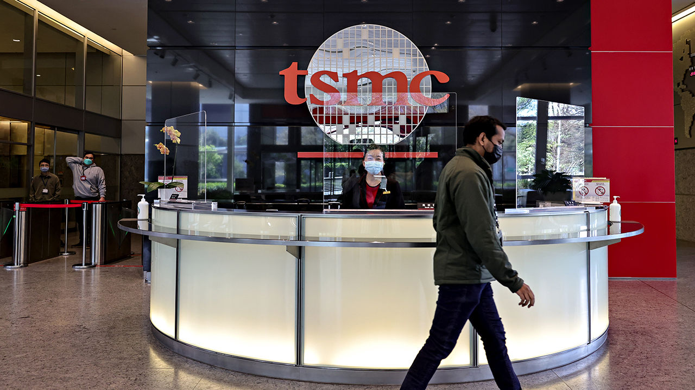

###### Semiconductors

# Taiwan’s dominance of the chip industry makes it more important 

##### No industry matters more to Taiwan than chipmaking 

 

> Mar 6th 2023 

They are the chips that power everything from mobile phones to electric cars—and they make up 15% of Taiwan’s GDP. Taiwan produces over 60% of the world’s semiconductors and over 90% of the most advanced ones. Most are manufactured by a single company, Taiwan Semiconductor Manufacturing Corporation (TSMC). Until now, the most advanced have been made only in Taiwan.

The semiconductor industry is called Taiwan’s “silicon shield”, giving the world a big reason to defend the island. Yet chips are the industry most affected by the split between America and China. Parts of the shield are now moving abroad. In December TSMC held a ceremony to mark the start of a chip plant (or “fab”) in Arizona. Joe Biden was there, as were Tim Cook from Apple and TSMC’s founder, Morris Chang. Mr Chang said TSMC would triple its investment in Arizona to $40bn, open a second fab in 2026 and make three-nanometre chips, now the most advanced, in America. Mr Biden declared that “American manufacturing is back, folks.” Mr Chang more morosely called globalisation and free trade “almost dead”.

The chip industry was built on globalisation, with every part of the supply chain supporting it. TSMC’s fabs, based on efficiency and high-skilled, long-hour labour, could make chips faster and more accurately than any rival. Experts agree that replicating this supply chain elsewhere would be inefficient. Mr Chang told reporters in November that the cost of making chips in America would be 55% higher. He reportedly told Nancy Pelosi that American efforts to bring the business home were “doomed to fail”. Yet the shift to local supply chains is happening, boosted by covid-19 and the war in Ukraine. Governments want critical tech made in safer places, closer to home. And America and China are competing to control the most sophisticated chips that may prove crucial to the next generation of advanced weapons. 

Taiwan is pulled between the two. China has poured $50bn into chipmaking, hoping to meet 70% of domestic demand for chips by 2025. It has also poached Taiwan’s chip engineers, executives and trade secrets. That brain drain has alarmed Taiwan’s government, which has raided Chinese chipmakers and passed new laws against economic espionage. America is also trying to stop China getting advanced chips. It passed the CHIPS and Science Act in August 2022, offering $39bn in subsidies and a 25% tax credit to promote manufacturing at home, as well as $13bn of investment in chip research. In October 2022 it banned the export of advanced chips and chipmaking gear to China. 

 


America’s success in bringing TSMC to Arizona sparked alarm in Taiwan. The KMT accused the government of “gifting” TSMC to America. “TSMC will surely become USMC in the future,” said Tseng Ming-chung, a KMT legislator. Officials say such fears are overblown. TSMC aims to produce 600,000 wafers a year at its American fabs. But its manufacturing capacity is more than 13m wafers a year. It is also building a new fab in Japan and considering one in Europe. “It’s not that Taiwan’s cake is being cut in half. The cake is getting bigger, and we’re giving some of the extra slices to America and Japan,” says Emile Chang from the economic ministry.

The minister of economic affairs, Wang Mei-hua, says TSMC’s new fabs do not mean a loss of Taiwan’s advantage. The most advanced nodes will still be made in Taiwan, and research will stay. In January Taiwan passed its own chips act, offering tax subsidies worth 25% of research costs. Foreign chipmakers are investing in Taiwan. ASML, a Dutch company that makes advanced lithography machines for cutting-edge chips, is opening its sixth factory in Taipei in 2023. Micron and Applied Materials, two American semiconductor firms, are expanding in Taiwan. 

None of this changes the fact that “friend-shoring” semiconductor making will involve inefficiencies. But this is the reality of a world reshaping itself around geopolitical risk. ■

Photos: I-Hwa ChenG

