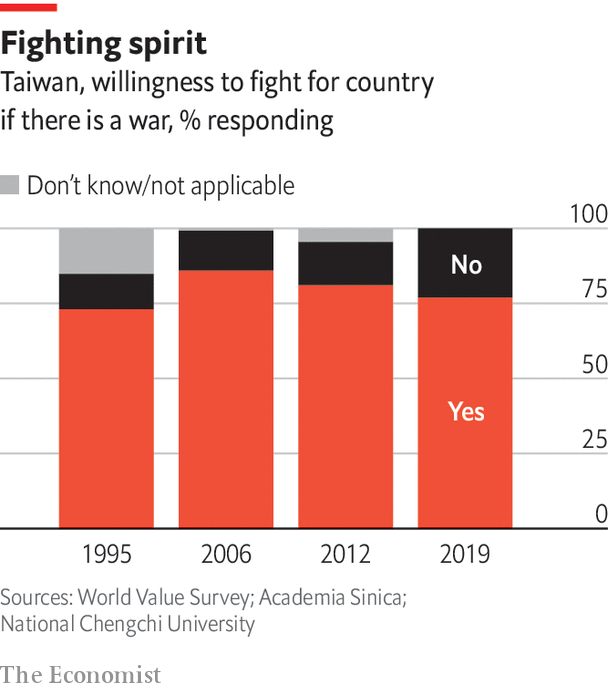
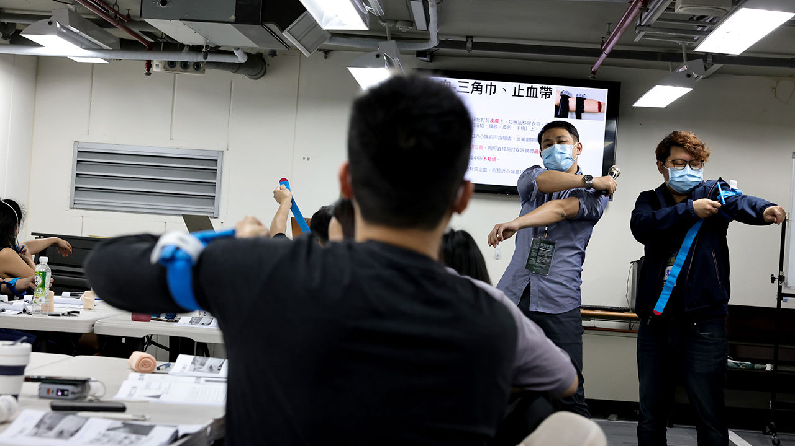
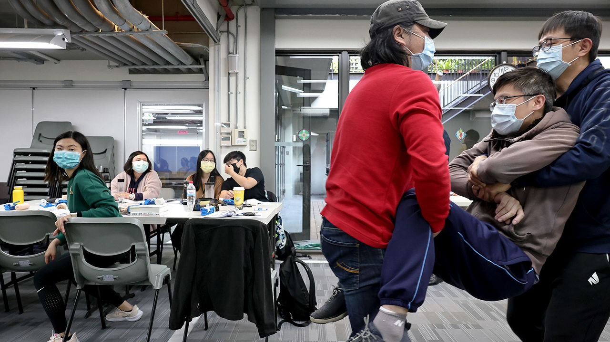

###### The home front

# The battle with China is psychological as much as physical 

##### The importance of psychology in resisting China 

 

> Mar 6th 2023 

ROBERT TSAO pulled a helmet on, grinning as he held up a copy of his Taiwan identity card. “I am 100% Taiwanese, and I’ve come back to defend my country,” he said. It was September 2022, weeks after Nancy Pelosi’s visit was followed by belligerent Chinese military exercises around Taiwan. The billionaire founder of UMC, Taiwan’s second-largest chipmaker, announced a $100m donation to Taiwan’s defence. He promised to support the training of 3m “black-bear warriors” over three years.

Mr Tsao, who is 76, had given up citizenship and emigrated to Singapore after the Taiwanese government sued him for illegally investing in China in 2011 (he was found not guilty). He had also once proposed a referendum on peaceful unification with China. But now he called on the Taiwanese to stand up against Chinese Communist Party “thugs”. Taiwanese reporters wondered if he had lost money in China or been paid off by a political party before the local elections. Why would such a successful businessman put money into Taiwan’s defence, when anyone he trained would not even be legally allowed to pick up weapons? Was this all just a propaganda campaign?

In Mr Tsao’s view, that is exactly the point. He spoke up after the Pelosi visit not because of China’s military exercises, but because of the media response. Too many commentators criticised the government and the Americans for upsetting China, not China for intimidating Taiwan. “It’s as if we are victims of domestic abuse, but when police come to check on us, we say: ‘Don’t let them come or we’ll be abused more.’ So cowardly!” says Mr Tsao. This comes after decades of Chinese propaganda telling the Taiwanese they will be safe from war so long as they don’t annoy China. That is dangerously naive, says Mr Tsao, who witnessed China’s crackdown on Hong Kong’s pro-democracy protests in 2020.

Red menace

China’s Communist Party has been running psychological operations against Taiwan for decades. It tries to affect Taiwanese thinking in two ways: by cultivating businessmen and politicians to support unification, and by sowing defeatism. China works not only through traditional media, but also by hiring Taiwanese influencers and posting false content on social media. Chinese disinformation exploits a media scene that is already rife with rumour-mongering.

When Hong Kong’s protests broke out in 2019, Chinese-run social media carried disinformation about protesters taking American money and being controlled by the CIA. Before Taiwan’s 2020 presidential election, Taiwanese media spread false claims that Tsai Ing-wen had faked her doctoral dissertation, which Chinese media picked up and amplified. The London School of Economics had to make an official statement certifying her thesis.

 


The growth of Chinese disinformation in Taiwan has raised social awareness and resistance. Thousands protested in 2019 against the influence of “red media” such as those of Want Want Group, a food company invested in China, that are said to co-ordinate coverage with Chinese officials. Taiwan’s media regulators fined Want Want’s TV channels several times for failure to check facts, and terminated one channel’s broadcast licence in 2020. Those restrictions sparked accusations of censorship. 

Taiwan has had more success in strengthening civil society and transparency than in curtailing “red” speech. A flurry of fact-checking organisations post rebuttals to false narratives in the media. One group made a chatbot that could detect false messages and automatically send fact-checks. Taiwan has added online- and media-literacy programmes to public education. It requires government agencies to debunk disinformation on a “222 principle”: responses should be posted within two hours, with 200 words and two images, making official clarifications speedy, clear and easy to share. Ms Tsai’s presidential victory in 2020, with a record 8.2m votes, showed that the strategy worked. Although 80% of respondents to exit polls said they had heard that Ms Tsai’s thesis was fake, only 20% believed this to be true. 

 


The information battle rages on. After Russia invaded Ukraine, public confidence that America would send troops to defend Taiwan against an invasion fell from 65% in October 2021 to 34.5% in March 2022, according to polls from the Taiwan Public Opinion Foundation. Taiwanese respondents were more confident (43%) of Japanese assistance in a war than of American help. That belief is divorced from geopolitical reality, says Taiwan’s foreign minister, Joseph Wu. But it was influenced by propaganda in Taiwanese media blaming NATO, not Russia, for the Ukraine war.

Taiwanese society is susceptible because of its authoritarian history, says Lee Ming-che, an activist who returned to Taiwan in 2022 after five years of imprisonment in China. Mr Lee was convicted of “inciting subversion of state power” because he raised funds for families of Chinese political prisoners. In the 2000s, when cross-strait relations were close and China more open, Chinese activists often came to Taiwan to learn how it moved away from one-party authoritarianism. “They thought, and so did we, that Taiwan could show the way forward for China,” says Mr Lee. 

The past five years have shattered that illusion. Imprisoned in Hunan, Mr Lee spent his days sewing gloves, shoes and purses, and his nights watching propaganda. He experienced how China treats its people “as machines to be controlled, not as humans”. He shifted from hopes of Taiwan inspiring change in China to the need to protect Taiwan from a Chinese takeover.

While Mr Lee was in prison, his wife Lee Ching-yu spearheaded a campaign to save him. She flew to America and Germany to demand that China adhere to its laws, and led a letter-writing drive to promise he had not been forgotten. Yet some Taiwanese media criticised Ms Lee for provoking China and Mr Lee for having gone there. Ms Lee was urged to keep quiet and look for ways to collaborate with China to save her husband. She refused.

That kind of victim-blaming is a leftover from Taiwan’s martial-law era, says Mr Lee. “We are taught to obey power. We fear and respect it. We demand a lot from the victims, but we are gracious to the abuser.” It suits China that Taiwanese censor and blame themselves. That may be how many Taiwanese survived decades of political oppression. But Mr Lee insists that, in the case of China, “backing down to appease them does not work.” What does work, he says, is resistance.

That message is new to many Taiwanese, although activist groups are now promoting it. One is Kuma Academy, the non-profit where Mr Tsao’s 3m warriors are trained. The training does not involve actual weapons. Rather it aims to teach civilians about modern warfare, Chinese disinformation and first aid. Puma Shen, one of Kuma Academy’s co-founders, says the point is to get the Taiwanese to think seriously about the risk of war and what to do if it comes.

 


That is already a big step, say two young men at a Kuma Academy training session in the basement of a church. “We don’t have a sense of crisis,” says Weng Shih-hsuan, a software engineer. Despite the growing threat of Chinese aggression, none of his family ever talks about war, he says. “Even this morning I was thinking, defence is not my responsibility. The government should serve me.” But the Kuma lectures have changed his mind. If war does come, he says, everyone will have to respond. Taiwan should expand this training to its schools and military, he adds, saying they would be more valuable than today’s conscription. 

His friend Tsai Cheng-wei, another young software engineer, agrees. Taiwanese society needs to get over its fear of war, he says. “Everyone is used to thinking, ‘We just want peace’. But the question is, if you want peace, what kind of risk are you willing to undertake to attain it?” The best way to stop a war is to increase the cost to the invader by mobilising nationwide resistance, he reckons. Such thinking is growing faster in civil society than among Taiwan’s armed forces.■

Photos: I-Hwa ChenG

