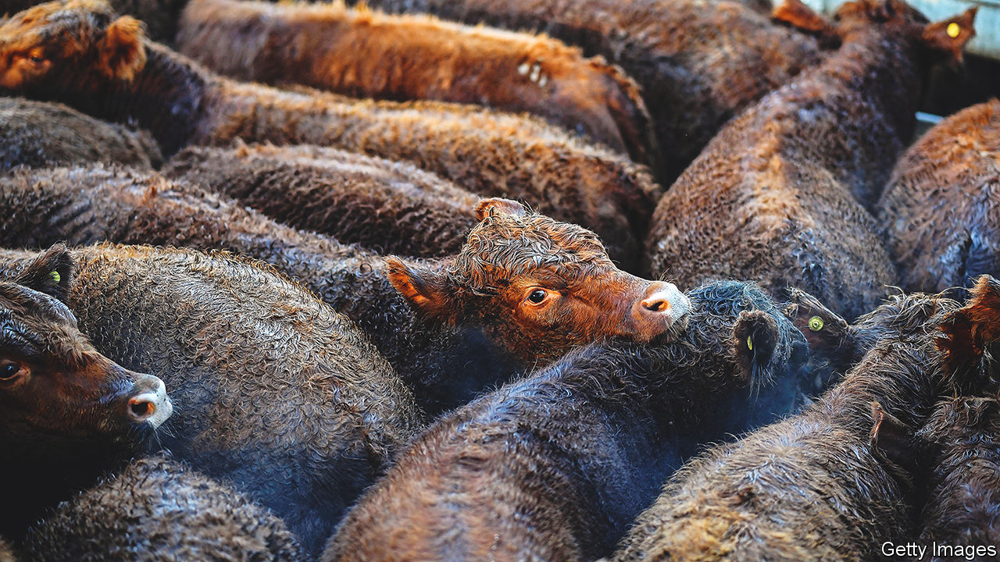
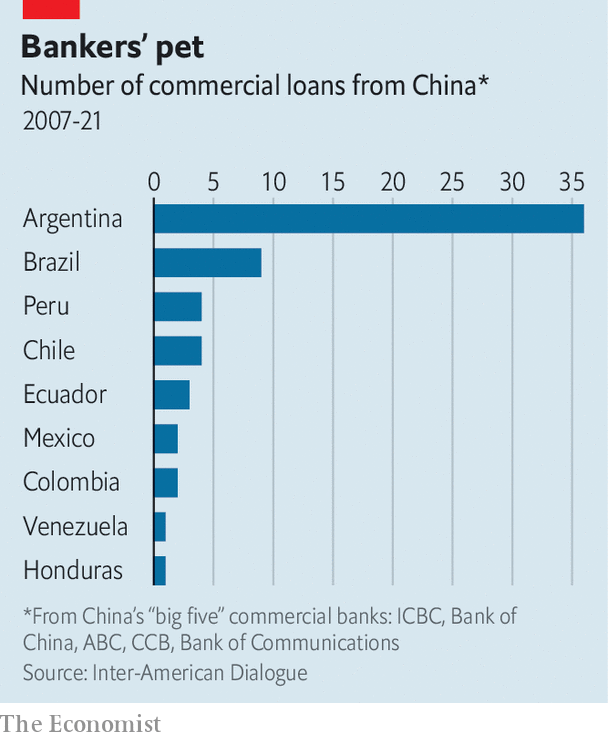
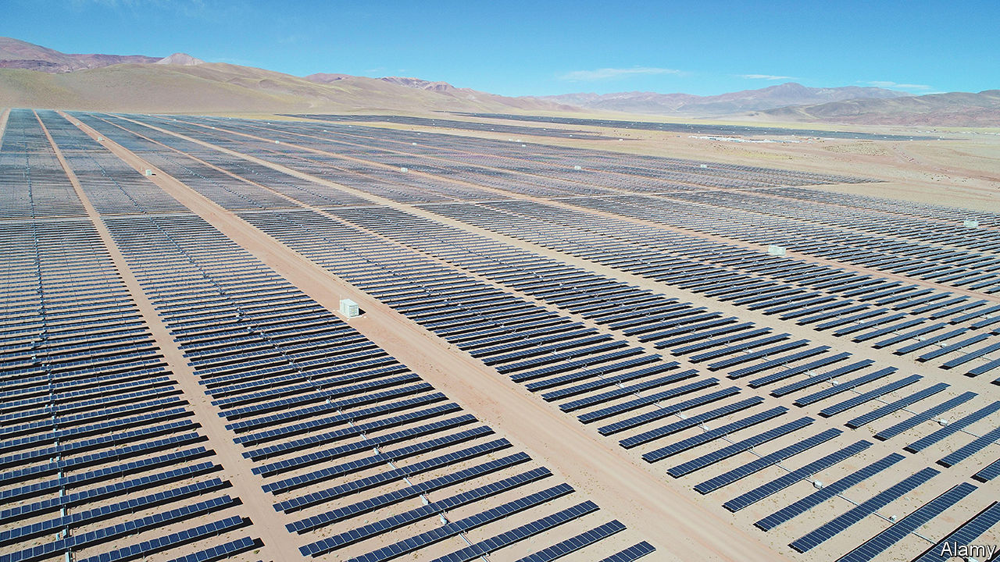

###### Deals not done

# Argentina is wasting the vast opportunities China offers it 

##### China is asking its South American partner: where’s the beef? 

 

> Mar 7th 2023 

THEY SHOULD be a perfect match, like a steak and a glass of Malbec. Argentina has fertile land and skilled farmers. China has 1.4bn mouths to feed. Bilateral trade should be sizzling. But Argentine policy is so erratic that China is often left asking: where’s the beef? 

Sometimes, literally. In 2018 China opened its market to Argentine beef. At first, trade boomed. However, in 2021 Argentina slapped a beef-export ban on itself. “The Chinese couldn’t believe it,” recalls Patricio Giusto of the China-Argentina Observatory, a think-tank.

The convoluted logic went like this. Domestic meat prices were rising, upsetting barbecue-loving Argentines. President Alberto Fernández reasoned that if he stopped foreigners from wolfing Argentine beef, there would be more for domestic consumers. The ban did little to curb inflation, which is now  year on year and mostly caused by the government’s frenzied money-printing. But the export ban gored Argentine farmers and infuriated their Chinese customers.

Cleverer engagement would yield huge benefits. Argentina desperately needs capital; China has deep pockets. China craves minerals; Argentina has mountains of them. Rather than exploit those economic opportunities, Argentina’s current government of prickly left-leaning Peronists has given priority to political and diplomatic ties with China, which alarms the United States. A more pragmatic one would seek to get along well with both big powers, while taking full advantage of the way the Argentine and Chinese economies complement each other. Argentina’s next national election, due in October, may bring such a government to power. 

 


In recent decades the economic relationship between Argentina and China has burgeoned. Bilateral trade has increased from $2.3bn in 2001 to $26bn last year. Several big Chinese investment projects have been announced. More than half of the 62 loans doled out by Chinese commercial banks in Latin America between 2007 and 2021 have gone to Argentina, according to the Inter-American Dialogue, a think-tank in Washington (see chart). Most of this has taken place since 2015. A branch of ICBC, China’s biggest commercial bank, dominates the skyline near the presidential palace in Buenos Aires. 

Lately, though, progress has stalled. Wherever Argentina has a comparative advantage, the Fernández government erodes it. The total ban on beef exports has gone, but bans remain on seven popular cuts of beef, such as short ribs. Crops are whacked with export taxes ranging from 7% (for sunflower oil) to a crushing 33% for soya. This discourages investment and costs Argentina a fortune. If it had halfway sensible policies it could add $25bn a year to grain and oilseed exports within a decade, estimates David Miazzo of Fada, a think-tank. That is equivalent to 5% of today’s GDP. But the government is desperate for short-term cash, and shiploads of grain are hard to hide and easy to tax. 

Chinese investments that generate headlines often run into trouble. A year ago China announced an $8bn deal to build a nuclear power plant near Buenos Aires. It was eager to show off its Hualong One nuclear technology, which so far produces power only in China itself. It also hoped to lock Argentina into the kind of long-term relationship that nuclear projects require. 

The problem is that Argentina cannot afford the price tag (which with interest could add up to $13bn, estimates Julian Gadano, a former energy official). Its net foreign reserves are a mere $2.5bn, according to Econviews, a consultancy. Argentina owes  to the IMF, and is trying to secure another lifeline. Having renegotiated the nuclear project several times, Argentina is begging Chinese lenders to cover 100% of the cost, up from 85%. The project “is not going to happen”, predicts Mr Gadano. 

In 2014, during the presidency of Cristina Fernández de Kirchner (who is now the country’s vice-president), Argentina borrowed $4.7bn from three Chinese state-owned banks to build two hydroelectric dams in Santa Cruz, Ms Fernández’s political stronghold. Interest payments are now a big drain on the budget, and the dams have yet to produce any electricity. Last year Chinese firms seemed well placed to win a contract to build a pipeline to Buenos Aires for gas from Vaca Muerta, one of the world’s largest deposits of shale gas and oil. But after some wrangling, they abandoned the bidding. In 2020 Sinopec, a Chinese oil giant, pulled out of Argentina after squabbles with labour unions. 

The incentive to invest in energy is dulled by price controls. Households pay hardly anything for electricity and waste it copiously. Power cuts are common. 

Regardless of their line of business, “Chinese firms have the same problems as all companies that want to invest in Argentina,” says Gerardo Morales, the governor of Jujuy province. In addition to high inflation investors must contend with currency controls, which make it hard to repatriate profits. A system of multiple exchange rates (there are at least a dozen for the dollar) causes confusion and distortion. Exporters must surrender their dollars at the official rate, which is roughly half what they are worth. The government allocates cut-price hard currency in a process riddled with graft. Special rates apply to such things as rock concerts (the “Coldplay” rate) and streaming services (the “Netflix” rate). Chinese firms find it hard to operate in a country where policy changes direction as often and unpredictably as a football at Lionel Messi’s feet. 

Argentina seems more interested in being China’s ally than its supplier. Vice-President Fernández (no relation to her nominal boss) recently gushed that China was the “most successful capitalist system”. China plays up similarities between Taiwan and the Falkland islands, a British territory that Argentina claims. (One parallel it does not mention is that the Falkland islanders, like the Taiwanese, have no desire to be ruled by their bigger neighbour.)

Many of Argentina’s recent ventures with China are long on political symbolism and short on economic substance. Some of these have irked the United States. Last year Mr Fernández announced that Argentina would join the Belt and Road Initiative, a Chinese global infrastructure scheme. The agreement included no new financial commitments. China has built a space observatory in Patagonia, which it claims is purely for scientific purposes—the far-southern latitude gives it a view of the cosmos unavailable from China. Others suspect it is spying; unlike a similar European observatory, China’s is closed to outsiders and staffed by military folk. In September the governor of Tierra del Fuego, on the tip of Argentina, offered his province as “the gateway” for China to Antarctica, with a logistics base for ships. 

The Fernández administration may have underestimated how hostile the United States has recently become towards China, and how determined it is to prevent China from gaining a foothold in its hemisphere. Anything that looks like Chinese military activity in the region is sure to infuriate any American administration. Although Argentina is not like the dictatorships in Cuba or Venezuela, which the United States regards as foes, some hotheads in Washington suggest it is heading that way. On February 28th María Elvira Salazar, an American legislator, claimed that Argentina had struck a deal with China to build Chinese warplanes in Argentina. She called it “a pact with the devil that could have consequences of biblical proportions”. The Argentine government said there was no such plan. 

Although the Peronists are suspicious of the government in Washington, they do not want to alienate it, not least because support from the IMF depends on American goodwill. They have begun to walk back from the deals with China to which the United States most objects. Argentina now says it will build the maritime base in Tierra del Fuego with its own money, which means it is unlikely to happen. An Argentine plan to buy Chinese fighter jets was cancelled in December; Argentina may now buy vintage American jets instead, if it can find the money. 

Frustrated with Argentina’s central government, some Chinese investors are dealing directly with provincial governments. Governor Morales in Jujuy has made multiple trips to China. Jujuy’s arid soil is little use for farming, but it has sunshine and minerals. A solar park at Cauchari, built high on an  (plateau) with Chinese money and technology, yields enough electricity for 160,000 homes. A nearby $852m Sino-Argentine lithium project is expected to start producing the metal, used in electric-car batteries, this year. Mr Morales says Argentina has “great opportunities…in a world hungry for food and energy”. It would receive “far greater investment flows” if it scrapped capital controls and had only one exchange rate. 

 


The election in October is expected to bring in a government with saner economic policies, which ought to help Argentina’s commercial relations with China. It may also be less willing than the Peronists are to promote China’s ambitions in the western hemisphere. “We are democratic and believe in human rights. We don’t [share the Chinese] vision of the world,” says a senior member of the opposition. But economically, “they need what we have, and we should take advantage of that, [by exporting] minerals and food.” Mr Giusto agrees. Uruguay, Argentina’s better-governed neighbour, maintains excellent relations with the United States and good ones with China, he notes. It exports beef and behaves predictably. 

China’s communist regime may grumble if Argentina elects a government that is less friendly to its strategic aims and closer to the United States. But if that makes Argentina’s economic policy less wacky, Chinese investors may quietly welcome it. ■

