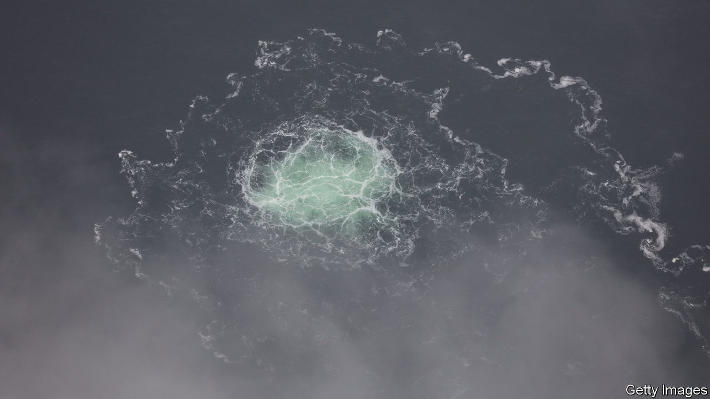
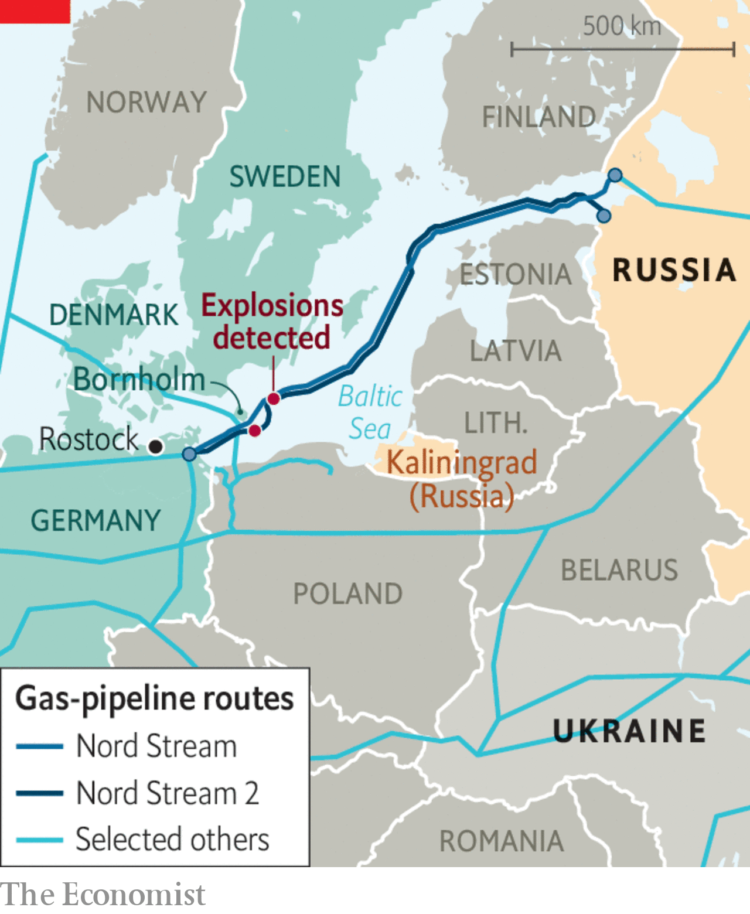

###### The Economist explains

# Who blew up the Nord Stream pipelines? 

##### Lots of blame, no hard evidence 

 

> Mar 8th 2023 

LAST SEPTEMBER,  when explosions damaged Nord Stream 1 and 2, two  that connected Russia to Germany, evidence of a culprit was scant. Some European governments . President Vladimir Putin had been threatening to cut off energy supplies to Europe in retaliation for sanctions imposed by the EU over Russia’s invasion of Ukraine. Russia, on the other hand, blamed America and Britain. Six months later American intelligence officials, as well as German and British news organisations, have suggested the possible involvement of an unidentified pro-Ukrainian group unaffiliated to the government. So whodunnit, and why?

On the morning of September 26th Danish monitoring equipment detected a seismic event equivalent to 500kg of TNT (roughly the same as a car-bomb) south-east of the island of Bornholm. At around the same time, a drop in pressure was recorded in Nord Stream 2, the southerly of the two parallel pipelines designed to transport Russian gas under the Baltic Sea. A plume of methane bubbles was then detected on the surface. Seventeen hours later, another leak was detected to the north-east. The blasts blew several holes in the steel and concrete casings of the two “strings” comprising Nord Stream 1, and one of the two Nord Stream 2 strings.

 


Neither pipeline, both of which are operated by Russia’s state-owned gas company, Gazprom, was delivering gas at the time. Nord Stream 2 was completed in 2021, but had not begun operating when Germany suspended the project on the eve of Russia’s invasion of Ukraine. Russia stopped pumping gas through Nord Stream 1 one month before the explosions, ostensibly for maintenance. 

Some European officials initially believed the attack might have been organised by Russia, which was escalating its war in Ukraine and its energy battle with Europe at the time. Its Baltic fleet, which could deploy divers or mini submarines, is based in , 300km from the targets. The attack took place one day before Poland completed a new pipeline to import Norwegian gas via Denmark, designed to reduce its long-standing reliance on Russia. On October 12th, two weeks after the attack, Mr Putin  that the world’s energy infrastructure was “at risk”.

Russia, meanwhile, pointed the finger at America. President Joe Biden had repeatedly warned that a Russian invasion of Ukraine would “bring an end” to Nord Stream 2, which America had long opposed. In February this year Seymour Hersh, an American investigative journalist, claimed on the basis of a single, anonymous source that American Navy divers had planted explosives on the pipelines. ​​American officials denied the claim. And Mr Hersh’s story was littered with errors of fact and logic. 

Neither country would appear to have a clear motive for the attacks. By damaging its own infrastructure, Russia would deprive itself of future leverage over energy-starved Europe. An American attack would risk antagonising European allies, especially . And Mr Biden has generally adopted a cautious approach to the conflict.

The latest speculation revolves around Ukrainian involvement, although the evidence released so far is flimsy. On March 7th ARD, SWR and , German media outfits, all carried a report that German police had identified a yacht thought to have been used to transport explosives to the site. The boat was hired in Poland from a company apparently owned by two Ukrainians. According to the reports, six people used forged passports to sail from Rostock, Germany’s Baltic port, on September 6th, almost three weeks before the explosions. 

The German reports coincided with revelations in the that American intelligence officials suspect renegade pro-Ukrainian groups of carrying out the attack. (The Americans have not accused President Volodymyr Zelensky’s government, or the Ukrainian military, of involvement.) A follow-up report on March 8th by the , a British newspaper, suggested that NATO governments covered up suspicions of Ukrainian involvement to prevent German public opinion from turning against supplying . 

A Ukrainian motive is plausible, though hardly decisive. The country had long seen the Nord Stream pipelines as a national-security risk that increased Europe’s dependence on Russia and deprived Ukraine of transit fees it could charge Gazprom for overland pipelines. And a recent increase in Ukraine-linked sabotage activities, including attacks on airfields in Russia and Belarus, suggests an emphasis on unconventional warfare. Indeed, some have speculated that the Americans may have decided to brief their intelligence now as a warning to Ukraine not to escalate further. 

Whether the attacks could have taken place without state assistance is unclear. But Ukraine’s defence minister, Oleksii Reznikov, has denied involvement. “It would be a certain compliment to our special forces, but these are not our actions,” he said on March 8th. Germany’s defence minister, Boris Pistorius, warned against hasty conclusions, noting the possibility of a false-flag operation to blame Ukrainian groups. Investigations by Danish, German and Swedish authorities are all under way. But for now, the view to the depths of the Baltic remains murky. ■

