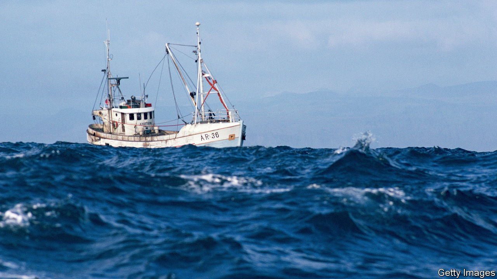

###### The Economist explains

# Why a new UN treaty to safeguard the “high seas” matters 

##### Long-neglected international waters will finally receive more protection 

 

> Mar 8th 2023 

THE OPEN OCEAN, which covers nearly three-quarters of the Earth’s surface, sustains and regulates life on the planet. Each year it sucks in about a quarter of the carbon dioxide emitted by humanity. It is economically valuable, too. The food, shipping, tourism and other activities which rely on the ocean are worth some $2.5trn annually. But almost two-thirds of the ocean lies outside , which extend up to 200 nautical miles (370km) from countries’ coasts. That leaves some 219m square kilometres of ocean, known as the “high seas”, outside any national jurisdiction. These areas are vulnerable to plunder by states, businesses and . Two-thirds of fish stocks in the high seas are overexploited, according to the International Union for Conservation of Nature, a network of conservation groups and governments. But there has been no way to tackle these problems—until now. On March 4th negotiators at the UN agreed on the first international treaty to protect the high seas. What might it achieve?

Only around 1% of the high seas currently enjoy protected status, including a 600,000 km patch of the North Atlantic that is important for seabirds. The new High Seas treaty establishes a legal framework for more such areas. Any country that signs the eventual agreement—ratification alone is likely to take several years—will be able to propose the protection of an area of the high seas and suggest measures, such as limits on fishing or shipping, to help. Other interested parties, including scientists and business, would review such proposals before countries vote on them. If the required number of states agree, the protected area will be established. The treaty’s signatories will then be obliged to apply its rules through other bodies like the International Maritime Organisation, which regulates shipping.

Signatories will also be obliged, for the first time, to carry out environmental-impact assessments for potentially damaging activities such as deep-sea mining. And they will have to share with other countries data and technology needed for scientific research or environmental monitoring. The treaty also includes rules governing the share of profits derived from “marine genetic resources”: materials from ocean plants and animals used by industries like pharmaceuticals and cosmetics. Access to this bounty has long complicated attempts to reach an international agreement over the high seas. But despite the breakthrough, it will not be easy to hammer out how the profits can be shared “fairly and equitably”, as the treaty demands.

 The deal should help countries meet their pledge to protect 30% of the world’s land and sea by 2030, as agreed at , a  held last year. Open oceans may not have the colourful, biodiverse ecosystems found closer to shore, but every part of the sea must flourish if the oceans are to thrive. And healthy ecosystems mitigate climate change by regulating temperatures, absorbing carbon and producing oxygen. The new treaty alone will not achieve that; comprehensive monitoring will be required. Nor is it yet clear how it will be enforced ( already struggle to keep fishing in the high seas sustainable, for example). Countries have a long history of making ambitious but unfulfilled promises about biodiversity. But proper attention is at least now being paid to a long-neglected part of the planet. ■

