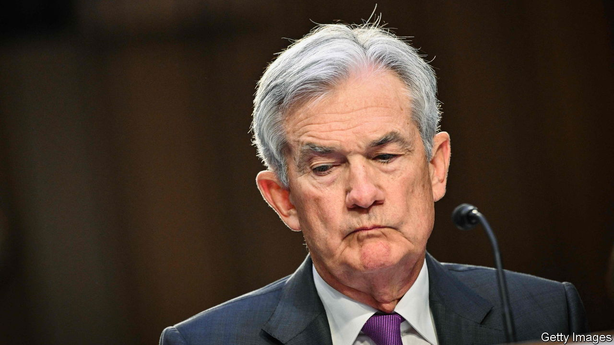
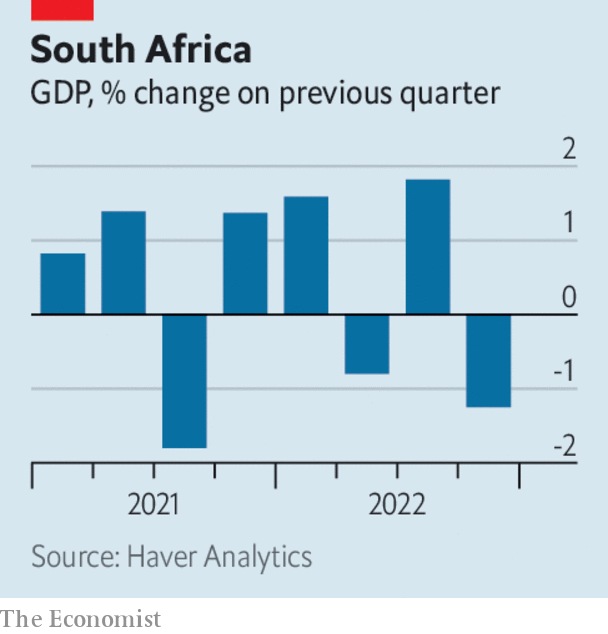

###### The world this week

# Business 

#####  

 

> Mar 9th 2023 

 said that the  may have to raise interest rates higher than it had anticipated only recently, because new data on inflation, jobs and spending pointed to an overheating economy. The Fed lifted its main rate by a quarter of a percentage point at its last meeting, but investors now reckon it could increase the rate by half a point on March 22nd. Stockmarkets swooned. 

Meanwhile, and pouring more cold water on investors’ hopes of smaller interest-rate rises, Christine Lagarde said that “inflation is a monster that we need to knock on the head” and that price pressures remain “sticky”. The president of the  said another half-point increase by the ECB on March 16th was “very, very likely”. 

, a British chip designer owned by SoftBank, will reportedly raise up to $8bn in a blockbuster IPO later this year. In a blow to the London Stock Exchange, and the lobbying efforts of three prime ministers, Arm has decided to list only in New York. 

 government announced  to its supervision of the financial sector, and will create a new body to replace the China Banking and Insurance Regulatory Commission. The oversight of financial companies (except for securities) will fall under the control of a new department that will take over some of the functions of the central bank and report to the State Council. The aim is to consolidate the operations of numerous regulators. 

 declared in its annual report that “We are capitalists,” a statement that may not be obvious to critics of the bank’s ESG (environmental, social, governance) goals. Brian Moynihan, the chief executive, said in the report that he has been asked in Congress whether he is a capitalist (he replied “yes”). He elaborated that the bank wants to use capitalism to benefit its shareholders, but also address the priorities of society, which may not do much to placate the critics of ESG. 

 central bank lifted its main interest rate to 3.6%, the tenth consecutive rise. The bank said that the rate would need to rise again, but it dropped language referring to “multiple” increases. 

Holding pattern

America’s Justice Department sued to block  takeover of , arguing that their combination would eliminate competition on hundreds of routes and increase air fares. JetBlue won a bidding war for Spirit last year, after Spirit’s merger deal with Frontier Airlines fell apart. Both companies said they would fight the lawsuit. The boss of JetBlue said regulators had been determined to stop the deal from the outset. 

, one of the world’s biggest tobacco companies and owner of the Marlboro brand, swapped its stake in , a maker of electronic cigarettes, for intellectual-property rights to some of Juul’s technology. Altria paid $12.8bn for the stake four years ago, before Juul was accused by regulators of pushing vaping products to teenagers. The stake is now worth $250m. Expanding its reach into the alternative-cigarette market, Altria has agreed to pay $2.8bn for , which has had an easier time with the regulators. 

The company behind  announced its acquisition of Sequence, a telehealth platform that provides visits from doctors who can prescribe Ozempic, Wegovy and other weight-loss drugs. The company described weight-management medications as the “biggest innovation in our industry today”. 

 


  shrank by 1.3% in the last three months of 2022 compared with the previous quarter. The country endured a series of rolling blackouts that is estimated to have cost the economy $50m a day. This week Cyril Ramaphosa, the president, appointed a new electricity tsar to get to grips with the crisis that has beset Eskom, the state provider, which is struggling to meet the demand for power given its old and broken network. 

Volkswagen said that it would build a factory in South Carolina to assemble  and would open a facility to make batteries in North America. The German carmaker is reportedly suspending plans for a battery plant in eastern Europe as it waits to see if the EU will match subsidies for manufacturing EVs in America’s Inflation Reduction Act. 

Vegetable stew

A shortage of  in Britain caused unit sales of tomatoes and peppers to drop by around 17% in February, according to NIQ, a market-research firm. But the unit sales of some vegetables did grow, even though adverse weather in exporting regions made them hard to find; cucumbers were up by 32%. And although the volume of fresh produce sold declined, inflation meant that overall grocery sales rose by 11%. So all in all Britain’s salad days are far from over. 

