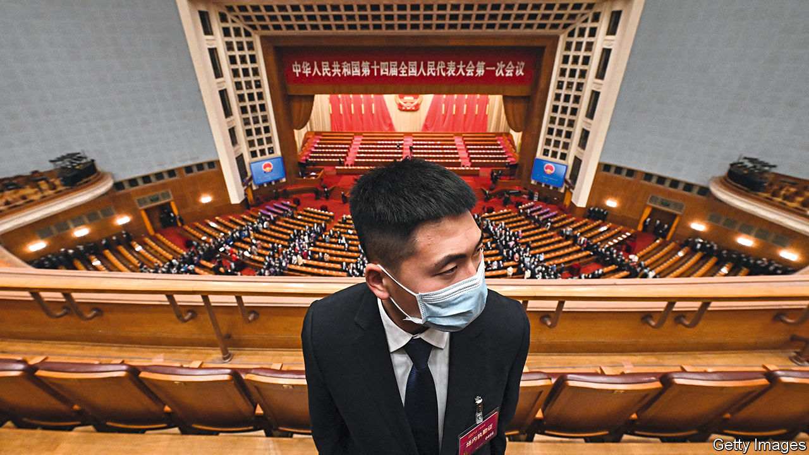
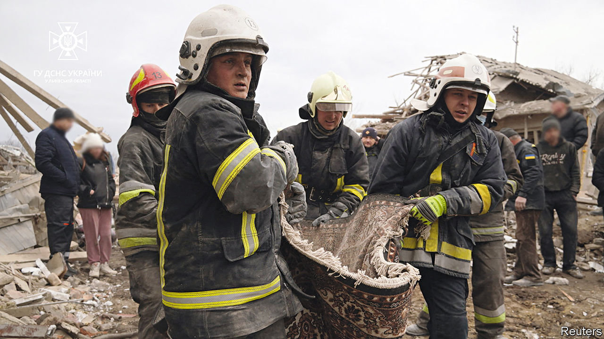

###### The world this week

# Politics 

#####  

 

> Mar 9th 2023 

The National People’s Congress,  rubber-stamp parliament, opened its annual session. The outgoing prime minister, , kicked things off by announcing an economic growth target of “around 5%” in 2023, lower than many external forecasts. Xi Jinping blamed Western countries led by America for trying to suppress China. The congress is expected to approve a set of reforms that will give Mr Xi more direct control over government bodies. It will also confirm him for a norm-busting third term as president.

On the wrong track

China’s foreign minister, Qin Gang, warned America that its hostile attitude was in danger of  between the two countries, comparing the situation to a train heading towards derailment. China is also “seriously concerned” that the president of , Tsai Ing-wen, is going to meet the speaker of America’s House of Representatives, Kevin McCarthy, in the United States. 

Japan’s space agency commanded its new   to self-destruct after its second engine failed to ignite after lift-off. It is a big setback for Japan’s rocket programme, which hopes to compete in the growing business of launching commercial and government satellites. The rocket was carrying a satellite that could, among other things, monitor North Korean missile tests. 

A suicide-bomber killed ten police officers in  Balochistan province, the latest in a series of attacks on the country’s security forces. 

Al-Shabab, a jihadist group in linked to al-Qaeda, recaptured a base that it had lost in the south, a sign that the biggest government offensive against the group in years may be stalling. 

 postponed elections to choose governors in 28 of its 36 states to March 18th in order to configure voting machines after a chaotic presidential election last month.

After a visit to Tehran, Rafael Grossi, the head of the International Atomic Energy Agency, the UN’s nuclear watchdog, said that had agreed to the reinstallation of cameras and other monitoring equipment at its nuclear sites. He later clarified that the terms of these concessions would have to be worked out in future negotiations with the regime. 

forces killed six in a raid on Jenin refugee camp in the West Bank. Binyamin Netanyahu, Israel’s prime minister, said that one of the dead had been responsible for killing two Israeli settlers in February, which had prompted hundreds of settlers to attack a Palestinian town. Two days after the raid, Israeli security forces killed three Palestinians near Jenin who had opened fire on them while they were trying to make an arrest. 

 prime minister, Justin Trudeau, said he would appoint an independent special rapporteur to investigate claims that China had attempted to influence the federal elections in 2019 and 2021. Mr Trudeau has been under pressure to take more seriously reports that China had tried to help his Liberal Party. He contends that the interference did not affect the election results. 

 National Assembly approved a report by a legislative commission that recommends the impeachment of the country’s president, Guillermo Lasso. The vote suggests that the legislature will try to impeach him, but the Constitutional Court has the power to quash that. The report alleges that Mr Lasso failed to stop bribery at public companies.

Armed men kidnapped four Americans and killed two of them in the  city of Matamoros, just across the border from Texas. A Mexican woman was also killed. American officials believe that the Gulf Cartel, a gang based in Matamoros, is responsible for the killings. It is not clear what the motive was.

 


Cities across  were struck by a wave of Russian missiles targeting power infrastructure but which also hit residential buildings. The missiles fell on Kyiv, the capital, Odessa, Kharkiv, Dnipro and other areas. Meanwhile, fierce fighting continued for control of Bakhmut. Volodymyr Zelensky said that the battle for the town and the Donbas region was Ukraine’s first priority.

Murky waters

Germany’s defence minister warned against jumping to conclusions about who sabotaged the  that carried gas from Russia. Boris Pistorius was responding to press reports linking the attack last year to Ukrainians, and said there was an equal chance that it could have been a “false-flag operation staged to blame Ukraine”.

The liberal Reform Party increased its number of parliamentary seats in  general election, allowing Kaja Kallas to continue as prime minister. She was urged to form a new coalition quickly to head off any notion of uncertainty regarding her country’s stalwart support for Ukraine. The Centre Party, favoured by Estonia’s Russian-speaking minority, did badly in the election. 

 ruling party withdrew a bill that would have required NGOs and media that receive at least a fifth of their funding from abroad to register as foreign agents. The legislation had sparked huge demonstrations in Tbilisi, the capital. The protesters, some waving EU flags, feared that the bill would be the first stage towards adopting a clampdown on press freedoms similar to Russia’s. 

In Athens police clashed with demonstrators protesting over a train crash that killed 57 people. Unions claim that the neglect of rail infrastructure in  contributed to the tragedy, putting pressure on the government just as it is due to call an election. 

Unions in  held their biggest strike yet to protest against the government’s proposal to raise the state retirement age to 64, from 62. Rail workers are considering a rolling wave of action. In next door  farmers brought central Brussels to a standstill when they drove 2,700 tractors into the city to demonstrate against plans by the Flemish regional government to limit nitrogen emissions from agriculture.

The British government  its umpteenth plan to try to stop the tide of illegal  crossing the English Channel. If the bill passes, new arrivals will be detained and swiftly removed, some to Rwanda or a safe third country. Asylum claims would then be heard remotely. Migrant charities said the proposals were unworkable and may flout international law. The opposition described the announcement as “groundhog day”. 

The American Senate voted to overturn a decision by the council of   to reduce sentences for some violent crimes in the city. Democrats in the Senate joined Republicans in blocking the measure, which critics say was soft on crime. Homicides are up by a third in Washington this year, though overall violent crime is down. 

