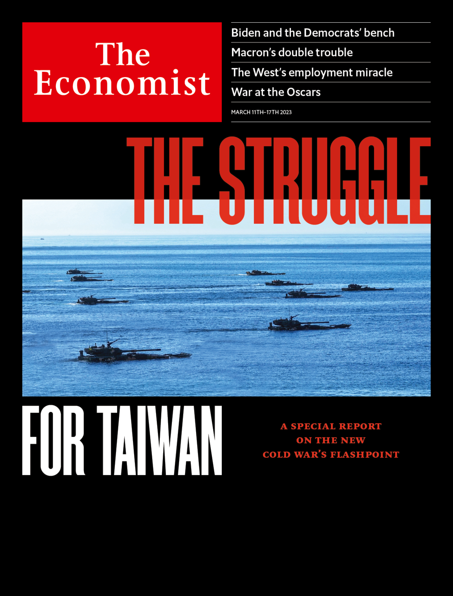
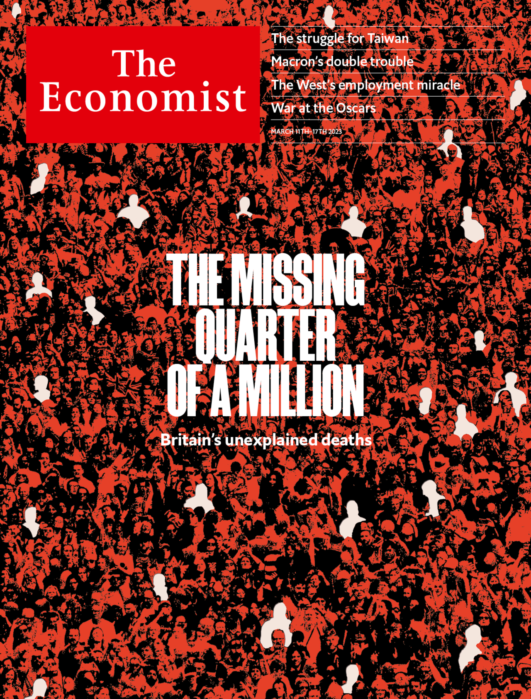

###### The Economist

# This week’s covers 

##### How we saw the world 

> Mar 9th 2023 

IN MOST OF the world we have a cover contemplating how to avoid a superpower conflict. Tensions between America and China in relation to Taiwan make war a distinct possibility.

 


: 


: 

In Britain we consider an unpleasant question rather closer to home: what to do about the country’s woeful life expectancy? In the past decade hundreds of thousands of people have died earlier than might have been expected. 

 


: 

: 


