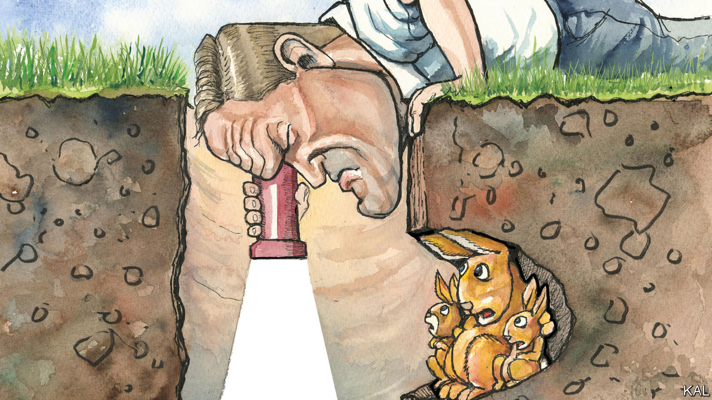

###### Lexington

# America’s government has not been “weaponised” 

##### But it is being undermined by the wrong kind of congressional oversight 

 

> Mar 9th 2023 

If you set out to crystallise what is self-defeating and immiserating—yet, admittedly, also kind of funny—about American politics and governance, you might come up with something quite like the Congressional Committee for the Spelunking of Rabbit Holes (technically operating under a less precise name, the Select Subcommittee on the Weaponisation of the Federal Government). 

The subcommittee’s chairman, Jim Jordan, was a champion wrestler in college, and he retains both impressive pugnacity and a lean, bantam physique incidentally accentuated by his habit of appearing in his shirtsleeves. An astute politician from Ohio, he has vaulted into the Republican leadership without dulling his positions as a founder of the razor-edged . Mr Jordan believes Americans’  are under assault, and there is certainly cause for concern, or at least vigilance.

He has said he suspects deep corruption, that President Joe Biden and other Democrats are using federal agencies—as well as big tech firms and left-wing news media—to crimp Americans’ rights for the benefit of his family and party. Though the name of the subcommittee may suggest prejudgment, Mr Jordan insists his focus is “facts and truth”. He faces a hard road, for several reasons.

No party will ever again make the mistake the Republicans made when they chose to object to the J by not nominating members to it. That freed the committee’s Democrats, and the two Republicans who defied their leadership to take part, to script a coherent and at times riveting television series about how Donald Trump tried to overturn the 2020 election. 

Mr Jordan, by contrast, is stuck with Democrats, including the formidable ranking minority member, Stacey Plaskett of the Virgin Islands, who can grill his witnesses and call their own. At the first hearing, last month, Mr Jordan said “dozens and dozens of whistle-blowers” at the FBI were coming forward. On March 2nd Ms Plaskett and other Democrats released a book-length report on the three FBI witnesses they know of so far, describing them as embracing conspiracy theories about the January 6th attack (“Insurrection my a$$,” tweeted one of them. “It was a set-up.”), and offering extreme opinions but no evidence of misconduct. “We urge Chairman Jordan to schedule the public testimony of these individuals without delay,” they wrote, drolly. 

Ms Plaskett, a former prosecutor, says she hopes Mr Jordan is withholding better witnesses he plans to spring on her later. “I’m hoping that we’re playing chess and not, you know, Connect 4,” she says. “Right now it feels more like Connect 4.” 

Also unlike the January 6th committee, this subcommittee is following the standard approach to public questioning, under which members alternate by party. The result at the first hearing was a bewildering oscillation for almost four hours between alternate realities, compounded by lousy questions, a bipartisan problem. Most members addressed their friendly witnesses, treating them as backboards against which to thwack their talking points. (Q: “Is it ever appropriate to turn congressional oversight authority into a weapon to harm a political opponent?” A: “No.”)

Even Mr Jordan’s fellow spelunkers posed a problem for him. Each vanished down a rabbit hole of their choosing, often popping out of yet another one: The Twitter Files, Russiagate, the FISA court, investigations of uproar at school boards, Hunter Biden’s laptop, Anthony Fauci, the surveillance state—a litany implicating just about every acronym from the ATF to the FTA. Each theory would require dizzying explanation for the blessedly uninitiated. 

Kat Cammack, a Republican from Florida, noted that agencies like the IRS were buying “millions of dollars’ worth of ammunition and tactical ballistic gear”, and stirred that concern with another one to conjure a menacing phantom: “Can you detail why the capability, coupled with extensive warrantless data-collection efforts, of these agencies should concern everyday Americans?” she asked a witness called by the Republicans, Jonathan Turley, a law professor. A seasoned witness, Mr Turley ignored the bit about weaponry and filibustered about data collection. 

Mr Jordan’s biggest problem may be that no vast underground warren connects all these holes. That does not mean the concerns are crazy. The IRS has been buying weapons. But it has been doing so since 1919, for its criminal-investigation division. It is careless to hint that Mr Biden is turning the IRS into his secret police. But it would be refreshingly workmanlike for Congress to check that the programme is justified and, if so, rightly configured. 

A virus made in America

At least until recently both parties, as Mr Turley noted, were worried about government’s ability to vacuum up data via social-media companies. But the logic of polarisation dictates that if one party expresses a concern the other must denigrate it. Not long ago the Democrats were the ones complaining about partisanship at the FBI, an agency whose powers and history of violating Americans’ civil liberties justify regular congressional scrutiny. 

When Republicans seized on the hypothesis that covid leaked from a Chinese lab, Democrats—and, yes, the left-wing media—mocked their suspicion. Now Mr Biden’s Department of Energy has said the theory is probably correct. Recently, at a conservative conference near Washington, Mr Jordan pointed to that as evidence that, despite “the left and the mainstream press and big tech”, the truth will win. “The only thing we get wrong”, he said, “is it’s always worse than we thought.”

And so the two parties’ reciprocal scorn intensifies, along with suspicions of the evil the other side is plotting. To the satisfaction of their most partisan supporters, 21 congressmen backed by dozens of aides are devoting countless hours battling over suspicion piled on suspicion, while questions about how to make government more effective go unasked. You might almost suspect some sort of conspiracy. ■


