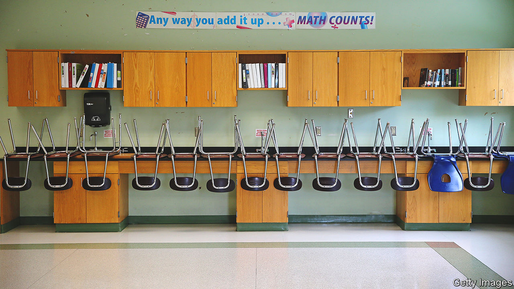

###### Closing down schools in America

# America’s schools are heading for a crunch 

##### Enrolment is declining; budgets will follow 

 

> Mar 9th 2023 

AT A MEETING earlier this year, board members in Seattle’s biggest public-school district were treated to a grisly chart. Over five years the number of full-time staff on the district’s payroll has drifted upwards, even as the number of pupils on its books has fallen. In September teachers won a pay rise following a strike that delayed the new school year. But enrolment could keep shrinking for a decade, reckon district leaders, who warn of budgetary black holes. Threatened bankruptcy may eventually require “consolidating”, which may mean shutting down schools. 

 in urban schools across much of America. As a result of rock-bottom fertility rates and lower-than-usual levels of immigration, the total number of children in the country declined by 1m in the ten years to 2020. Many big cities have an added problem: families have been leaving. Chicago’s main public school district has lost a fifth of its pupils in a decade (though some of these have decamped to charter and private schools). Los Angeles has lost a quarter. District leaders in that city say numbers could fall a further quarter or so by 2030.

The pandemic speeded up these woes. Parents who already had itchy feet found that a plague made their cities less appealing. Urban schools kept  longer than others; that gave some families extra reason to leave. Enrolment in New York City’s public schools has fallen by 10% in the three years since the disaster started; in a few of its neighbourhoods the decline is almost a fifth. Families with children under five were especially likely to leave big cities during the pandemic, suggest data from the Census Bureau. So the full impact may not yet have registered.

Class divides

School districts are generally funded on a per-pupil basis. Even small declines in enrolment may therefore be hard. Some of the children who left city schools during the pandemic may end up returning to class: a proportion are home-schooling, and may tire of that. But the other trends that have been thinning downtown classrooms will probably not reverse soon, even if immigration starts nudging the number of children in America back up. In some cities the need to close schools is growing. About 1% of traditional public schools shut up shop each year, says Douglas Harris of Tulane University (the closure rate is 5% for charter schools and 3% for private ones). The number will probably rise.

Recent battles suggest that this is going to hurt. Protests, including a hunger strike, broke out last year after school-board members in Oakland, California, voted to close or merge several schools. Angry locals installed a new board; in January it said it was cancelling many of the cuts. In Chicago about one-third of schools are operating in buildings at only half-capacity, or less, according to local government data analysed by “Wirepoints”, a blog. The smallest has around 30 youngsters and a little over 20 staff.

The patchwork way in which American schooling is governed—by board members in some 14,000 districts—may make it more difficult than in other countries for schools in large metro areas to shrink effectively. America’s teaching unions are unusually tetchy: their hostility towards testing has sometimes prompted boards to declare, gallingly, that a school’s results will play no role in deciding which ones will close or merge. Tensions about race make things more complicated. Families in inner cities sometimes suspect that their schools have been earmarked for closure only because parents in richer, whiter areas have more power to make a fuss.

Dragging feet rarely helps. Smaller classes do not reliably boost results. Excellent teachers are more important; training and rewarding good ones is easiest if they are not thinly spread. Smaller schools also find it more difficult to provide all the courses and extra-curricular activities that American education ought to offer. Leaders of good school systems elsewhere in the world have sometimes been ruthless about closing small institutions. In 20 years the number of comprehensive schools in Finland, for example, has shrunk by about 40%.

Planning ahead would save trouble. When New York City closed schools ten years ago it found enough time and money to shut some of them slowly, grade by grade. That gave youngsters who did not want to move the option to age out. Authorities in Chicago have given teachers who seem likely to lose their jobs an early chance to retrain for roles in high demand. But too often talk of shuttering schools starts only when things are desperate, says Paul Hill of the Centre on Reinventing Public Education, a think-tank. That forfeits the chance to close schools “respectfully and transparently”. Instead, doing things in a rush just makes district leaders look “as if they are stealing something”.

The worry is that few urban school districts are taking their problems seriously enough, says Marguerite Roza, a school-finance expert at Georgetown University. Since the start of the pandemic they have been handed lots of federal relief money. Some have used this merely to delay decisions about downsizing that were already overdue. The extra cash that is sloshing around has also made unions more likely to demand pay rises and bonuses—even in places where drops in enrolment have been sharp. A cliff edge approaches next year, when relief funds are set to expire. At the moment, it seems the rows that follow will be about everything except how best to help children learn. ■


