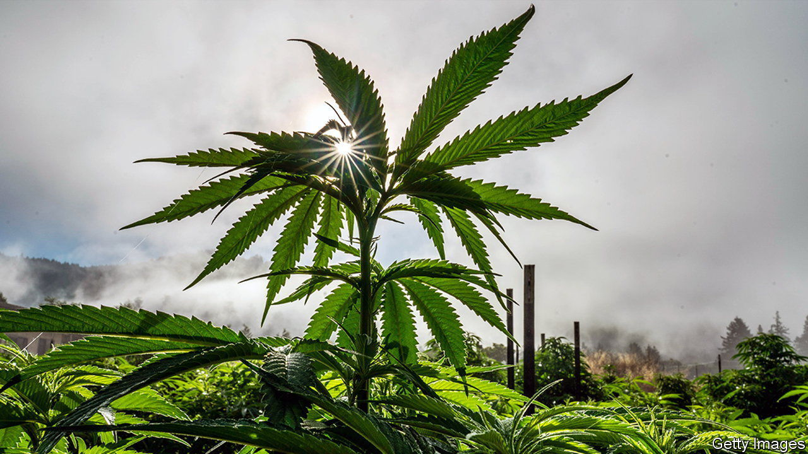

###### O beautiful for spacious highs

# Cannabis and anaesthesia do not mix 

##### As more Americans get high, medical drawbacks of marijuana come to the fore 

 

> Mar 9th 2023 

Waking up in the middle of a surgery is the stuff of nightmares. Your eyes squint open as a surgeon digs her scalpel into your abdomen. The operating team becomes frantic; an anaesthesiologist rushes to administer a stronger dose. Though some such horror stories have made headlines, thanks to modern medicine that kind of situation is exceedingly rare. But the risk of it happening may be rising and anaesthesiologists are taking note. The culprit is not an invasion of evil doctors or a bad batch of drugs, but the rise in Americans’ casual use of a substance that many think is harmless: marijuana. 

A study published in 2019 found that patients who used marijuana on a daily or weekly basis needed up to three times the typical anaesthesia dose to stay under while they were in the operating theatre. Smoking weed before surgery can make patients confused, irritable and sometimes even violent when they wake up. But the problems do not end there. A working paper presented in October, which has yet to be peer-reviewed, suggests that weed can hinder recovery, too. Of the nearly 35,000 Cleveland Clinic patients assessed, those who used marijuana within 30 days of their operation experienced 14% more pain in the day after surgery and took 7% more prescription opioids to ease it. Why this might be is, like anaesthesia itself, something of a mystery.

The problem is magnified by a growing number of Americans getting high. This past November Maryland and Missouri joined 19 states and Washington, DC, in legalising recreational marijuana. New York recently awarded its ; in January Connecticut stores got the green light to start selling it. The share of Americans who report smoking weed jumped from 7% in 2013—the year before legal sales began in Colorado, the pioneering state—to 16% in 2022. That spike is at least partly driven by the change in laws: a study of twins living in different states found that legalisation led to a 20% uptick in use. 

Meanwhile federal regulation remains tight, making marijuana hard to study. The Controlled Substances Act of 1970 classified weed as a Schedule One drug, just like heroin. Back then it was deemed to have a “high potential for abuse” and no established medical use. Studies from around the world have since shown that marijuana can relieve chronic pain, dull chemotherapy-induced nausea and help treat epilepsy. Even though in 2019 the World Health Organisation recommended rejigging the categorisation, in America this has not been done. That makes it tricky to conduct clinical trials. Labs must be fitted out with elaborate safety equipment for the Drug Enforcement Administration to give its stamp of approval and funding is scarce. As more and more Americans light up joints, other grim side-effects could be lurking.

To clinicians, the downsides for surgery are clear enough to justify changing medical protocols—even before more studies come in. In January the American Society of Regional Anaesthesia and Pain Medicine released guidelines on how to screen patients for marijuana use before surgery. Pregnant women should be discouraged from smoking weed, the organisation said, and non-emergency surgeries should be postponed by at least two hours if the patient comes in blitzed. A slew of other new reports warn anaesthesiologists of the mounting risks.

The common perception that marijuana eases nerves works against doctors. Some people seem to be getting stoned before they arrive at the hospital in order to calm themselves down. New users may be particularly likely to smoke for such a purpose. For a better experience, patients should forgo the parking-lot hit.  readers will now know better. ■


