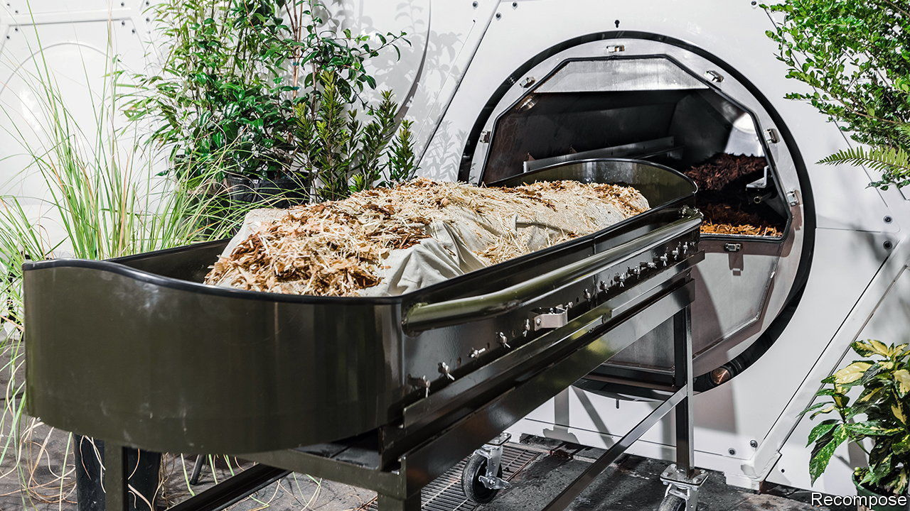
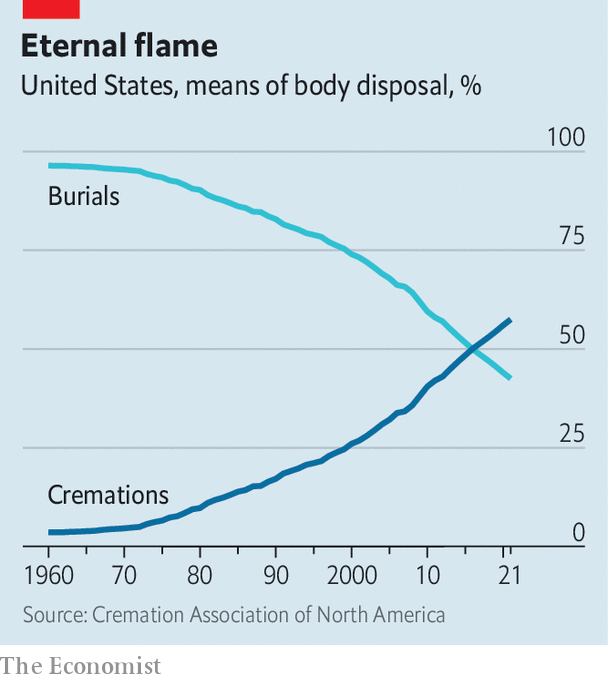

###### Composting humans

# Quite a few young Americans plan to end their days as compost 

##### A new spin on resting in peace 

 

> Mar 9th 2023 

As a 30-year-old architecture student in 2013, Katrina Spade began pondering her mortality. Specifically, what would happen to her body after she died. Ms Spade, who was enrolled at the University of Massachusetts Amherst at the time, was in the minority: only about a fifth of Americans plan their own funerals. Traditional burial, which 44% of Americans choose, didn’t feel right for her, and nor did cremation, which has become the more popular option (see chart). Neither did a “natural burial” which, although pleasingly green, would probably have required her to be laid to rest outside her home city due to lack of space: New York City, for example, banned burials in Manhattan south of 86th Street in 1851. She grew increasingly nonplussed that “there was no urban ecological death-care option” available.

 


Then the brainwave came. If farmers could turn whole cows into compost, why not the same with humans? A decade on from presenting the idea in her master’s thesis, Ms Spade now runs Recompose, a “human-composting” facility in Seattle. For many, it’s a difficult idea to chew over. A body is placed in a vessel alongside woodchips, straw, and alfalfa, which together create a warm atmosphere of carbon, nitrogen, oxygen and moisture. It is then left for up to twelve weeks, during which microbes help break it down. It may all sound rather grisly, but the process ends with a small mound of soil, which is then given back to the families and can be used to plant trees or nurture plants. Later this month, New York will become the sixth state to allow it. 

The idea is not without its detractors. For religious groups with strict burial customs it goes against core teachings. Edward Mechmann, the director of public policy for the Archdiocese of New York, argues that the Catholic church’s belief in the “unity of body and soul” renders the process disrespectful, a “violation of dignity”. The state’s Catholic Conference laments that “human bodies are not household waste”, saying composting “is more appropriate for vegetable trimmings and eggshells”.

The environmental benefits are clear, though. Every year, burials in cemeteries across the country require vast quantities of steel and concrete to reinforce graves, as well as millions of litres of embalming fluid, which seep harmful chemicals into the ground. Meanwhile, cremating one corpse emits the carbon-dioxide equivalent of driving about 750 kilometres in a car. 

Human composting, on the other hand, is thoroughly green. There are bills that would legalise it currently being considered in five states, including Nevada, Minnesota and Connecticut. Recompose has several thousand people from across the country on its waiting list, a quarter of them under the age of 49. While many remain instinctively repulsed by the idea, the human-composting industry would appear to be growing in fertile soil. 


