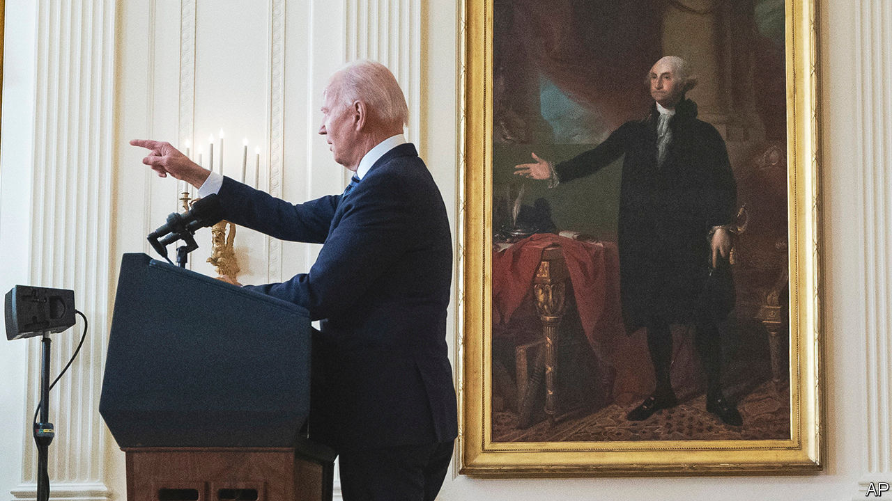
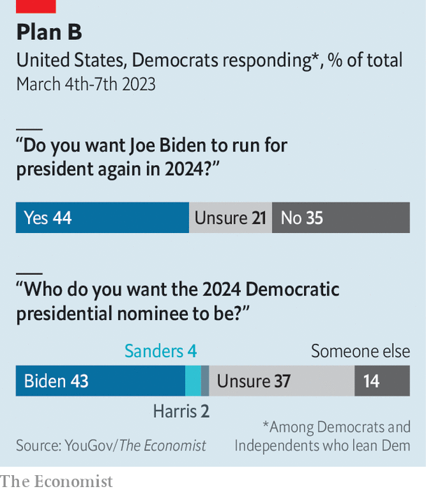

###### Say it ain’t Joe

# What if Joe Biden decided against running for re-election? 

##### The Democratic bench has plenty of talent 

 

> Mar 9th 2023 

PRESIDENT JOE BIDEN is literally living history. With every passing day he sets a new record for —the sole octogenarian ever to occupy the Oval Office. When he began his campaign to unseat Donald Trump, Mr Biden intimated that he would not seek a second term, presenting himself as an elder statesman who would calm the nation’s turbulent politics before a younger generation took over. And yet he is now giving every sign that he intends to stay in office for six more years, by . 

It is not as though his age doesn’t show. The president stammers through his speeches, sequesters himself from the press and recently had a minor health scare in the form of a cancerous skin lesion. So why doesn’t Joe want to go?

The proximate cause was the midterm elections, which did not go  as Mr Biden’s lacklustre approval ratings suggested they might. That halted the sense, once well-established among Democrats, that he was leading the party to disaster and the likely re-election of Mr Trump in 2024. Most insurrectionist chatter of pushing the president out before he wanted to go was quelled. The exception is the declared challenge from Marianne Williamson, a quackish self-help guru who thinks the Avatar movies hold the secret to Middle East peace. 

The unexpectedly light rebuke by voters—who only narrowly awarded Republicans the House of Representatives and even granted Democrats an extra seat in the Senate—gave the administration scope to . The president had steered the country out of the pandemic, passed the largest climate-change-mitigation bill in history, repaired international alliances and led the West in supporting Ukraine. A younger president with a similar record would have an unquestioned right to seek re-election.

But the other impulse that might keep the Democratic ticket unchanged is an extreme kind of risk aversion. The party is terrified of Mr Trump’s return to the White House and the damage that would do. Mr Biden owes his current position to a similarly pragmatic calculation: when the party risked nominating the ultra-progressive Bernie Sanders in 2020, support consolidated around Mr Biden as the only viable option for winning. 

This time, too, many Democrats fear that an open primary could be disastrous. Kamala Harris, the vice-president, has developed a reputation for bungling issues assigned to her, like deterring migration at the southern border. Her approval rating among the public is even lower than the president’s. Her gaffes rival her boss’s, but without the available excuse of old age. Yet plenty of donors and perhaps enough voters would find the prospect of passing over the country’s first female vice-president off-putting. The memory of Hillary Clinton’s loss still haunts the party. 

Despite her weaknesses, hardly anyone in Washington expects Mr Biden to choose a different running mate. The vice-presidential survival sweepstakes are a quadrennial parlour game, but the last president to actually go through with it was Franklin Roosevelt in 1944.

 


Mr Biden himself sees it as his mission to defeat Trumpism. “Donald Trump and the MAGA Republicans represent an extremism that threatens the foundations of our republic,” he said in a severe speech delivered in Philadelphia last year. In 2020 Mr Biden promised to beat Mr Trump “like a drum”; he thinks he can deliver another thumping in 2024.

But although Mr Biden’s credentials as a Trump-beater are impeccable, the calculations in a match against a Republican alternative are less compelling. The president’s approval ratings remain underwhelming, barely better than Mr Trump’s at this point in his presidency. Recent polling from YouGov shows that only 44% of Democrats are keen for Mr Biden to run again. (Other polls show even less enthusiasm.) Most are unsure who they would rather have to replace him, though. Only 2% say they would like to see Ms Harris at the top of the ticket.

Make way while the sun shines

Democrats are probably right to think that widespread antipathy towards Mr Trump, who has alienated much of the donor class of his own party, would paper over some of Mr Biden’s vulnerabilities. But the contrast with Ron DeSantis, the 44-year-old Republican governor of Florida who is closer in age to some of the president’s grandchildren, would be particularly extreme. And highly visible: unlike the campaign of 2020, which was largely conducted in lockdown, the coming race will require strenuous campaigning. 

There is precedent for a president reneging on a re-election pledge, but it is not a happy one. In 1968, after a disappointing show in the New Hampshire primaries, Lyndon Johnson dropped his campaign for another term just eight months before the presidential election—which his party subsequently lost to Richard Nixon. Still, an open primary might not be as catastrophic as some Democrats fear. 

When evaluating a party’s presidential bench, conventional wisdom tends to focus on those who campaigned in the previous election. Most of those also-ran Democrats—such as Pete Buttigieg, now transportation secretary, and Elizabeth Warren, a Massachusetts senator—do not inspire much confidence as contenders. Ms Harris’s standing is so dismal that she would not freeze the field as Mrs Clinton did in 2016. That leaves room for alternatives.

As Democrats have moved away from the progressive stances that were voguish in 2020 and back towards the centre, a crop of state governors, who tend to be more pragmatic than senators, appear more compelling. Rather than opting for progressives like Gavin Newsom in California or J.B. Pritzker in Illinois—both of whom have been unsubtly signalling that they are keen to run for president—Democrats could plump for Gretchen Whitmer, who just won handy re-election in an important Midwestern swing state, Michigan. The newly elected governors of Pennsylvania and Maryland, Josh Shapiro and Wes Moore, are both gifted speakers. Jared Polis, the freethinking governor of Colorado, is an effective tactician. 

Then there are governors, like Andy Beshear in Kentucky and John Bel Edwards in Louisiana, who have proved capable of winning in red states. And Gina Raimondo, who was governor of Rhode Island before becoming Mr Biden’s secretary of commerce, is arguably the most effective member of the current administration.

If a senator must be chosen, there are mild-mannered newcomers who might suit a general election better than a progressive bomb-thrower. Raphael Warnock is an African-American preacher who won the crucial swing state of Georgia twice in two years. Mark Kelly has done the same in Arizona—and would have the distinction of being the first astronaut president that schoolchildren dream of.

All may be capable, but none will challenge the president unless he excuses himself. Almost every modern president who has garnered a serious primary challenger as an incumbent—Johnson, Jimmy Carter, George Bush senior—has gone on to lose. And no Democrat wishes to be blamed for ensuring their party’s loss.

Mr Biden obsessively tries to study the examples of presidents past, and convenes councils of historians at the White House. He may do well to look back beyond the modern era, to the time when George Washington gave up power so that the business of democracy could properly flourish. After accomplishing the Herculean task of defeating Mr Trump, Mr Biden has already scored unexpected success. That is all a fitting coda; losing to a sprightlier Republican would be an undignified end for America’s eldest statesman. ■


