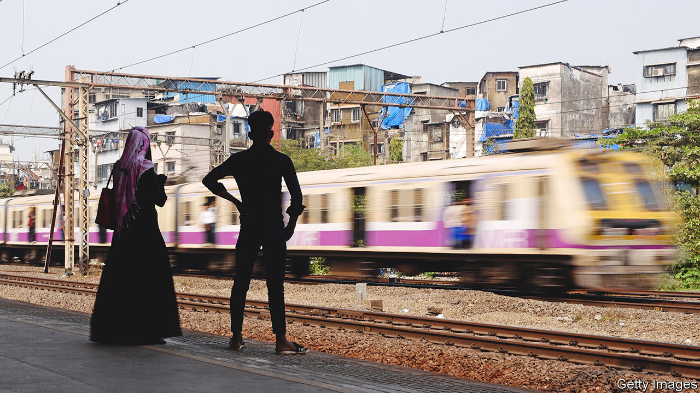
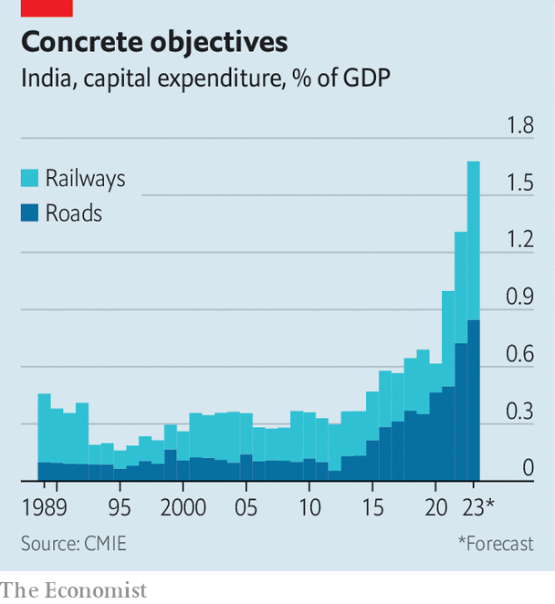
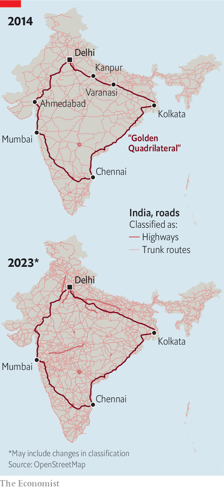
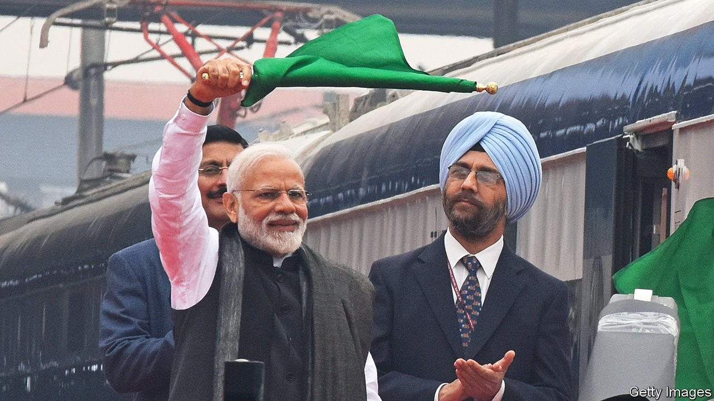

###### Transport infrastructure

# India is getting an eye-wateringly big transport upgrade 

##### Overhauling the country’s roads and railways will make it richer and much better-connected 

 

> Mar 13th 2023 

A sense of wonder filled the carriage as the Vande Bharat Express raced through the flatlands of Uttar Pradesh, bound from Varanasi to Delhi, at 130kph (81mph). That is a shade faster than the Northeast Regional ferries passengers between New York and Washington—and, by , revolutionary. The train covers its 759km route 130 minutes faster than the next-quickest service. “It’s so much more comfortable!” says M. Afzal, 42, a cloth dealer from Varanasi heading to Kanpur, an intermediate stop. “But the main thing is the saving of time.” 

That sentiment is becoming increasingly commonplace in India. Long known for its interminable, rattling train journeys, snarled roads and grotty airports, the country is experiencing an infrastructural makeover on a scale unprecedented outside China. It will transform Indians’ ability to travel, by rail, road and air; and thus to intermingle and do business. The government of Narendra Modi hopes it will remove one of the biggest constraints on the  that India desperately needs in order to meet the aspirations of its young, fast-growing population. 

 


The pace of the buildout is remarkable. The first indigenously designed and built Vande Bharat service was flagged off by Mr Modi in 2019. In the past six months the Hindu-nationalist prime minister, who loves a ribbon-cutting above all things, has inaugurated eight more, including two in Mumbai last month. His government promises to launch 500 more Vande Bharat services in the next three years; it also has ambitions to export the rapid new trains to other countries. A genuinely high-speed line—with top speeds greater than that of America’s Acela service—is meanwhile being built, with Japanese help, between the financial capital of Mumbai and Ahmedabad, in the western state of Gujarat. It will cut travel time between the two economic hubs to two hours from six.

Two new “freight corridors”, between Mumbai and Delhi and between Punjab and West Bengal, are semi-operational and scheduled to be finished by next year. Another four are on the cards. Their electrified tracks will allow goods to be moved on double-stacked 1km-long trains at speeds of up to 70kph—up from a painful 25kph today. The railways’ share of freight traffic has declined in the decade to 2022, even as the overall goods volume has increased. The government hopes its new corridors will boost railway freight from 27% to 45% by 2030. That would mitigate the country’s greenhouse-gas emissions as well as its reliance on imported fuel. By decongesting existing lines, the corridors should also allow passenger trains to move faster.

India is at the same time adding 10,000km of highway a year. The length of the rural road network has increased from 381,000km in 2014, when Mr Modi was elected, to 729,000km this year. Over the same period the number of Indian airports has doubled. The prime minister opened an airport in the southern state of Karnataka last month; on March 12th he inaugurated a new highway in the same state.

Mr Modi, backed by state-level leaders of his Bharatiya Janata Party (BJP), has pushed new infrastructure across the board. India’s electricity-generation capacity has grown by 22% and renewable-energy capacity has nearly doubled in the five years to 2022. Broadband connections have jumped from 61m before Mr Modi took over to 816m last year. A mobile-based payment system launched in 2016 accounts for over half of digital transactions. 

Yet the infrastructure push is mainly focused on transport, which the Modi administration considers the key to India’s past failings and its likeliest guarantor of future success. It trusts new roads and railways will help fulfil its ambition to turn India into a $5trn economy by 2025-26—up from $3.5trn today.

To that end, India will spend 1.7% of GDP on transport infrastructure this year, around twice the level in America and most European countries. If such infrastructure were a central-government department, it would have the third-biggest budget after the finance and defence ministries. The stated aim of the splurge is to cut the cost of logistics within India from around 14% of GDP today to 8% by 2030. It should also, the BJP hopes, help Mr Modi win a third term next year.

The makeover is everywhere stamped with his imprimatur. Mr Modi conducts progress reviews with the rail, roads and other relevant departments every month. His bearded image, underlined with triumphalist bjp slogans, gazes munificently down over construction sites across the country. bjp propagandists present the prime minister as a results-driven leader building India into an or, loosely translated, “golden age”.

The infrastructure bonanza has clearly accelerated on his watch. The 50,000km of national highway India has added in the past eight years is twice as much as it managed in the previous eight. The number of airports with civilian flights has grown from 74 in 2014 to 148 this year. Domestic passenger numbers have duly risen from 60m in 2013 to a peak of 141m in 2019, before the pandemic hit. The aviation minister reckons total passenger numbers could soon be double their pre-pandemic highs, rising to 400m in the next ten years. (Last month Air India, the recently privatised flag-carrier, placed an order worth $70bn for 470 new aircraft from Boeing and Airbus, with an option to buy another 370.)

 


How has Mr Modi achieved this lift-off? One answer, rarely heard among his admirers, is that he inherited a solid platform from his two immediate predecessors. India’s major road-building drive was initiated by Atal Behari Vajpayee, a BJP prime minister from 1998 to 2004. His marquee project, the “Golden Quadrilateral”, connected the country’s four biggest cities, Chennai, Delhi, Kolkata and Mumbai. He also launched a rural roads programme. His successor, Manmohan Singh of the Congress party, continued those efforts and initiated new projects, including the freight corridors. He also handed more power to the roads ministry, which removed some of the bureaucratic barriers to decision-making.

Mr Modi has doubled down, however, largely by throwing money at the effort. In the financial year starting in April, road and rail will account for nearly 11% of central-government capital spending, up from 2.75% in 2014-15. He deserves credit, too, for putting capable lieutenants in charge of the buildout, such as Nitin Gadkari, the admired roads minister. Instead of endlessly butting heads with the progress-throttling bureaucracy, Mr Modi has also taken selective steps to empower it. In his first review with the roads ministry he more than doubled the amount that civil servants could spend without seeking approval from the treasury. Having run Gujarat for over 12 years, he brought to Delhi a chief minister’s penchant for getting stuck into the nitty-gritty of project delivery.

Co-ordinating the revamp is no small task. Roads are being built by a couple of central-government ministries, by India’s 28 state governments and by cities. Railways, aviation and ports all fall under different ministries. Land acquisition is tied to cadastral surveys, which are administered by states. Yet improving technology is helping to corral these efforts. In 2021 Mr Modi’s government introduced an ambitious data-sharing plan across 16 ministries. The aim is to reduce waste and make the best use of resources, such as by creating and providing high-quality digital maps with dozens of layers of data. That should help make the design of India’s emerging transport network as growth-boosting as possible—by connecting ports, airports and industrial clusters to appropriate roads and railways, for example. 

 


Though the new infrastructure is mostly too new for its effects to have been studied, they are likely to be positive. A seminal paper published in 2018 by Dave Donaldson of the Massachusetts Institute of Technology evaluated the economic impact of the 67,247km railway network built on the subcontinent by the British between 1853 and 1930. It found that it “reduced the cost of trading, reduced inter-regional price gaps, and increased trade volumes”. Though most of those gains went to the colonial administration, and thence to London, the railways also boosted agricultural incomes in the rural districts they passed through. The railways, Mr Donaldson writes, were responsible for “bringing them out of near-autarky and connecting them with the rest of India and the world”. Mr Modi can reasonably expect his infrastructure splurge to have a more advanced version of the same effect. 

Studies of a more recent development, the Golden Quadrilateral, suggest the road network boosted economic activity, reduced transport costs, increased gains from trade and drove up wages, especially for skilled workers. The rural-roads programme has been shown to help move workers from agriculture to more productive jobs. By making that transition appear more feasible, it also inspired improvements in educational attainment in nearby villages. Yet the patchiness of India’s infrastructure meant that such positive effects have been too few and unevenly felt. The Golden Quadrilateral connected India’s existing economic hubs; the condition of many rural roads remained poor.

Temples in concrete

The contrast with China is striking. In the late 1990s that country set out to connect every city with a population greater than 500,000. Had Vajpayee done something similar, India would have seen more broad-based growth across rich and poor parts of the country (though at much greater cost), according to research by Simon Alder, then at the University of North Carolina. Mr Modi is intent on making good. By enmeshing India in a high-quality transport (and digital and energy) network, his government aims to develop its domestic market, increase connectivity to the outside world, and spread prosperity.

Roadblocks remain. The biggest is land acquisition, which acts as a brake on building anything in India. Its billion-plus citizens have rights and its courts move slowly. Enforcing contracts is tricky in a country where higher courts have 6m pending cases and lower ones face a backlog of 42.6m. Outdated land records and squabbles over title make their task even harder. Obtaining environmental clearances is another headache. Such factors load projects with risks of delay and cost overrun, dissuading private firms from bidding for contracts. The government continues to experiment with the design of contracts but critics say it could do more to attract a wider range of investors.

Indeed, the rapid expansion of infrastructure has not spurred the increase in private investment in the economy at large that many had hoped for. It soared in the decade before Mr Modi came to power, but has since remained subdued in the face of bjp policy missteps such as the demonetisation of large-denomination banknotes in 2016 and the messy rollout of a national goods and services tax.

The covid-19 pandemic did further damage to business confidence. Private investment in 2019-20 was only 22% of gdp, down from 31% in 2010-11. Nirmala Sitharaman, the finance minister, recently beseeched Indian businesses to explain their hesitation to pile in: “I want to hear from India Inc: what’s stopping you when countries and industries abroad think this is the place to be now?” Mr Modi echoed her this month, by calling on private companies to “increase their investment just like the government”.

What is dissuading them? Beyond the disincentives listed above, the rising cost of capital and uncertainty over demand are making investors wary. Businesspeople whisper other reasons for caution. Mr Modi’s government can be capricious. Its use of tax authorities to go after political foes has weakened faith in their impartiality. Regulators’ independence can no longer be taken for granted, mutters an investor.

Mr Modi’s faith in the transformative power of new transport infrastructure is well judged. It is a precondition for the high growth that India—including above all its millions of poor and emerging middle-class citizens—seriously needs. But without additional reforms, even the prime minister’s impressive new ports, roads and railways will not be enough. ■

