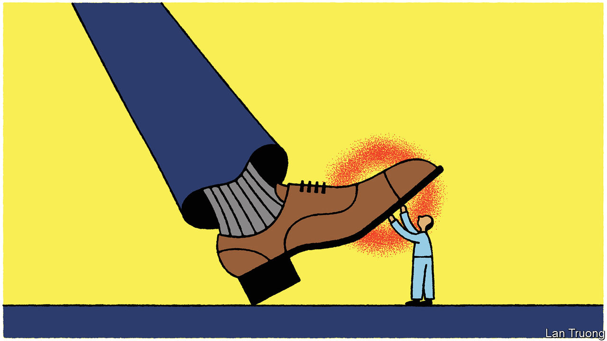

###### Banyan

# Micronesia takes on China 

##### The Pacific’s small states can pick a way through great-power pressures 

 

> Mar 16th 2023 

FOR THE annals of great-power competition in the Pacific, the letter from David Panuelo that leaked on March 10th is a keeper. Addressing his country’s Congress and state governors, Micronesia’s outgoing president describes in engrossing detail Chinese efforts to bully and bribe politicians into toeing a pro-China line. Mr Panuelo accuses China of waging “political warfare” against his country. To mitigate the damage this is doing, he recommends Micronesia switch diplomatic recognition to Taiwan. He claims to have secured a promise of $50m from Taiwan, plus annual payments of $15m, to plug the fiscal hole that shunning China would create.

China’s shameless methods for holding sway among small Pacific island states are no secret. Yet the level of detail Mr Panuelo provides is remarkable—and surely deeply embarrassing for China. “We are bribed to be complicit, and bribed to be silent,” he writes. He describes Chinese envelopes of cash and offers of trips by private plane to curry favour among politicians and administrators who “advance their personal interest in lieu of the national interest”. In another instance, the Chinese ambassador to Micronesia pushed the covid-19 vaccines at the heart of China’s recent global propaganda campaigns so incessantly that the president had to change his mobile-phone number.

When gifts do not work, warnings are issued. Mr Panuelo claims to have received “direct threats against my personal safety” from Chinese officials. While attending a Pacific Islands Forum meeting in Fiji, he says he was followed by two men from the Chinese embassy. 

China, prickly over perceived slights, even from a nation of just 113,000, called the letter “smears and accusations”. But it will struggle to dismiss it. Mr Panuelo has consistently warned of the risks when engaging with China. He published another letter to Pacific island leaders last May, urging them to resist China’s pressure to join a “common development vision” that would amount to a new geopolitical bloc. They duly rejected it.

Mr Panuelo’s latest insight is how much China’s political warfare has to do with Taiwan, which the government in Beijing has an avowed readiness to invade. Micronesia, along with the neighbouring Marshall Islands and Palau, all north of the Equator, would be closer to a conflict over Taiwan than the more numerous Pacific states south of it. It is also close to Guam, a key logistical base for American armed forces in the Western Pacific. To prepare for the possibility of war, Mr Panuelo says, China wants Micronesia to align itself with China against America.

That would imply a dramatic loss of sovereignty. Indeed, a loss of agency is the predicted fate for tiny Pacific states in the face of a great-power struggle between America (and its friends, such as Australia) and China. Yet Mr Panuelo’s response suggests that is far from inevitable.

His defiance of China and his public musing about a switch to Taiwan suggest that on some issues Micronesia has a strong hand. China and Taiwan are, after all, in a fierce contest over diplomatic recognition—on March 14th Honduras switched allegiance from Taiwan. As Graeme Smith of the Australian National University in Canberra puts it: “If you’re small enough, Taiwan can still be an attractive option. Now it really is as simple as ‘Give me so many million dollars, and I’m your friend’”. Micronesia needs development goodies, not least to help keep Chuuk, a restive island-state, from breaking away. Even if Micronesia does not switch, China might have to dip deeper into its pocket to keep it on-side.

Meg Keen at the Lowy Institute, a think-tank in Sydney, points out that “geopolitical competition can give small states power”. That power is evident in the “compacts of free association” that the Marshall Islands, Micronesia and Palau have renegotiated with America, which has long underwritten their security and provided financial aid. All three countries have obtained increasingly generous terms from the superpower, reflecting its desire to hold them close.

Elsewhere, Fiji’s incoming prime minister recently dropped a controversial deal for Chinese security forces to train the country’s police, preferring to work with Australia, his country’s traditional security partner. All across the Pacific, great-power competition means much more development and many more financial choices; countries can pick carefully among them. The Pacific’s tiny nations would rather great-power rivalry did not suffuse their region. But they are not mere hapless victims of it.■


