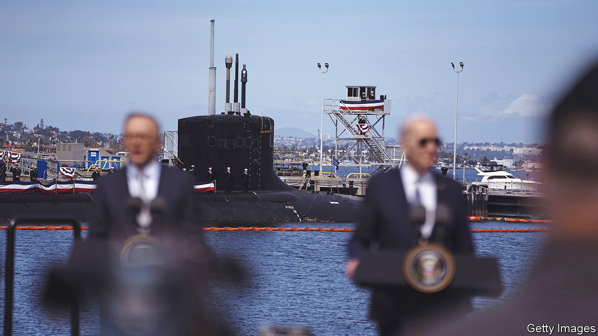
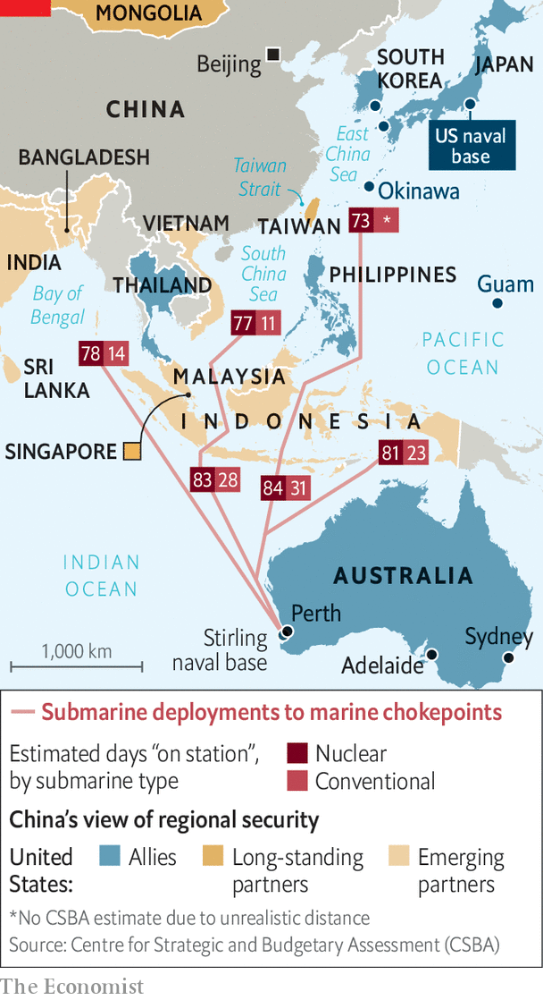

###### Great AUKUS

# The Anglophone military alliance in Asia is seriously ambitious 

##### America, Australia and Britain will build and man each other’s nuclear subs in Asia 

 

> Mar 13th 2023 

IN 1908 the second , an American battleship, sailed from San Francisco to Sydney as part of the so-called Great White Fleet’s tour of Asia and circumnavigation of the world. Her successor, the third , hosted Japan’s surrender in 1945. On March 13th the fourth , a Virginia-class attack submarine, lived up to this illustrious lineage by etching her own name in the history of  in the Pacific. 

On a warm afternoon in San Diego, Joe Biden, Anthony Albanese and Rishi Sunak, leaders of America, Australia and Britain, gathered in front of the  and revealed the next chapter of the  signed by their countries 18 months ago. It will intensify American and British involvement in the Pacific and bind the three allies together in unprecedented ways, into the 2040s and beyond. 

 


This saga began in 2016 when Australia agreed to a $33bn-deal to replace its ageing Collins-class attack submarines with a dozen French diesel-electric boats. In 2021, increasingly mindful of the threat from China, it ended that deal and signed AUKUS with great fanfare. Under its terms, America and Britain would help Australia build a fleet of at least eight nuclear-powered (but not nuclear-armed) submarines. These have far greater range, endurance and stealth than electric boats (see map). They are also far more complex. Only six countries have them and America has previously shared the technology only with Britain.

Mr Biden, Mr Albanese and Mr Sunak revealed that Australia and Britain plan to co-produce the new boat by building on a design for Britain’s future attack sub, known as an SSN(R). (An SSN is an attack submarine which carries conventional weapons and hunts other subs and ships, as opposed to an SSBN, which carries nuclear-armed ballistic missiles). Britain will build the first boats at Barrow in north-west England. Australia will learn from the prototypes, then build its own in Adelaide. The idea is to create an economy of scale, with Australian investment boosting British shipbuilding and a larger aggregate order lowering the cost to both countries.

American technology will suffuse this new “SSN-AUKUS”. America will provide its vertical-launching system, a set of tubes that can hold a greater number of missiles, and more advanced ones, than traditional torpedo tubes. No British attack submarine has had this capability. The defence industries of all three countries will be entangled to an unprecedented degree. Subsystems like communications gear, sonar and fire control should be compatible between the Anglo-Australian boat and the next American one. “We’ll almost be one joint nuclear submarine force,” says one official involved in the pact. It will be a “beautiful, blended submarine” gushes another.

But, like that of whisky, the production of high-end subs is measured in double-digit years. Australia’s current boats are around 30 years old and must be retired by the early 2030s. The first SSN-AUKUS will not be in Australia’s hands until the early 2040s. It takes at least 15 years to produce a submarine commanding officer in America’s navy, says Tom Shugart, who reached that position himself—partly because of the complexity of training officers in how to use and maintain nuclear propulsion systems. China’s navy, the largest in the world, already looks dangerous. To bridge the gap, the three leaders announced two further path-breaking steps.

First, as early as 2027, America and Britain will deploy their own subs to the Pacific in a scheme that some officials are calling “enhanced rotational presence”, a deliberate nod to NATO’s “enhanced forward presence” of armoured battle groups in eastern Europe. America typically has between two and four attack subs in Asia at any time, according to one official. Under the new set-up, it will rotate up to four Virginia-class subs to hmas Stirling near Perth—a big and relatively conspicuous step that will require ending a policy of near-total secrecy about sub deployment. Britain intends to rotate one of its own Astute class subs, out of a planned fleet of only seven. Australian sailors have already started embedding in American and British subs.

Second, in the early 2030s, assuming Congress approves, Australia will buy three Virginia-class submarines from America at a discounted rate, with the option of two more, as an interim boat to use until ssn-aukus turns up. That America agreed to this is surprising. Renting out a nuclear sub is vanishingly rare: only Russia has ever done it, to India. Australia has struggled to crew its current subs, which take fewer than 60 people; the Virginia-class needs 140 or so. More important, America’s navy is struggling to acquire enough Virginia-class subs for itself as it races to close the gap with China. Australia is therefore expected to invest billions of dollars and thousands of workers in American shipyards. Even so, many in Congress may be unhappy with the diversion of hulls. And America’s lawmakers may need to amend the International Traffic in Arms Regulations regime, which imposes strict limits on high-tech exports even to allies.

The risks are manifold. The project will need to endure at least three American presidential terms beyond Mr Biden’s current one and more than three British elections—a stiff test, even though it has bipartisan support in all three countries. The cost to Australia could be $180bn-245bn over 32 years, according to early estimates. For Australia to produce the necessary skilled labour and nuclear expertise will be hard. “This is potentially a 100-year endeavour,” observed Peter Malinauskas, the premier of South Australia, of which Adelaide is the capital, on March 10th.

But the pay-off would be high. For Britain, the benefit is not just a shot in the arm for a submarine industry that has struggled with stop-start construction. It also gives real substance to the government’s wished-for “tilt” to the Indo-Pacific. Critics had questioned the wisdom of emphasising naval power in Asia while a land war raged in Europe; Mr Sunak has doubled down. On March 10th he agreed with Emmanuel Macron, France’s president, that the two countries would establish “the backbone to a permanent European maritime presence in the Indo-Pacific” by co-ordinating deployments of their aircraft-carriers. On March 13th Mr Sunak’s government published a  of foreign policy which emphasised the “epoch-defining” challenge of China. The decision to rotate subs through Asia and co-build new ones with an Asian ally gives the tilt an additional long-term anchor. 

I’d like to be, under the sea

For America, aukus and the related agreements are the latest and most dramatic step in its steady consolidation of Asian alliances. It is readying to sell hundreds of cruise missiles to Japan and in January agreed to upgrade a marine regiment in Okinawa. In February it secured access to four extra bases in the Philippines. AUKUS also includes a second “pillar” of collaboration on advanced technologies, such as artificial intelligence, quantum systems and hypersonic missiles. And it is part of a wider boom in US-Australian defence ties. 

America has invested huge sums in Australia: in building up stockpiles of fuel and ammunition, and in expanding airfields to allow long-range bombers to operate from the north of the country, out of the range of most Chinese missiles. Australian investment in naval bases around Perth to support the rotational deployments of American and British subs will make it easier for the boats to be maintained, repaired and replenished without having to slog back to Guam or Hawaii, enabling a higher tempo of operations in peacetime and war.

The fact that AUKUS survived the transition from Australia’s centre-right Liberal party to Mr Albanese’s centre-left Labor party last year reflects the consensus now baked into Australian politics over the threat from China and the need for drastic measures to confront it. A defence review in 2020 concluded that the prospect of a major war was “less remote than in the past” and the government could no longer be assured of a ten-year warning of such a conflict. (A new defence review written by a former defence minister and military chief was submitted to the government in February, but has not yet been published.)

At present Australia cannot strike a target or protect an expeditionary force more than about 150km from its landmass, points out Ashley Townshend, an Australian expert at the Carnegie Endowment, a think-tank in Washington. The country’s new subs, he says, will give it “escalation options” in regional crises where Australian leaders might want to “deter or defeat” a Chinese military presence—say, in South-East Asia or in the southern Pacific. “This will be an Australian sovereign capability,” stressed Mr Albanese, “built by Australians, commanded by the Royal Australian Navy and sustained by Australian workers in Australian shipyards.”

But the scenario that weighs most heavily on American planners is a larger war over Taiwan. “aukus has one overriding objective,” declared Mr Biden, in front of the : “to enhance the stability of the Indo-Pacific amid rapidly shifting global dynamics.” A US-Australian pact in 2021 spelt out the purpose of all that investment in Australian facilities. It is intended “to support high-end warfighting and combined military operations in the region”. Eight additional subs’-worth of missiles prowling in the South and East China Seas would make it significantly harder for China to get an invasion force across the Taiwan Strait or to escalate elsewhere. 

That will add to deterrence. Equally significant, it has developed the Anglophone military alliance in Asia to a point of no return. Australia’s ports, bases and potentially submarines will increasingly feature in American war plans. That gives Australia influence and leverage over those plans, says Mr Townshend. It also constrains its options. “This is an extremely costly signal of our willingness to contribute to the collective deterrence of China. To back out of it would cause an unimaginable rift in the alliance—which is precisely why it will be taken seriously in Beijing.”■

