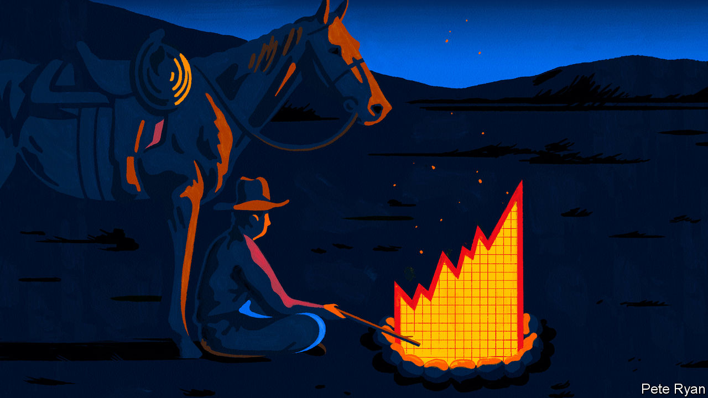
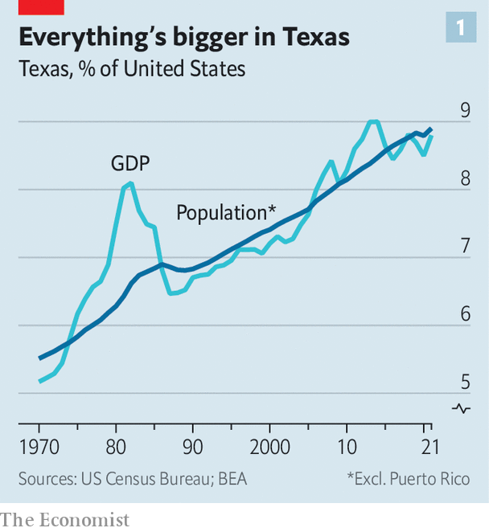
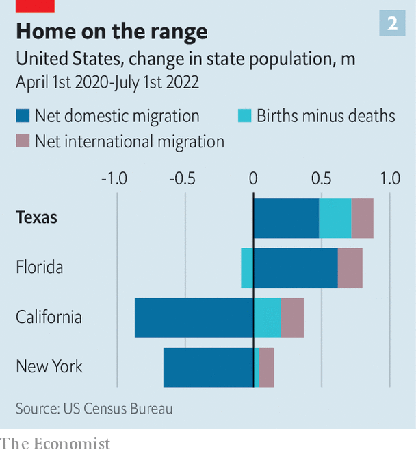
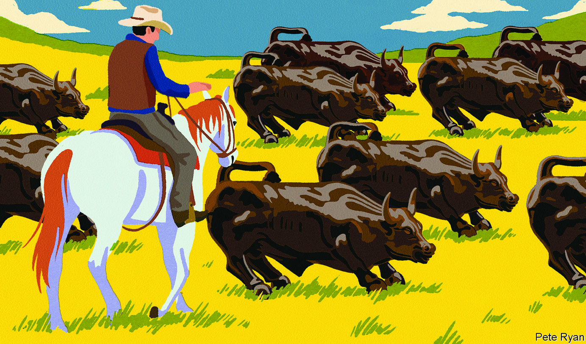

###### The lodestar state

# Texas’s latest boom is its biggest yet 

##### The state is sucking in people, companies and federal spending 

 

> Mar 16th 2023 

THIS APRIL will mark 45 years since “Dallas”, a hit soap opera, first aired. The show, with its greedy oilmen, sun-soaked cattle ranches and lilting drawls, introduced the Lone Star State to the world. But it’s not just the big hair and grainy resolution that make “Dallas” seem dated today. It is also the Dallas skyline.

The opening credits showed a cluster of midsized office buildings, within sight of the open prairie. Since these shots were filmed, the skyline has soared and the city has sprawled. There is no open country for miles around. Instead, Dallas and nearby Fort Worth have merged into a “metroplex” of about 7.8m people. From 2010 to 2021 the population of this conurbation grew by 22%—triple the national rate and the fastest pace among America’s biggest cities. Its economy grew by 46% over the same period. Dallas-Fort Worth is expected to overtake greater Chicago as the country’s third-largest metropolis in the mid-2030s. 

 


And it is not just the area around Dallas that is booming. The population of Texas as a whole grew by 18% from 2010 to 2021. The state’s economy grew by 39%, one and a half times faster than the national one (see chart 1). Employment has been growing even more quickly. From February 2020, just before covid-19 took hold, until the end of last year, Texas gained some 760,000 jobs, an astonishing 35% of the total net increase in employment across the whole of America.

Texas now has more than 30m people. Its GDP is $2trn—bigger than Canada’s. It would be the world’s ninth-biggest economy if it were independent (which it was for ten years in the 19th century). The state racked up $486bn in exports in 2022, almost a quarter of America’s total and more than Taiwan. And only about half of Texas’s exports are fossil fuels and chemicals; the state also makes parts for computers and aircraft and much else besides.

Two different buckets of possums

California still has more people than Texas, although, if current trends persist, Texas will eclipse it as the most populous state at some point in the 2040s. California’s economy is also huge and fast-growing. But whereas California has been losing residents to other states, Texas is sucking in ever more people from other parts of America, California included. “Texas is what California was in the 1950s and 1960s,” says Ken Miller, a professor at Claremont McKenna College in California: an affordable place where people move for jobs and advancement.

The Republicans who run Texas like to crow about these numbers. They consider their business-friendly, small-government conservatism an example for the rest of the country. “If Texas decides to go down a certain pathway, the rest of the United States will go down that pathway,” says Greg Abbott, the state’s governor since 2015, with the dauntless confidence of a politician on the verge of a run for president. But Texan Republicans have been departing from their own measured script recently, espousing radical positions of the sort that make businesses uneasy. And their devotion to parsimony has caused them to scrimp on investments that are important to the state’s future. In the long run, that may curb the growth they trumpet. 

Texas has had booms before, in cotton, cattle, timber, railroads and—several times—oil. But its current success is, in effect, four bonanzas at once. The economy is growing thanks to the people flooding into the state, to businesses relocating from other parts of the country, to the energy industry (both green and grubby) and to a swelling tide of federal handouts.

 


The first boom, in people, is remarkable by any standard. In the 12 months starting in July 2021 Texas added a net 471,000 residents, the most of any state. That is equivalent to 1,290 new Texans each day, or around 9,000 a week. Only a quarter of those came from natural increase (the difference between births and deaths). Another quarter were immigrants from abroad. But roughly half were arrivals from elsewhere in America (see chart 2). Texans, notes Pia Orrenius of the Dallas Federal Reserve Bank, are markedly less likely to move away from their home state than New Yorkers or Californians.

Texas has many attractions. The state government does not levy any income tax. The cost of living is 7.5% below the national average. A big part of that is housing, which is 15% cheaper than the national average. That makes the typical home in Texas 56% cheaper than the equivalent in California. The state generates jobs even faster than it attracts people: employment grew by 28% between 2010 and 2021. 

That is in part owing to the second boom, in companies, which are also stampeding into the state. From 2020 to February of this year, at least 139 firms moved their headquarters to Texas, according to YTexas, which tracks corporate relocations to the state. More than 40% of them came from California. Fifty-four of the 500 biggest companies in America by revenue call Texas home, more than any other state. Plenty of firms that are not based in Texas are expanding operations there, too. Goldman Sachs, an investment bank, is expecting its office in Dallas to become its second-largest, after the one in New York City.

Some footloose firms are looking for an easier place to do business. States in the north-east and on the West Coast tend to have slower permitting, heavier regulation and higher costs. Many kept businesses closed longer during the pandemic. “States that shut down were a great advertisement for Texas,” says Ross Perot junior, chairman of Hillwood, a property firm based in Dallas, and son of the former presidential candidate of the same name.

Small government is not Texas’s only draw, however. Another is its location at the centre of the United States, with excellent transport links to the rest of the Americas by road, rail, air and sea. McLaren, a sports-car company, moved its North American headquarters from Manhattan to Coppell, a suburb of Dallas, last year. Travel to big American and Latin American markets is easier, says Nicholas Brown, head of the firm’s operations in the Americas. Proximity to Dallas-Fort Worth airport, which was the second-busiest in the world in 2021, is also a plus. 

Mr Perot, who in expansive Texan fashion enjoys flying helicopters in his spare time, tries to explain Dallas’s appeal from the air. On the north-western outskirts of the metroplex is another, “industrial” airport, where cargo is shunted between planes, trains and lorries. Owned by the city of Fort Worth and managed by a subsidiary of Hillwood, it has become one of the busiest inland ports in the country. Surrounding it is a “mixed-use” development, called Alliance, of 42 square miles (109 square kilometres) which includes shops, restaurants, offices, data centres and even grazing for cattle. This is where Charles Schwab, a financial firm previously based in San Francisco, moved its headquarters in 2021. In total, 560 companies have offices here, employing 66,000 people. 

Clusters of industry have sprung up across the state. Finance is concentrated in Dallas-Fort Worth, tech in Austin, energy in Houston and West Texas and manufacturing and aerospace all over the state, including in southern Texas. The diversity of industry and large number of thriving cities acts as a hedge, reducing the chances of a state-wide slump like those created by the oil bust and the savings-and-loan crisis of the 1980s and 1990s, says Mark Jones of Rice University in Houston. Today finance and property account for 18% of Texas’s GDP. Oil and gas, along with associated industries, such as pipelines, refining, petrochemicals and LNG, account for 13-14%, reckons Ray Perryman of the Perryman Group, an economic-analysis firm.

Energy is the source of the third boom. Texas produced 43% of America’s oil and 25% of its natural gas in 2021—far more than any other state. But the story is not simply one of natural endowment. It was in Texas that the practice of “fracking” to release oil from shale beds was pioneered. As a result Texas’s oil production has risen by 360% since 2009. 

This growth, and the high prices brought on by Russia’s invasion of Ukraine, have filled the state’s coffers. In the fiscal year that ended on August 31st the state collected $10.8bn in taxes from oil and gas, two-and-a-half times the average of the previous decade. That, in turn, contributed to a record $33bn surplus.

Texas is also a leader in green energy. It produces more wind power than any other state, and over the past two years has led the country in solar installations, adding 6.3 gigawatts of solar farms, 85% more than California. Next year the share of renewables in Texas’s power mix is expected to surpass natural gas for the first time, according to the US Energy Information Administration. “People used to think that Texas was the last place where the energy transition was going to happen,” says Brett Perlman of the Centre for Houston’s Future, a think-tank. But a “green rush” is afoot in Texas, he says, aided in part by federal subsidies for clean energy.

Lard without boiling the hog

That is the fourth boom: all the money raining down from Washington, DC. Like most states, Texas received federal transfers intended to stimulate the economy during the pandemic: a whopping $300bn of them. Glenn Hegar, Texas’s comptroller (akin to treasurer), compares the experience to a film in which the protagonist receives “an adrenalin shot to the chest” and wakes with a start.

Three more recent federal laws are now adding to the largesse. The Inflation Reduction Act, which aims to reduce carbon emissions, will bring an estimated $66.5bn to Texas for clean-energy projects by 2030. The Infrastructure Investment and Jobs Act, which focuses on transport and broadband, will ladle on a further $27.5bn over the next five years. The $52bn CHIPS Act, passed in July and designed to boost the domestic production of semiconductors, provides huge incentives that will benefit Texas. Even before it became law, Samsung and Texas Instruments had announced plans to spend $17bn and $30bn respectively building factories in the state. 

Can the bonanza last? Inevitably, the fire hose of federal money will at some point lose pressure. Energy prices, too, tend to gyrate. But Texas has many lasting advantages. Its young, growing population is a boon. So are its wide-open spaces. It is the second-biggest state by area, after Alaska. The city of Fort Worth, just one slice of the metroplex, has an area of 350 square miles, points out Mattie Parker, its mayor. That is bigger than the five boroughs of New York City, but with barely a tenth of the population. And unlike New York, which is hemmed in by water, Fort Worth sits in flat grassland.

Several things could yet trip Texas up, however. One is its own success. As more people have arrived, it has become more expensive, somewhat eroding the advantage of its low costs. Austin, the capital, is seen as a cautionary tale. As tech companies have flocked there, they have brought some of San Francisco’s problems with them. Home values have surged by over 50% more than the national average since 2010. In part, that is because the city has become more hostile to development, slowing the construction of new roads and houses. Although Austin remains an outlier, such problems could proliferate.

Another question is whether Texas will make the investments required for long-term success. The state’s leaders are proudly stingy and government-phobic. The legislature meets for 140 days every other year, far less than in most states, yet wags joke that Texans would prefer them to meet for two days every 140 years. The lack of a state income tax lends itself to bare-bones budgets. That, in turn, constrains spending on infrastructure. Underinvestment in the electric grid, for instance, contributed to its harrowing failure during the “snowpocalypse” of 2021.

 


The state is especially stingy when it comes to investing in people. It refuses to expand state-funded health care for the poor, even though the federal government pays 90% of the cost. That leaves Texas with the largest uninsured population in the country. “I am sceptical of the long-run booming times in Texas, if we don’t find a way to invest in the people of Texas,” says Stephen Klineberg of Rice University’s Kinder Institute for Urban Research.

Texas’s public-education system is also poor in both funding and results. The state spends $10,741 per student, putting it 42nd out of the 50 states. Margaret Spellings, a former national secretary of education, who now heads Texas 2036, a think-tank, says she would give Texan schools a “C-minus” if she had to grade them. Only 38% of fourth-graders (aged nine and ten) meet the required standard in maths and less than 30% of them in reading. The state’s relative performance in education has recently improved, but that may be because other states were slower to reopen schools during the pandemic. “We are crawling out of the basement,” says Ms Spellings.

That is alarming, given that about a tenth of American public-school pupils are in Texas. By 2036 over 70% of the state’s jobs will require a credential beyond a high-school diploma, predicts Texas 2036, yet only 22% of pupils currently earn one within six years of high-school graduation.

Demography compounds the need for greater investment in education. From 2010 to 2020 the number of white Texans under the age of 18 fell by 43%. But the overall number of under-18s grew by 413,000 because of a surge in the numbers of Hispanic and African-American children. Children from these groups, however, are far more likely to live in poverty. Their prospects for advancement hinge on the quality of their education.

Recently Texas has been investing more in education and experimenting with innovative programmes that pay good teachers who work in struggling schools more and reward school districts for producing pupils who go on to further education. Today about half of teachers and pupils are in districts with performance-based pay, up from less than 5% in 2019, notes Todd Williams of Commit Partnership, an educational charity. He says the state is “getting serious about making sure that our own kids get to participate in the prosperity of Texas versus continuing to rely heavily on filling jobs from out of state”.

The state’s $33bn surplus could help fix this. But only a portion of the “once-in-a-lifetime opportunity”, as Mr Hegar, the comptroller, calls it, will go to education. Instead, legislators want to use funds from the existing budget to send children to private schools through a voucher scheme. The governor also wants to cut property taxes, although that does little to help poor Texans, who tend not to own their homes.

Populist politics are another potential stumbling block. The state used to have a reputation for moderation. Recently, however, Mr Abbott and other prominent politicians have adopted more extreme policies, in an effort to fend off primary challenges. (They assume the leftward shift of the national Democratic Party and a lack of good candidates in Texas will protect them in the general election.) The previous legislative session, in 2021, was the most conservative in decades, approving laws to allow guns to be carried without any permit and banning abortion from the moment a fetal heartbeat can be detected, with no exceptions for rape or incest.

Don’t squat with your spurs on

Although they pride themselves on their  approach to regulation, Texan politicians are also starting to interfere in companies’ decisions. They have banned any firm that has blacklisted gunmakers from doing business with the state. Ditto financial firms that have staked out “environmental, social and governance” policies that seek to limit investment in oil and gas. “We will discriminate back against those discriminating against our oil and gas firms,” says Mr Abbott, adding that “BlackRock is blackballed in Texas.”

This fixation with cultural controversies is a distraction from the state’s real needs. “The business sector doesn’t want to see state government obsessed with scoring highly partisan points on hot-button identity-politics issues; they want to see long-term problem-solving on road infrastructure, water infrastructure, the research facilities and schools of the future,” says Cullum Clark of the Bush Institute-Southern Methodist University Economic Growth Initiative. After the restrictive abortion law came into effect, some tech companies saw a fall in the number of engineers and executives willing to relocate to Austin from California.

None of these potential problems is likely to derail the Texan economy, however. Mark Cuban, a businessman based in Dallas who stars on the television show “Shark Tank”, says he has heard “not a single conversation about anyone moving out”. The question, rather, is whether the state makes the most of its quadruple boom. “Don’t mess with Texas”, runs a popular slogan found on bumper stickers and T-shirts all over the state. Its politicians should take heed. ■


