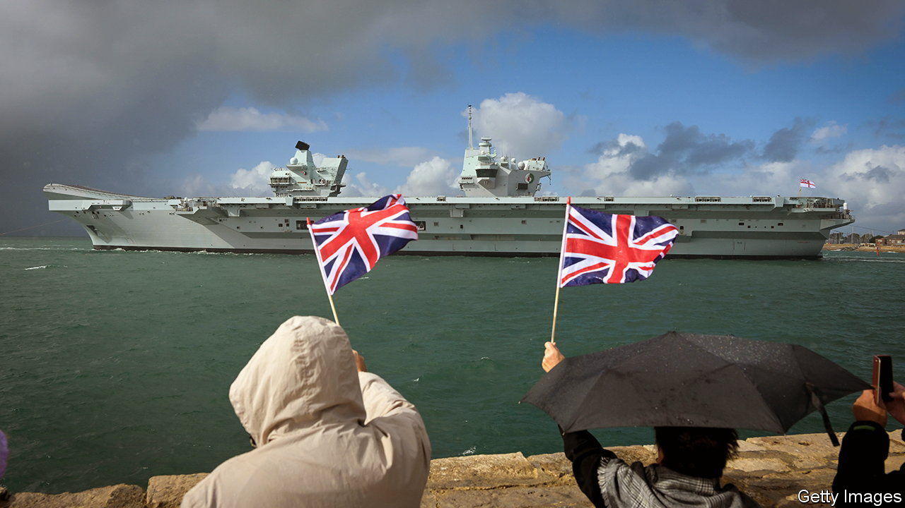

###### What place in the world?

# Britain takes a fresh look at its foreign policy 

##### A new review sets out an ambitious if gloomy vision 

 

> Mar 13th 2023 

IN MARCH 2021 the British government published a sweeping review of foreign, defence, development and security policies dubbed the “Integrated Review”. The world was becoming more competitive and fragmented, it warned. Just how much so it could not have guessed. That summer Kabul fell to the Taliban. A few months later Russia invaded . Sino-American relations appear to be in . On March 13th the government accordingly gave the review an update. 

The new report tackles two of the criticisms levelled against the original. One was that it had a Europe-shaped hole. At the time, Boris Johnson, then prime minister, was waging diplomatic trench warfare with the EU. Rishi Sunak, the current prime minister, has achieved an armistice by signing the “”, a deal over the arrangements for Northern Ireland, and soothing relations with France. 

The second gripe was that Mr Johnson’s “tilt” to the Indo-Pacific region was boosterish folly, not least after Russian tanks had rolled into Ukraine. But the review declares the tilt a success, largely owing to non-military instruments such as trade and diplomacy. The policy looks more substantial than it once did. In December Japan signed up to an Anglo-Italian initiative to build a next-generation warplane, a project known as GCAP. And on March 13th it emerged that Britain would co-design a nuclear submarine with Australia as part of the pact, a three-way deal announced by America, Australia and Britain 18 months ago. On top of that, Britain is also close to being accepted as a member of the , an Asian trade deal.

The review, led by John Bew, a professor brought into Downing Street by Mr Johnson and kept on since, deftly weaves together these two strands of British foreign policy. “The prosperity and security of the Euro-Atlantic and Indo-Pacific are inextricably linked,” it argues. It points to growing co-operation between European and Asian powers, including not just GCAP and AUKUS but also a promise to establish a “permanent” maritime presence in the Indo-Pacific with France. It also emphasises China’s “epoch-defining challenge” to the world order, and promises to double funding for “China capabilities”, such as language skills in government.

The document’s tone is sober, often gloomy. “The transition into a multipolar, fragmented and contested world has happened more quickly and definitively than anticipated,” it acknowledges. “The risk of escalation is greater than at any time in decades.” China and Russia, growing closer, are among the authoritarian powers working “to undermine the international system or remake it in their image”. Protecting that system, it warns, requires co-operation not just with Western liberal democracies, but all sorts of “middle-ground” powers—think Brazil, India, Saudi Arabia and Turkey—who reject the idea of joining either an American or Chinese bloc.

The report avoids bombastic talk of Britain as a superpower. The phrase “Global Britain”, a favoured slogan under Mr Johnson, has been exiled. But it recognises British strengths, notably in science and technology, and the need to build economic resilience in areas from artificial intelligence to semiconductors. A new government-industry task force will focus on bolstering British capability in AI “”, similar to ChatGPT.

As with the first review, the biggest question is whether Britain has the resources to realise the vision. The ambition to co-ordinate the various levers of power, from offensive cyber capabilities to sanctions, “is a terrific goal,” says an official who was involved in the last review, “but is there yet a properly integrated machinery—and human capital—to do all this?” 

Defence spending is a particular bone of contention. On March 13th, two days ahead of the , the British government said it would give an additional £5bn to the Ministry of Defence over the next two years. All of that will be absorbed by nuclear weapons, submarines and the replenishment of  run low by the war in Ukraine. Instead of pledging to spend 2.5% of GDP on defence, as military chiefs had wanted, the review says that this is only an “aspiration…as fiscal and economic circumstances allow”.

If the core defence budget were indeed to rise to that level over a decade, that would mean a 40% rise in spending, with accompanying tax rises, says Malcolm Chalmers of the Royal United Services Institute, a think-tank. “The government has left this tricky dilemma to its successor,” he suggests. In opinion polls, the Labour Party holds a commanding lead of more than 20 points over the Tories. The next election is due by January 2025.

Despite harsh public criticism of the government’s failings over foreign and defence policy, Labour is aligned with the official Ukraine policy, supportive of schemes like GCAP and AUKUS, and similarly sceptical of China. It would preserve much of this strategic vision. Even so, John Healey, Labour’s shadow defence secretary, says that he would hold a fresh review in his first year in office. Events will surely have changed the picture again by then. ■


