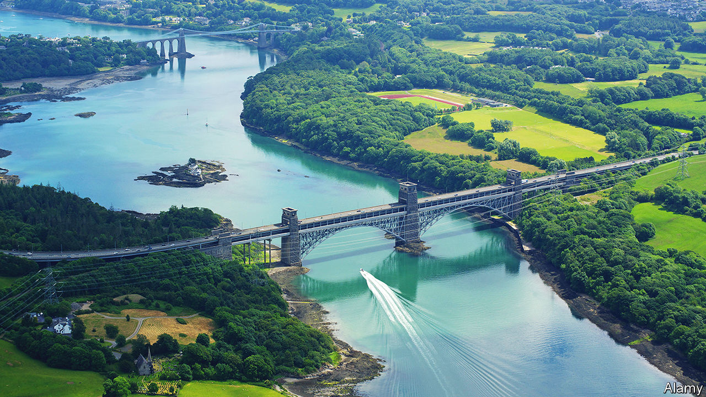
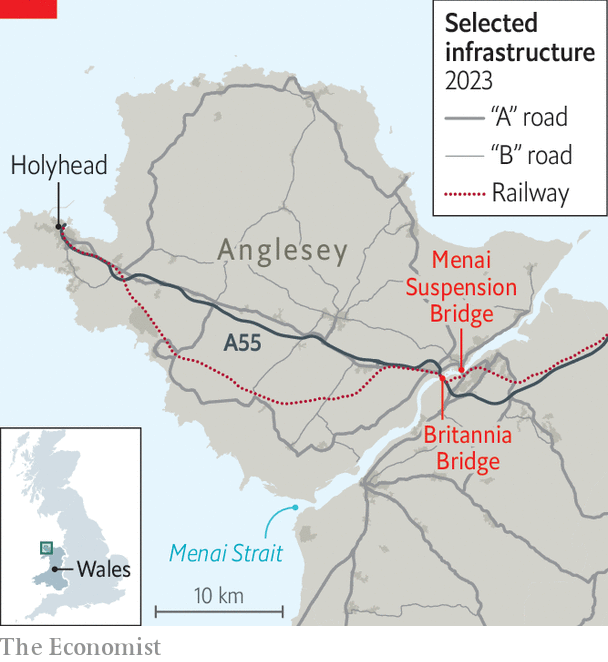

###### A bridge too far

# In the name of the planet, Wales curtails roadbuilding 

##### A debate about climate and cars 

 

> Mar 16th 2023 

The 21st century is a strain on two wonders of the 19th. Thomas Telford’s suspension bridge over the narrow Menai Strait, between Anglesey and the Welsh mainland, was the biggest of its kind when completed in 1826. When it was shut for repairs between October and February, cars clogged the bigger Britannia Bridge, a little to the west, which was opened in 1850 and carries both rail and road traffic. The Britannia Bridge anyway gets congested at peak times—so much so that in 2018 the Welsh government (then a Labour-led coalition) promised a third road bridge. 

Last month the Welsh government (now Labour alone) accepted an expert panel’s recommendation that this scheme and 30 other road projects be shelved. The projects have fallen foul of a climate-friendly, car-hostile transport policy introduced in 2021, plus a lack of cash. Ministers want car mileage per person in 2030 to be 10% lower than in 2019, and journeys shifted to “sustainable modes”—trains, buses, bikes and walking. A shift to electric vehicles will help, the panel says, but will not be enough. Scotland has a more demanding target, of a 20% cut in total mileage by 2030; England has no such national target. The Welsh decision raises a simple question: when is it OK to build a road? 

 


The panel’s conclusion is that there are just four acceptable answers: shifting trips to sustainable modes (eg, building separate cycleways or access for buses to railway stations); reducing casualties; adapting to climate change; and access to new developments with plenty of sustainable transport. Moreover, schemes should not increase road capacity for cars, allow higher speeds and hence more emissions, or damage ecologically valuable sites. Emissions due to construction should be minimised. The third Menai crossing would have meant a boost to traffic, of 10-12% by 2038, and wreckage of ancient woodland. 

Some fear that curbing road-building will put the brakes on the economy. Andrew Davies, the Conservative leader in the Senedd, or Welsh Parliament, says ministers have “put a ‘closed for business’ sign on Offa’s Dyke”. It’s not as if the transport system is fit for the 21st century already, he adds. Even some Labour politicians are vexed by the chopping of schemes in the north-east, around Wrexham and on the A55 in industrial Deeside.

The economic case for more tarmac is not always robust: the panel pointed out that the expected benefits of some proposed schemes fell short of their costs. But it also argued, in essence, that the government’s climate-friendly policy reduces their expected benefits, most of which came from the value of time saved on quicker journeys. If other means of transport are available and fewer cars are on the road, those gains shrink.

That is a big if. The Welsh government has plans to boost the alternatives to cars. It intends to oversee closer integration, from tickets to timetables, of different forms of public transport—which is lacking all over Britain. Buses on demand have been deployed in some areas. In south-east Wales a commission led by Terry Burns, an economist and former head of the Treasury, made dozens of recommendations in 2020, including new railway stations and improved cycleways, in order to shift traffic off the M4 motorway. Implementation plans are in hand.

A similar body, also chaired by Lord Burns, has been set up for north Wales. In a progress report in January it noted the dominance of the car, from the rural north-west to the more urban north-east, where industrial estates “have been designed with vehicles at their centre”. A “major shift in the public transport services” will be needed to cut car use. Among much else, that means better buses in the north-west, where frequent services are rare even at peak times, and better rail services in the north-east. Some schemes are already under way, but there is an awful lot to do.

Lord Burns’s remit includes the Menai Strait, where a new but greener crossing may yet happen. Rhun ap Iorwerth of Plaid Cymru, the Welsh-nationalist party, who represents Anglesey in the Senedd, says he anyway preferred a “simpler” option: adding a two-lane structure next to the Britannia Bridge, which would provide cycle lanes and walkways.

A more robust link to the mainland might be valuable for a proposed freeport near Holyhead, at the former home of Anglesey Aluminium, which closed for good in 2013, and for a putative modular nuclear reactor at Wylfa, where an atomic power station shut in 2015. The island could do with investment: a poultry factory employing more than 700 is to close. The point of the third crossing isn’t relieving congestion, says Mr ap Iorwerth. “It’s about resilience. We don’t want to be isolated.” ■


