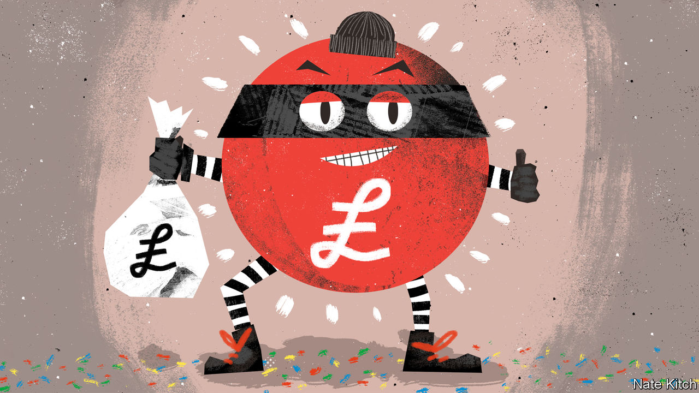

###### Bagehot

# It is far too easy to run lawbreaking businesses in Britain 

##### The Tories are obsessed by small boats. They should stop the dodgy car washes and sweet shops instead 

 

> Mar 16th 2023 

Always judge a man by his shoes. What works as a rule of thumb for fashionistas also works for people rooting out dodgy employers in Britain. The best way to check whether a car wash is legitimate is to look at the workers’ feet, says Mary Creagh, the chair of Ethical Trading Initiative, which looks at labour abuses. A legal operation will have workers in proper boots, as they scrub vehicles by hand. A dodgy one will see poor souls scrubbing cars in soaking trainers. If a business is skimping on wellies, it is probably breaking other rules—whether paying below the minimum wage or hiring people who do not have the right to work in Britain. 

Hand car washes, of which there are at least 5,000 across Britain, are the archetypal example of Britain’s black-market economy. Rishi Sunak, the prime minister, fears that the tens of thousands of people who cross the Channel in small boats each year will “just disappear” into this economy unless something is done. The government has launched a crackdown on arrivals, signing a £479m ($575m) deal with France to stop migrants and announcing draconian new laws to detain and deport those who make the crossing. But as the government panics about small boats, it ignores the reason why many make the trip: the Conservatives have made it too easy to run a lawbreaking business in Britain.

This fact is oddly overlooked. When car washes do crop up in conversation, they are often portrayed as an amusing example of Britain’s lousy productivity, rather than illegality. Why are four workers doing the job of one machine? Yet lawbreaking is “endemic” at car washes, according to a study last year by Nottingham Trent University. In the study 89% of surveyed car washes did not provide payslips. Mandatory “right to work” checks were completed in only 7% of businesses. Only one in ten had the correct insurance. Allegations of modern slavery, where people are forced to work for little or no pay, dog the sector. 

Ministers know all this. But when the government attempted to tighten the rules in 2018, it opted for self-regulation. A code, which largely amounted to car washes promising to follow existing laws, has been taken up by few operators. Those businesses that are profitable largely because they do not adhere to the law were less keen. Consumers, meanwhile, are happy to have their Nissan Qashqai washed for a tenner. 

Car washes are far from an isolated example. Local fast-fashion operators knock out clothes at scarcely believable prices. Sweatshops operate with impunity in places such as Leicester, with a largely foreign workforce often forced to work in illegal conditions. In 2018 there was an outcry when it emerged that some workers in the city’s garment industry were paid as little as £3.50 an hour. A year later, a parliamentary report revealed a glut of problems, from withheld wages to fire doors being padlocked shut. Conditions have not improved. A recent survey by the University of Nottingham revealed about half of textile workers in the city still did not receive minimum wages, sick leave or holiday pay. A third did not receive payslips. A quarter had wages withheld. 

Enforcement of basic labour rights is weak. The taxman investigates about 3,000 of Britain’s roughly 5m businesses each year for minimum-wage violations. Between 2007 and 2021 just 16 employers were successfully prosecuted for breaking the national minimum-wage law. (“This is an increase on last year’s figure (15),” brags the report revealing this triumph.) “It is not even hiding in plain sight, it is just happening in plain sight,” says Ms Creagh.

It is possible to run clear and obvious scams in central London. Oxford Street, a busy shopping thoroughfare, has been taken over by stores selling an odd mix of luggage, vape juice and m&amp;ms priced at £24.99 for a 500g bag. Such shops have skipped business rates to the tune of £9m, according to Westminster Council. Allegations of money-laundering dog the sector. Investigators from the local authority are met with a series of shell companies and directors who do not exist. Weak laws and slack enforcement by national bodies allow scammers to thrive. 

The council does what it can. It often raids shops like the ones on Oxford Street on suspicion of selling dodgy goods, whether unsafe vape juice or knock-off chocolate. (One common ruse involves melting down cheap supermarket chocolate and then flogging it as knock-off Wonka bars for £8 a pop.) Think of it as a sequel to the Al Capone approach. Nailing the Chicagoan gangster for murder proved impossible so the authorities charged him with tax evasion. If tax-dodging is proving difficult to prove, whack today’s villains for flogging dodgy chocolate instead.

The secret ingredient is crime

The problem is not intractable. There is plenty that the government could do to crack down on black-market businesses. The Conservatives have long promised to meld the disparate agencies in charge of labour abuses into a single body. But it is yet to happen, despite being mooted over three years ago. Stricter identity checks for company directors are contained in an economic-crime bill currently going through Parliament. Yet the government has not guaranteed that Companies House, which registers firms in Britain, will have the resources to apply its new powers. 

A skint state will generally intervene only in the most extreme circumstances, meaning low-level crimes are overlooked, argues Dr Alison Gardner from the University of Nottingham. Someone in outright slavery may be rescued. An employee who does not get sick pay or earns less than the minimum wage is out of luck. The tax authorities do not crack down on minimum-wage abuses for the same reason that the police no longer bother to investigate, say, car crime: they usually have bigger things to worry about.

A government serious about dealing with the root causes of illegal immigration, rather than just looking tough, has plenty of options available to it. Until then, anyone looking for an ethical car wash should check for wellies. ■


