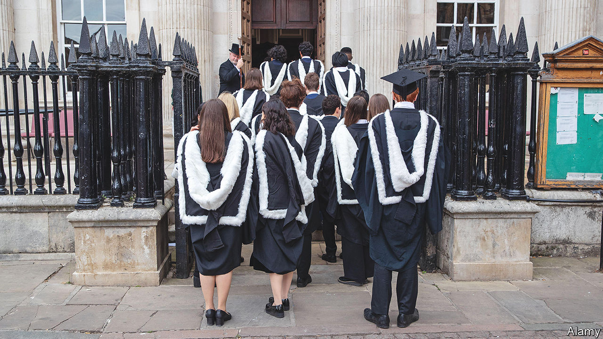

###### Making the grade

# State-school admissions are rising at Oxford and Cambridge 

##### That means fewer privately educated students are getting in 

 

> Mar 11th 2023 

The vast majority of Britons are educated in state schools: 94% of the population and 83% of those who take A-levels. Until recently, admissions to the best universities did not come close to reflecting these numbers. In 2013 state-school students made up 57% and 61% of those admitted to Oxford and Cambridge respectively. Admissions at other leading universities were also weighted towards teenagers who are educated privately. 

Since then a quiet revolution has got under way. Every year the number of state-educated pupils getting Oxbridge places has risen; the number gaining admission from private schools has fallen. In 2022 the proportion of state-school students offered places at  was 68%; at Cambridge, 72.5%. Because many members of the Russell Group, a collection of 24 prestigious universities, have long admitted higher proportions of state-school pupils than Oxbridge, the rise there has been less marked: from 78% to 80% in the past eight years. But Hollie Chandler, the group’s head of policy, says that its members have “ambitious targets” to admit more students from disadvantaged backgrounds.

Two schools illustrate the change particularly starkly. In 2014, 99 students at Eton College, which has produced 20 prime ministers (most of them Oxford- or Cambridge-educated), got offers to go to Oxbridge; by 2021 this had fallen to 48. That year 54 students at Brampton Manor College, a state school in a poor borough of east London, received offers from the two universities, up from one in 2014. 

A few things lie behind this change. The government has given cash to universities to reach underrepresented students and, since 2018, required them to publish plans showing how they are doing this. Universities have been bombarded by hard-to-ignore research into admissions disparities. One report in 2018 showed that eight schools accounted for more Oxbridge places than 2,900 other secondary schools combined; six of them were private.

A law allowing schools to become “academies”, with greater control over budgets and staff, has led to the development of many that are exceptionally ambitious for their pupils. Teach First, a scheme that sends clever graduates into tough schools for a couple of years, has also helped raise pupils’ aspirations. It began in London, one of the reasons why the highest-performing state schools are concentrated in the capital. 

All this has fuelled a joint effort by schools and universities to make pupils consider universities they might once not have done. Visits are crucial, says Deborah Warwick, head of Future Academies in Watford, north-west of London. Last summer one of her pupils, Ciaran Halpin, did an introductory architecture course at Cambridge; the school also set him up with a Cambridge-educated mentor. The son of a lorry driver and a cleaner will become the first person in his family to go to university when he starts there in September. He is looking forward, he says, to living in a beautiful city he can get around by bike and foot, “and just to get studying, really”. 

Emma Smith, an English professor at Hertford College, Oxford, says the notion that state-school kids are intimidated by Oxbridge can be overdone. In 2017 a class from Kensington Academy, a school in west London, spent a week studying at Hertford after a fire at , a nearby block of flats, made their school uninhabitable. During their stay they were shown around Magdalen, an especially majestic college. A handful of students subsequently applied to Magdalen (at least one got in), and none to Hertford . “I think they thought they might as well apply to a college with its own deer park,” she says. 

Professor Smith says once state-school students are applying in large enough numbers, the difficulty for admissions staff is discerning whether potential should trump the academic attainment of the privately educated (who tend to get better grades at school). Of the roughly 35 pupils who apply for eight English places at Hertford every year, she says, there tend to be two or three strikingly obvious candidates. But the remaining 20 who get to interview can seem equally deserving. 

For those state-school kids who do get into top universities, extra help is often needed at first. “If you’re going to do this you need to provide extra tutoring in the first year,” says an English professor at Oxford who made efforts to admit state-school students before it became fashionable. She says they often do worse in exams at the end of the first year, but clean up in final exams. 

That would seem to rebut one of the criticisms made of universities’ efforts to correct the state-private imbalance: that letting in more state-school students means standards will slip. Helen Mountfield, the principal of Mansfield College, Oxford, points out that as the college’s intake has “diversified”—95% of Mansfield’s students are now state-educated—its results have improved. “If you bring in people with diverse experiences and ways of thinking, who challenge one another’s assumptions, it promotes intellectual creativity and academic success,” she says. 

All of which adds up to a potentially momentous change to the case for paying to send children to school. In response, academic private schools, especially in London, are increasingly marketing themselves as conduits to American universities. But they don’t have a monopoly over that, either. Lawrence Foley, the chief executive of Future Academies, a network of state secondary schools, says increasing numbers of state-school children are applying to universities in America and getting full scholarships. ■


