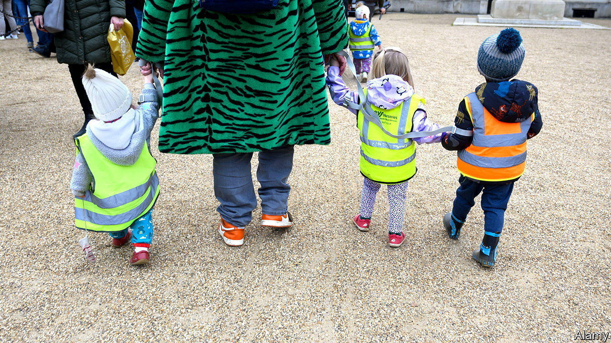

###### Not child’s play

# The chancellor hopes more child care will get more parents working 

##### But will nurseries provide the places? 

 

> Mar 15th 2023 

Space is tight in Lisa Evans’s office, but there’s enough for the important stuff. Bags of chocolate eggs are perched on a cardboard box, ready for daily hunts in the run-up to Easter. At Abacus Nursery and Childcare in New Romney, a pebble’s throw from the Kent coast, the rooms where children play and learn are light and airy. But the register is as full as the manager’s cubbyhole. Though Abacus can take 60 children at a time, during the day and in breakfast and after-school clubs, few slots are left for this coming September. 

Even as Jeremy Hunt  on March 15th, parents were asking Abacus about more hours. The chancellor unveiled a big expansion of “free” (ie, government-funded) child care, hoping to coax more parents (especially mothers) back into work. The government will, in effect, be setting the price of around 80% of pre-school care, calculates the Institute for Fiscal Studies (IFS), a think-tank, up from just under half now. But whether nurseries and childminders—who look after small groups, usually in their own homes—can meet the surge is open to doubt. 

From September 2025 working parents will be entitled to 30 hours’ state-funded child care a week, for the equivalent of 38 weeks a year, once their child reaches just nine months of age. (Mr Hunt is starting by giving two-year-olds 15 funded hours from April 2024.) Currently only working parents of three- and four-year-olds are eligible for so much. All parents of three- and four-year-olds can have 15 paid-for hours, as can the most disadvantaged—roughly 40%—of those with two-year-olds. Parents pay for additional hours, and often for lunches and other extras. 

The chancellor is also lifting the cap on help for those parents on universal credit, the main working-age benefit, who buy extra hours—from £646 ($780) for one child and £1,108 for two or more, where it has been stuck for years, to £951 and £1,630 respectively. They will also be able to claim in advance, rather than wait for weeks, which they can ill afford.

The Office for Budget Responsibility, a watchdog, estimates that of all Mr Hunt’s measures, the extension of 30-hour child care will provide the biggest boost to . It expects an extra 60,000 people to work an average of 16 hours a week by 2027-28, plus an equivalent effect from those already in jobs putting in more hours. Raising the universal-credit cap lifts employment by another 15,000.

That may be over-optimistic. It is hard to know how many parents of very young children will simply prefer to look after them. So is predicting whether there will be enough child-care places. Although Ofsted, the education regulator, says the total number has been pretty constant in recent years, many childminders, especially, have shut up shop. Providers say the hourly rate for “free” hours falls well short of their costs, as wages (around three-quarters of their expenses) and energy prices have risen. They make up the shortfall by charging more for additional hours: in New Romney, Ms Evans will raise prices after Easter. Extending free hours will reduce the scope for that kind of thing. 

Mr Hunt is trying to woo childminders back, offering them a £600 bounty. He is also raising providers’ hourly rate for 2023-24 and 2024-25. That, estimates Christine Farquharson of the IFS, covers expected rises in wages and other providers’ costs, but not the 13% cut in real funding since 2017-18 (after adjusting by a sector-specific price index). The government is also relaxing the minimum ratio of staff to children, though to some that means cutting corners as well as costs. “Fewer staff means less quality,” says Ms Evans. If the measures in the budget do not tempt more providers into the sector, Britain’s child-care squeeze may get even tighter.■


