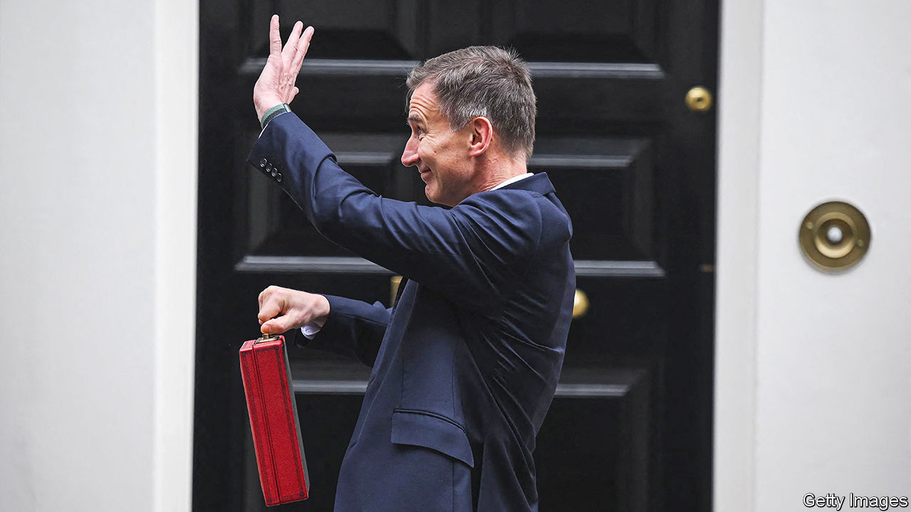
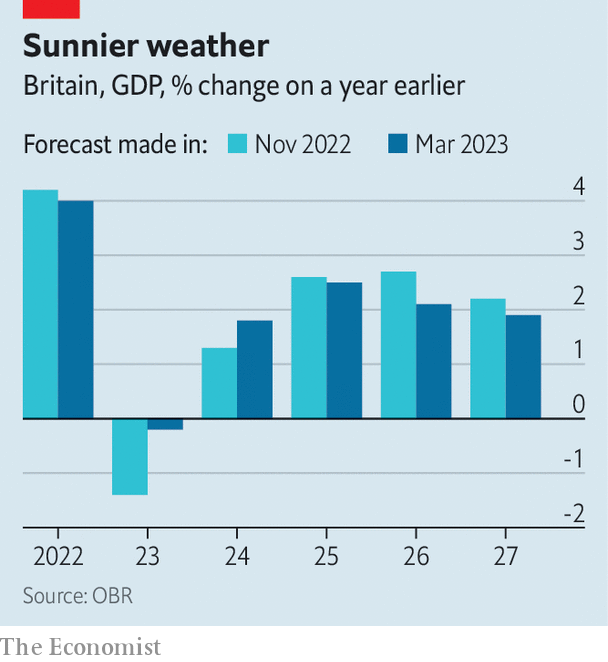

###### Steady as she goes

# Will Jeremy Hunt’s “budget for growth” achieve its goal? 

##### Britain’s budget was a triumph over low expectations 

 

> Mar 15th 2023 

Jeremy Hunt, the chancellor of the exchequer, started his  to Parliament on March 15th by hailing improvements to Britain’s growth forecasts. Thanks to better global conditions and the government’s own economic policy the country would, he said, manage to avoid a technical recession in 2023 (defined as two consecutive quarters of contraction). Later Mr Hunt ran through the actual forecasts from the Office for Budget Responsibility (OBR), a fiscal watchdog: Britain’s economy would shrink by 0.2% in 2023 instead of the 1.4% contraction that it had predicted in November (see chart). 

 


That sense—of low expectations being surpassed—infused Mr Hunt’s budget. Compared with the disastrous “” delivered by his predecessor, Kwasi Kwarteng, in September 2022, this was a sober and sensible affair. Gilt yields, the cost of government borrowing, fell during the speech (although that was more owing to concerns over the health of  than any news from Parliament). 

The message to restive investors was clear: there would be no more nasty surprises from a British chancellor. Most policy measures had been trailed in advance through leaks to the press. The OBR, which had been notoriously sidelined by Mr Kwarteng, judged that Mr Hunt would narrowly meet his fiscal target of debt falling as a share of national income in five years. 

Such fiscal rectitude came despite tax cuts and spending increases. Mr Hunt announced an extension of the energy-price guarantee, a subsidy that keeps annual household energy bills at around £2,500 ($3,020) for a typical family; tax-free child-care support for those with children between the ages of nine months and two years; and a change to investment allowances enabling large companies to offset all their capital spending on plant and equipment against their tax bill. He also abolished the cap on the lifetime amount that workers could save for their pensions before paying additional tax; and, finally, announced another freeze in the level of taxes levied on car fuel. In total the bill amounted to £20bn a year for the next three years, according to the OBR. 

Mr Hunt managed to square the circle thanks to a mix of those improved official growth forecasts and his own fiscal sleight of hand. The OBR itself handed the chancellor a windfall owing to what it labelled a brightening economic outlook. As well as higher growth this year and next, the watchdog judged that inflation would fall more quickly and the cost of government borrowing would not rise as much as it had expected in November. These changes to the forecast raised the amount the chancellor could spend by £24.6bn. 

The trickery was to present as temporary tax cuts that are very likely to be extended. Freezing fuel duty, for example, will cost the exchequer just under £5bn next fiscal year; the levy is ostensibly set to rise after that. But Tory chancellors have promised to increase fuel duty the next year ever since the party took office in 2010. Not one ever has, at a total cost to the public purse of around £80bn. 

In the same vein Mr Hunt made the change to corporate investment allowances temporary (while expressing the hope that this measure would eventually become permanent). The tax break is due to last for only three years—ensuring that he meets a fiscal rule of having debt falling within the fifth year of a rolling five-year period. Mr Hunt can, if he wishes, announce yearly extensions of the scheme. 

Such chicanery will, however, also reduce the benefits of the policy. Mr Hunt billed his plan as a “budget for growth”. The OBR judged him correct. Its number-crunchers estimated that Mr Hunt’s measures would raise economic growth by around 0.2% of GDP in 2027-28, by boosting investment through tax breaks in the next few years and the labour supply when the new child-care measures properly kick in. That would lower borrowing by £3bn in the next fiscal year and £1.7bn further out, offsetting some of the policies’ cost. 

Yet this additional growth will not come from higher productivity, the missing ingredient in the British economy. The OBR forecast that the temporary increase in investment allowances will change only the timing of capital spending and not the amount: in other words, high investment over the next three years will be offset by lower spending after that. The amount of capital per worker and, therefore, productivity will remain unchanged. It was the latest example of chancellors tweaking Britain’s corporation-tax system, said Paul Johnson, director of the Institute for Fiscal Studies, a think-tank. “There’s no stability, no certainty and no sense of a wider plan.”

Instead, the improvements in Britain’s long-term growth outlook stem from expectations of greater labour supply. The biggest boost is owing to migration. The OBR has, again, revised up its estimate of how many immigrants would come to work in Britain following the country’s departure from the EU. Net migration is forecast to add around 160,000 more workers. Of the 110,000 increase in the number of British workers that the OBR attributes to the budget, about 75,000 are thanks to the child-care changes (that may be a ). The watchdog reckons the remainder will be either prodded or tempted to find jobs by changes to benefit entitlements, more generous pension allowances or schemes to help the long-term sick into work. 

Such policies may be worthwhile, but their benefits can also be overstated. Parents of young children are already providing valuable services by taking care of them, for example, even if they are not paid and therefore not counted in economic output. Others are very expensive. Roughly 15,000 workers are predicted to stay in the labour force thanks to the changes to pension taxation, at an annual cost to the exchequer of £56,000 each by the end of the forecast period. The Labour party has pledged to reverse this measure if elected, potentially muting its effect. 

Nor did the budget provide much for Britain’s struggling public services, particularly the health-care system, which has been blamed for a rise in the ranks of those dropping out of the labour force owing to ill health. Mr Hunt has surpassed low expectations. Next he needs to raise them. ■


