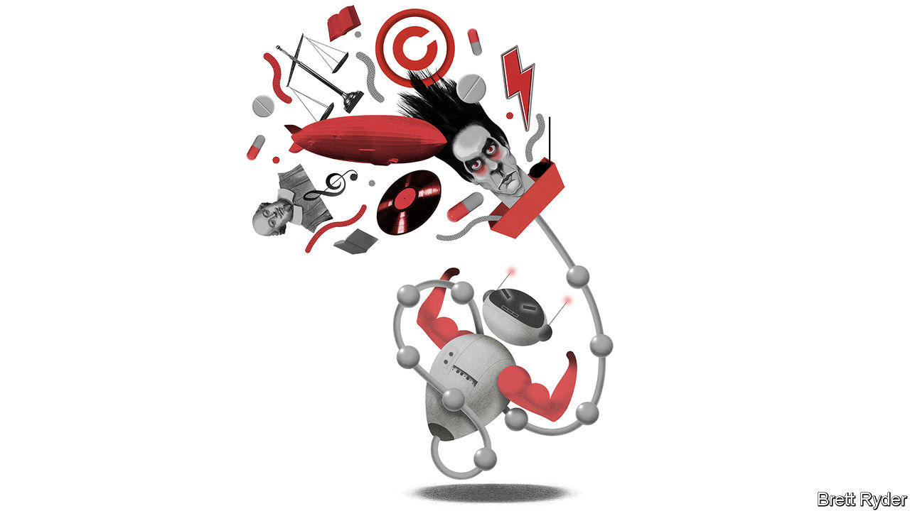

###### Schumpeter

# A battle royal is brewing over copyright and AI 

##### Beware the Napster precedent 

 

> Mar 15th 2023 

Consider two approaches in the music industry to  (AI). One is that of Giles Martin, son of Sir George Martin, producer of the Beatles. Last year, in order to remix the Fab Four’s 1966 album “Revolver”, he used AI to learn the sound of each band member’s instruments (eg, John Lennon’s guitar) from a mono master tape so that he could separate them and reverse engineer them into stereo. The result is glorious. The other approach is not bad either. It is the response of Nick Cave, a moody Australian singer-songwriter, when reviewing lyrics written in his style by , an AI tool developed by a startup called OpenAI. “This song sucks,” he wrote. “Writing a good song is not mimicry, or replication, or pastiche, it is the opposite. It is an act of self-murder that destroys all one has strived to produce in the past.”

Mr Cave is unlikely to be impressed by the latest version of the algorithm behind ChatGPT, dubbed GPT-4, which OpenAI unveiled on March 14th. Mr Martin may find it useful. Michael Nash, chief digital officer at Universal Music Group, the world’s biggest label, cites their examples as evidence of both excitement and fear about the AI behind content-creating apps like ChatGPT (for text) or Stable Diffusion (for images). It could help the creative process. It could also destroy or usurp it. Yet for recorded music at large, the coming of the bots brings to mind a seismic event in its history: the rapid rise and fall of Napster, a platform for sharing mainly pirated songs at the turn of the millennium. Napster was ultimately brought down by copyright law. For aggressive bot providers accused of riding roughshod over intellectual property (IP), Mr Nash has a simple message that sounds, from a music-industry veteran of the Napster era, like a threat. “Don’t deploy in the market and beg for forgiveness. That’s the Napster approach.” 

The main issue here is not AI-made parodies of Mr Cave or faux-Shakespearean sonnets. It is the oceans of copyrighted data the bots have siphoned up while being trained to create humanlike content. That information comes from everywhere: social-media feeds, internet searches, digital libraries, television, radio, banks of statistics and so on. Often, it is alleged, AI models plunder the databases without permission. Those responsible for the source material complain that their work is hoovered up without consent, credit or compensation. In short, some AI platforms may be doing with other media what Napster did with songs—ignoring copyright altogether. The lawsuits have started to fly. 

It is a legal minefield with implications that extend beyond the creative industries to any business where machine-learning plays a role, such as self-driving cars, medical diagnostics, factory robotics and insurance-risk management. The European Union, true to bureaucratic form, has a directive on copyright that refers to data-mining (written before the recent bot boom). Experts say America lacks case history specific to generative AI. Instead, it has competing theories about whether or not data-mining without licences is permissible under the “fair use” doctrine. Napster also tried to deploy “fair use” as a defence in America—and failed. That is not to say that the outcome will be the same this time. 

The main arguments around “fair use” are fascinating. To borrow from a masterclass on the topic by Mark Lemley and Bryan Casey in the , a journal, use of copyrighted works is considered fair when it serves a valuable social purpose, the source material is transformed from the original and it does not affect the copyright owners’ core market. Critics argue that AIs do not transform but exploit the entirety of the databases they mine. They claim that the firms behind machine learning abuse fair use to “free-ride” on the work of individuals. And they contend that this threatens the livelihoods of the creators, as well as society at large if the AI promotes mass surveillance and the spread of misinformation. The authors weigh these arguments against the fact that the more access to training sets there is, the better AI will be, and that without such access there may be no AI at all. In other words, the industry might die in its infancy. They describe it as one of the most important legal questions of the century: “Will copyright law allow robots to learn?” 

An early lawsuit attracting attention is from Getty Images. The photography agency accuses Stability AI, which owns Stable Diffusion, of infringing its copyright on millions of photos from its collection in order to build an image-generating AI model that will compete with Getty. Provided the case is not settled out of court, it could set a precedent on fair use. An even more important verdict could come soon from America’s Supreme Court in a case involving the transformation of copyrighted images of Prince, a pop idol, by the late Andy Warhol, an artist. Daniel Gervais, an IP expert at Vanderbilt Law School in Nashville, believes the justices may provide long-awaited guidance on fair use in general.

Scraping copyrighted data is not the only legal issue generative AI faces. In many jurisdictions copyright applies only to work created by humans, hence the extent to which bots can claim IP protection for the stuff they generate is another grey area. Outside the courtrooms the biggest questions will be political, including whether or not generative AI should enjoy the same liability protections for the content it displays as social-media platforms do, and to what extent it jeopardises data privacy.

The copyrighting is on the wall

Yet the IP battle will be a big one. Mr Nash says creative industries should swiftly take a stand to ensure artists’ output is licensed and used ethically in training AI models. He urges AI firms to “document and disclose” their sources. But, he acknowledges, it is a delicate balance. Creative types do not want to sound like enemies of progress. Many may benefit from AI in their work. The lesson from Napster’s “reality therapy”, as Mr Nash calls it, is that it is better to engage with new technologies than hope they go away. Maybe this time it won’t take 15 years of crumbling revenues to learn it. ■


