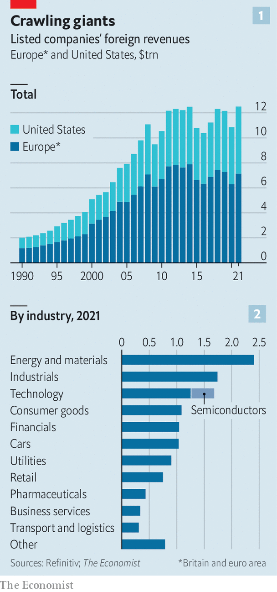
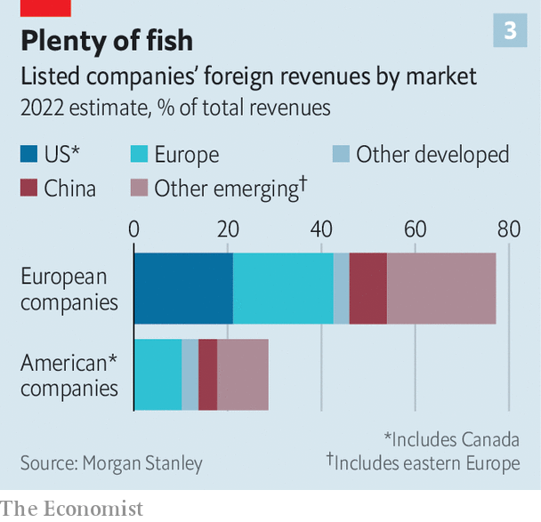
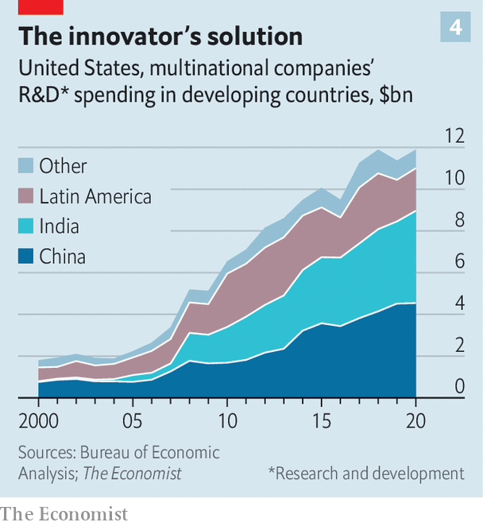
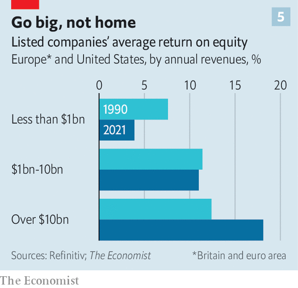

###### The new-look global corporation

# Are Western companies becoming less global? 

##### Being a multinational in a nationalist world 

 

> Mar 16th 2023 

Twelve months ago Russia joined the ignominious list of countries—alongside North Korea and Cuba—where consumers are denied the joys of a Coca-Cola. The American beverage giant had halted its operations there following the Russian invasion of Ukraine. Thirty years before, when Coca-Cola expanded in Russia after the collapse of the Soviet Union, barriers to global commerce were being torn down. Today they are being re-erected—and not just around Russia. 

America’s Treasury Department is reportedly working up plans to stop outbound investment in cutting-edge technologies in adversarial countries. It has already banned the sale of advanced microprocessors and chipmaking equipment to China. Sino-American commerce could snap shut entirely if China imitates Russia’s belligerence in its relations with its own coveted neighbour, Taiwan. At the same time, America is dangling subsidies worth half a trillion dollars with the aim of bringing supply chains for semiconductors, electric cars and clean energy back home. The European Union is expected to unveil a chunky package of similar sweeteners any day now.

Operating as a multinational company has always involved difficulties, from co-ordinating across time zones to navigating a patchwork of regulatory regimes. The latest strains on globalised commerce—wrought by geopolitical tensions and rising protectionism—raise tricky questions for the corporate giants of the West that have been among globalisation’s biggest beneficiaries. Their initial responses sketch out the contours of the Western multinational of the 21st century. It is less reliant on China and more reliant on intangible assets such as software and patents. But overall, it is no less global.

Western firms started spreading out into the world in the 1600s, when Europe’s colonial trading houses ventured (often violently) beyond the old continent in search of commercial opportunities. By the start of the 20th century the global stock of foreign direct investment (FDI), a rough proxy for the prevalence of multinational businesses, was hovering at 10% or so of world GDP. 

Then, around the time Russians took to glugging locally made Coke, the West’s corporate globetrotters experienced their own carbonated high. Freer trade, lower shipping costs and better communications technology allowed them to become more truly global. They set up shop wherever they could find cheaper labour, lower taxes or new customers. In the early 2010s the worldwide stock of FDI reached the equivalent of 30% of global output. Western businesses accounted for 78% of the total. The average American multinational had a dozen foreign subsidiaries.

In the past decade or so things started to change. American and European companies began to lose some of their foreign fizz. Banks battered by the global financial crisis of 2007-09 and the ensuing euro-zone debt rigmarole slimmed down their foreign businesses. And new competitors, especially from China, began to challenge Western firms. Four of the five biggest smartphone brands in India, for example, are now Chinese. Last year China overtook Germany as the world’s second-largest car exporter, behind only Japan. 

 


Since 2010 the foreign sales of listed American and European companies have grown by a meagre 2% per year, down from 8% in the 2000s and 10% in the 1990s (see chart 1). Multinationals have been adding fewer foreign factories to the FDI stock. Annual flows of American and European foreign investments (excluding reinvested earnings) plunged from a peak of $659bn in 2015 to $216bn in 2021, according to the United Nations Conference on Trade and Development—and that was an uptick from $156bn in 2019, before covid-19 quashed them almost completely in 2020. Between 2010 and 2021 the West’s share of the worldwide FDI stock fell from 78% to 71%. The typical American multinational now has just nine foreign subsidiaries.

Politicians on both sides of the Atlantic applaud this trend. They are talking up a domestic manufacturing renaissance and increasingly trying to keep China, the West’s factory turned foe, down. In January monthly spending on factory construction in America hit $10.9bn, up by 55% on the year before. The EU hopes its new subsidies will have a similar effect. 

America Inc and Europe SA are also cooling on China—both as maker of and market for their wares. According to BEA data, the value of American multinationals’ factories and equipment in China peaked in 2018. Western politicians may claim the credit for this change, but a bigger reason may be pricier Chinese labour. Since 2010 manufacturing wages in China have increased four-fold, from $2 per hour to over $8 in nominal terms. 

 


As for the Chinese market, it remains important for some sectors. Western semiconductor companies, for example, derive around 30% of their sales from China. But chipmaking accounts for just $400bn of the $12trn of sales generated abroad by listed Western companies (see chart 2). Look across all industries, and China is responsible for less than one-eighth of Western firms’ foreign revenues, according to Morgan Stanley, an investment bank—a much smaller share than American and European sales across the Atlantic or to the rest of the emerging world (see chart 3). Only 8% of European companies’ total revenues come from China. For their American counterparts, the figure is 4%. According to BEA figures, American multinationals’ sales in China were flat between 2017 and 2020. In India they grew by 6% a year in the same period. 

Western multinationals are, then, becoming somewhat less Chinese. Yet it would be a mistake to conclude that they are turning into homebodies. In so far as the “reshoring” of production from China is happening, observes Arend Kapteyn of UBS, a bank, it is mostly confined to a narrow set of favoured sectors. Overall manufacturing output remains below what it was before the financial crisis in America and roughly unchanged in Europe, after adjusting for inflation. 

Indeed, Western business looks the opposite of world-weary. American firms may have a quarter fewer foreign subsidiaries than a decade ago, on average, but the drop was more than offset by the number of them with a presence abroad. This swelled from 2,300 in 2010 to over 4,600 in 2020, BEA data show. On March 13th it was reported that Chick-fil-A, an American fast-food chain, plans to spend $1bn on expansion in Asia and Europe. 

The biggest firms maintain a large foreign presence. General Motors, a Detroit carmaker, still boasts more than 100 foreign subsidiaries. Most of Chick-fil-A’s new foreign diners will be able to wash down chicken sandwiches with Coca-Cola, which continues to quench thirst in more than 200 countries and territories. 

Western business is not giving up on foreign production, either. Apple and Adidas are increasingly sourcing their iPhones and sneakers, respectively, from geopolitically friendly places like India and Vietnam, where wages are roughly a third of those in China to boot. This month Elon Musk announced that Tesla would build a new factory in Monterrey, Mexico, another low-wage location with the added benefit of being next door to the car company’s home across the border in Texas. 

The world is still your Coke can

Those globetrotters are increasingly after more than merely cheap manual labour. Technological progress means that many firms’ most productive assets are now not their physical plant and equipment but intangibles like computer programs and patents. This increases the returns on investment in talent, especially in places where an educated workforce commands lower wages than in the West. Technologies such as speedier broadband, video calls and cloud computing make this talent pool easier than ever to tap. Richard Baldwin of the Geneva Graduate Institute predicts that the offshoring of white-collar work will form the basis of a new wave of globalisation akin to the dispersion of manufacturing in earlier decades.

 


Multinationals have already begun to think more expansively about what tasks can be done offshore, notes Jimit Arora of the Everest Group, a consultancy. American multinationals’ spending on research and development (R&amp;D) in low-cost countries roughly doubled between 2010 and 2020 (see chart 4). Last November Boeing, an aircraft manufacturer, announced it would build a $200m R&amp;D facility in the Indian city of Bangalore, its largest outside America. American tech giants such as Alphabet, Amazon and Microsoft have also opened R&amp;D centres in the city. So has Walmart, America’s mightiest supermarket chain, and Rolls-Royce, a British maker of aircraft engines. 

 


The importance of intangibles will only grow as businesses across the economy reinvent themselves for the digital era. Siemens, a German industrial giant, already calls itself a “technology company” focused on digital simulations, data analytics and so on. Walmart now employs some 25,000 tech specialists, equivalent to the combined workforce of Pinterest, Snap, Spotify and Zoom, four tech darlings. 

Because software tends to be expensive to build but cheap to reproduce, big firms that can spread the fixed costs of development enjoy an ever greater competitive advantage. And multinational companies can spread those costs widest of all.

Between 1990 and 2021 the average return on equity of American and European listed companies with less than $1bn in sales fell from 8% to 4%. That for firms with revenues of $10bn or more rose from 12% to 18% (see chart 5). And being big is easier if you are international. In 2021 American and European listed companies with $10bn-plus in revenue generated 43% of their sales abroad on average, compared with just 32% for those with sales below $1bn. Global reach is, in other words, more important than ever. With ambitious emerging-market rivals nipping at their heels, retreat is not an option for the West’s corporate champions. ■


