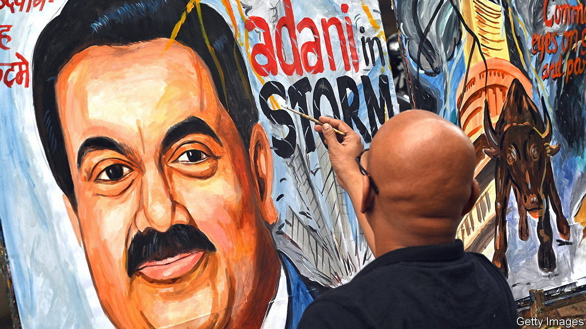
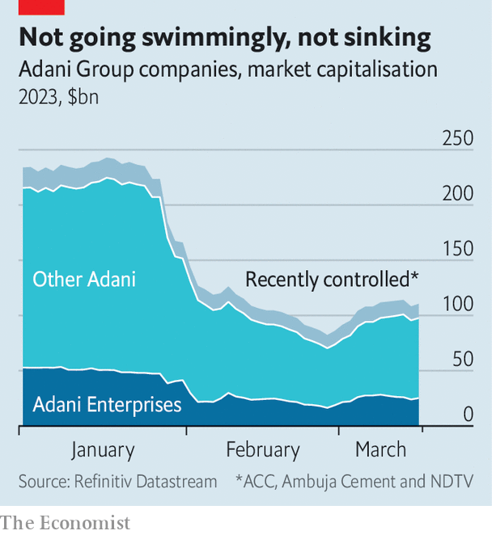

###### Uncapsized

# Can Gautam Adani ride out the storm? 

##### India’s embattled tycoon appears to be regaining his footing 

 

> Mar 16th 2023 

When a New York short-seller’s report wiped some $150bn, or two-thirds, from the combined value of the Adani Group’s listed holdings in late January and early February, several big questions were keeping India Inc up at night. Would Indian banks and insurance companies with significant exposure to the ports-to-power conglomerate also teeter? Would the contagion spread to the rest of the Indian financial world? And would India’s government pursue an aggressive investigation into the short-seller’s allegations of fraud and stockmarket manipulation, which set off the imbroglio (and which the Adani Group vehemently denies)?

A month and a half on, the answers to the first two questions are, happily for India, “no”. The answer to the third is less categorical, and somewhat less constructive: the government seems in no rush to settle the matter, perhaps because the Adani firms’ modest free float means a small number of mostly big shareholders bore much of the pain and no angry mob of retail investors is pressing Delhi to get to the bottom of it, fast. With those big questions out of the way, attention has turned to the next conundrum: can the Adani Ggroup and its eponymous tycoon founder, Gautam Adani, recover? Or will they founder, possibly dragging the Indian government’s grand plans for investments in infrastructure and green energy down with them?

 


The past month has offered hope to those rooting for Mr Adani and his businesses, which operate some of India’s biggest ports and airports, store a third of its grain, run a fifth of its power-transmission lines, produce a lot of its cement—and have their eye on clean hydrogen and steelmaking, among other ventures. The group’s total market value has climbed back to more than $110bn, from a low of $82bn. That of its flagship public company, Adani Enterprises, is up by 54% from its nadir on February 27th. The yields on bonds issued by some Adani firms have come down from levels indicating distress. 

The big turn in the Adani Group’s fortunes came in early March, after GQG Partners, a fund that is based in America, listed in Australia and run by an Indian, bought $1.9bn in shares of several of the group’s companies directly from the Adani family. At the time, GQG’s boss, Rajiv Jain, who lives in Florida, told the  that “the market was mispricing Adani” and praised the conglomerate’s “very competent management” and “fantastic” execution capabilities. 

Mr Adani used the proceeds to help repay $2.1bn in margin loans that used Adani companies’ shares as collateral, relieving one possible source of financial stress. Another $1.1bn, half coming from the Adani family and half from the Adani businesses’ cashflows, was used to meet other near-term obligations. These moves reduced the group’s outstanding debt by just 4%, to $27bn. But they eased pressure and reassured the market. So did the acquisitive conglomerate’s decision to pause new capital investments, beyond those it had already pledged, until September 2024, and to put big takeovers on hold.

As these demonstrations of financial discipline were taking place, the Adani Group embarked on a global charm offensive, set to conclude on March 17th in California. It appears to be working. Mr Jain, for one, has said GQG’s stakes in Adani businesses “most likely will increase depending on the price and how they deliver”. The group says it has been receiving plenty of interest from investors looking to park their money in its assorted companies. It says that a recent news report of a sale of just under 5% in its cement operations is bogus. But it does not dismiss the possibility of selling stakes in some of its divisions. Several of these, like the ports business, are solid operations offering predictable returns—maybe even good ones, if India’s economy continues to grow at its recent pace of 7-9% a year.

With the Adani Group on more stable footing, another question is bound to arise: how long can Mr Adani hold his nation-building ambitions in check? On March 1st his conglomerate was awarded a bauxite mine in a government auction. For the time being, the asset, for which the company had always been planning to bid, will be folded into Adani Enterprises’ mining subsidiary. But before the short-seller’s assault, the bid for the mine was widely regarded as part of a larger plan to enter aluminium smelting, steelmaking and other bits of heavy industry. Mr Adani is unlikely to have forsaken that idea for ever. ■


