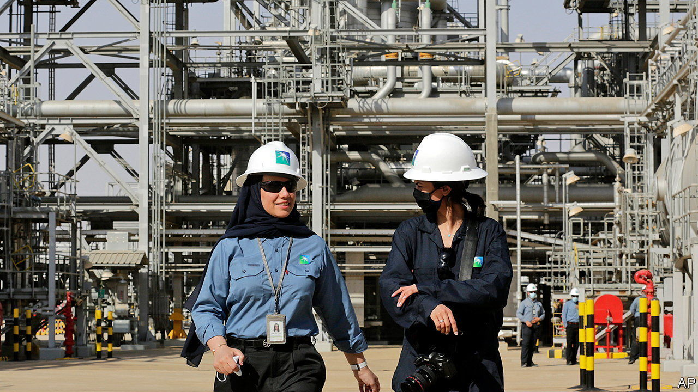
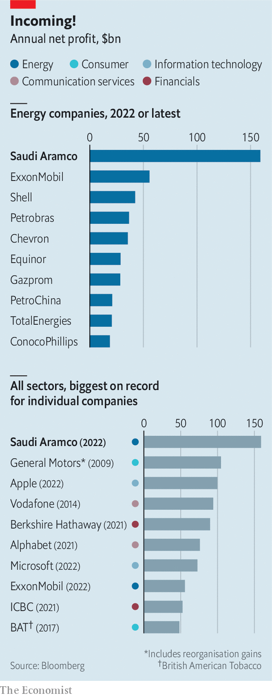

###### Aramco’s princely sums

# Saudi Aramco makes an eye-popping $160bn in profit 

##### And you thought the supermajors had a good year 

 

> Mar 16th 2023 

 


The world’s energy supermajors had a bountiful 2022. ExxonMobil, the largest of the private-sector giants, reported a record annual net profit of $56bn, after Russia’s invasion of Ukraine sent oil prices soaring. Mouth-watering—unless you are Saudi Aramco, in which case it’s peanuts. Last year the desert kingdom’s oil giant brought in some $160bn of net income, the most by any company in corporate history.■


