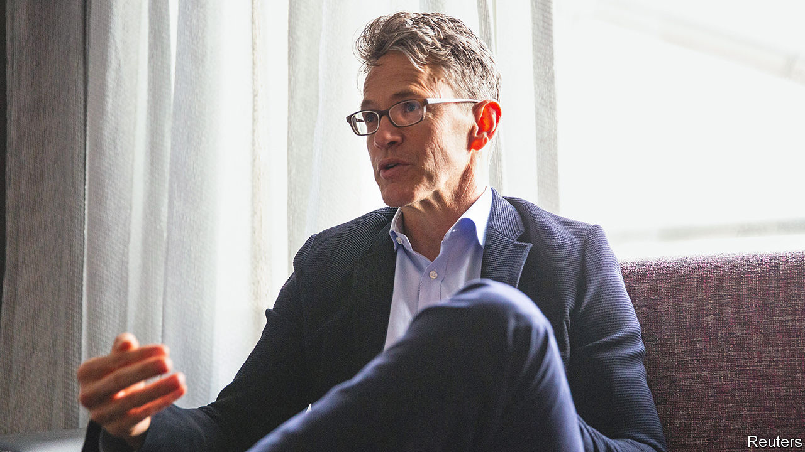

###### An American in Leverkusen

# Shareholders have high hopes for Bayer’s new boss 

##### Bill Anderson has two qualifications for the job. He knows pharma. And he is American 

 

> Mar 16th 2023 

After Bill Anderson, Bayer’s new boss, arrives on April 1st at the firm’s headquarters in Leverkusen, Werner Baumann, the German drug-and-chemicals giant’s outgoing chief executive, will be on standby for two months to ensure a smooth transition. Given Mr Anderson’s lack of experience in crop sciences, Bayer’s biggest business, you might ask what the board was thinking handing him the reins. The answer is that he has two qualifications that make up for his shortcoming. He used to run the pharmaceuticals business at Roche, a Swiss drug behemoth. And he is American. That makes him just the man for a company that is betting big on its pharma business across the Atlantic.

Mr Anderson will need to get up to speed with three challenges facing Bayer. He must deal with the legacy of Mr Baumann’s ill-fated $63bn takeover in 2018 of Monsanto, an American crop-chemicals firm. Then there are Bayer’s transatlantic ambitions. By the end of the decade it wants to double its drugs sales in America, the world’s biggest market—and launch new treatments to replace blockbusters like Xarelto, a blood-thinner whose patent protection expires this year. Last, Mr Anderson needs to deal with calls for a split of Bayer’s pharma and crop-science businesses, or at least a sale of the consumer-health unit, which makes Aspirin, Alka Seltzer and other non-prescription staples.

Mr Baumann left the top job a year earlier than planned amid growing discontent of investors, whose shares have lost a third of their value during his seven-year tenure. Much of the €26bn ($27bn) fall in Bayer’s market value over that period is attributed to the Monsanto takeover. The costly acquisition made lots of business sense for Bayer, which already had a crop business. But Mr Baumann misjudged the potential cost of Americans’ litigiousness: Monsanto makes Roundup, a weedkiller that contains glyphosate. Bayer has been inundated with 154,000 lawsuits from people who claim that glyphosate causes cancer. Bayer denies this and has the backing of many scientists. But to make the matter go away, it has paid out $9.5bn in settlements with 109,000 plaintiffs, and has set aside another $6.4bn for the rest.

The Monsanto experience has not put Bayer off the American market. The firm has 30,000 staff at 150 sites in America, making it one of the country’s biggest life-science firms, says Patrick Lockwood-Taylor, head of Bayer’s American business. Its three American units (including Monsanto) made up 40% of the company’s revenue last year. To reach the ambitious goal of doubling its $5bn American drug business Bayer is planning to beef up staff in marketing and distribution from 1,000 to 3,000 by 2030. Last year it opened a $140m research centre for molecular biology near Boston. It has high hopes in America for two recently launched drugs: Nubeqa, a treatment for prostate cancer, and Kerendia, for diabetics with kidney disease. 

Bayer has no plans to sell its consumer-health business, let alone split in two. That will not silence calls for a separation. Two activist investors, Inclusive Capital and Bluebell Capital, bought into Bayer at the start of the year. Jeffrey Ubben, boss of Inclusive, which owns more than €400m-worth of shares, calls the crop unit a “jewel” at times of heightened fears over food security. As a separate firm, he argues, its valuation could be similar to that of Corteva, the agriculture business spun off in 2019 from DowDuPont, an American chemicals giant. Corteva is trading at 20 times earnings, well ahead of Bayer, with a ratio of seven. 

A stand-alone drug business, meanwhile, may be better off without the legal risks related to Roundup. Other pharma spin-offs, as when Switzerland’s Novartis hived off its generics unit or America’s Pfizer sold its animal-health arm, have worked out well. 

The 56-year-old Mr Anderson is ambitious: he quit Roche last year after being passed over for the top job. He is also a risk-taker: at Roche he bet big on three costly trials of drugs to treat Alzheimer’s disease, breast cancer and lung cancer, despite unpromising results in early clinical studies. The trials failed. Bayer’s shareholders will be hoping that Mr Anderson will bring to Leverkusen a trait more typically associated with Ireland—luck. ■


