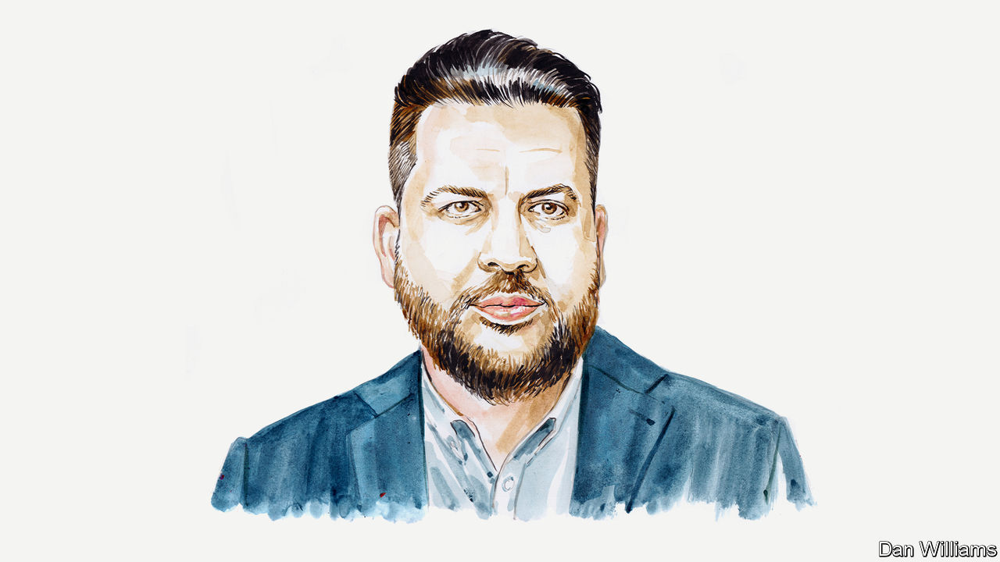

###### Russia and Ukraine

# Alexei Navalny’s chief of staff says personal sanctions need rethinking 

##### Offering those on the list a way off could weaken Vladimir Putin’s regime, argues Leonid Volkov 

 

> Mar 14th 2023 

ON MARCH 15TH the European Union will decide whether to prolong sanctions against Russian individuals. It is a good moment to take stock of their effectiveness. Last month in his state-of-the-nation address, Vladimir Putin made a lengthy appeal to the country’s fugitive businessmen and . Most of them are under Western , their assets frozen. He sounded uncharacteristically sympathetic. 


——

This was an explicit call for the Russian oligarchs to head back to his ship. Some have already done so. This is good news for Mr Putin and bad news for everyone else. 

Since the start of the war some 1,400 people have been put on sanctions lists. That number includes Russian MPs (450 Duma members and 170 senators), important members of the government, military officers, members of the security forces and a few oligarchs and propagandists. 

Last month, the  of Mr Putin’s full-scale aggression against Ukraine, the tenth package of EU sanctions, which took months to negotiate, saw 87 names added to the sanctions list. Most of them are mid-level officials from the occupied territories, cogs (but not masterminds) in the Kremlin’s war-crimes machine.

And while some of these sanctions vary in detail, they have one thing in common: they have not had any significant effect on Mr Putin’s ability to continue his criminal war. They have not caused a split within the Russian elite or triggered defections. Instead, they help to consolidate support for the regime and encourage the return of individuals facing sanctions back to Russia where they have poured their energies into saving their businesses.

This is because getting on the sanctions list is a one-way ticket. Anyone placed on it knows that the only guaranteed way off it is to die. As a result, people who have been placed under sanctions feel they have no option but to stay on board Mr Putin’s boat, even if it is sinking. Sanctions actually push people into Mr Putin’s arms, both figuratively (they feel that their political fates are now more closely linked than before) and in the most direct sense (those of them who have lived in the West are often forced to return to Russia, and their dependence on the Kremlin authorities grows). 

Needless to say, Russian oligarchs, officials and other former and current members of the Russian elite deserve no sympathy. Many of them bear collective responsibility for getting Russia to where it is in 2023. They neither protested themselves against Mr Putin’s regime, nor did they support those who did; they went with the flow, outsourced the protection of property rights to the West, while using Russia as their resource base, and thus contributed greatly to turning our country into a fascist-style totalitarian dictatorship. 

But we must remember: sanctions are a tool, not an end in themselves. The ultimate goal is not to punish some people—however detestable and unpleasant they may seem—but to weaken Mr Putin’s regime and deprive it of its resources. Consequently a smart sanctions policy should not consolidate Mr Putin’s entourage around him, but isolate him, weaken him and make him toxic.

This is why a fundamentally different approach to individual sanctions is needed. It would entail dramatically extending the lists of individuals incurring sanctions while also giving people a legally and politically acceptable way off.

While the precise criteria should be defined by countries imposing the sanctions, these conditions should clearly include a public breaking of ties with, and condemnation of, Mr Putin’s regime and the transfer of a sizable portion of their wealth to Ukraine as compensation. The idea was first raised by Chrystia Freeland, Canada’s deputy prime minister, at the G7 meeting last year and it deserves support. 

No one in Mr Putin’s inner circle has any reason to be grateful to him. Mr Putin’s friends have lost billions; their usual lifestyles have been disrupted. Their loyalty persists solely because of fear and, most importantly, the lack of an alternative. They can only bet on Mr Putin: win with him or go down with him. Pointing to an alternative could destabilise the regime. 

This is precisely what sanctions should aim to achieve. It would also address one of the main concerns we often hear from officials in Brussels. More people on the sanctions list means more potential court challenges. If there were a sure way to get off the list some of those who might otherwise mount tricky challenges would take it.

Our suggested approach is based on a real experiment. In April 2022 we at the Anti-Corruption Foundation, founded by the opposition leader Alexei Navalny (for whom I work), published a list of 6,000 individuals who should be placed under sanctions. Since then we have regularly and transparently updated and revised it. Every two weeks we add new individuals to our lists. But on several occasions we have also taken them off our lists because they have denounced the war or quit their positions in state companies. 

And even though our sanctions—unlike those imposed by Western governments—have no legal consequences and are designed to attract attention and expose people who we consider to be culprits of Mr Putin’s war, many individuals have taken concrete actions to get off our list by resigning their jobs in state firms or denouncing the war. Imagine what would happen if the governments of Western countries followed our example. Hundreds of people would run for the exit opened to them and so badly weaken Mr Putin’s regime.

Only governments can make it possible for people to escape sanctions because only they can offer Mr Putin’s former associates the kind of support they would need to get away. But it would be worth it. At present there is no incentive for those on the list to criticise Mr Putin and his system. All you would get in return for doing so is trouble in Russia. You would gain nothing from the West. 

Mr Putin is obviously very concerned that big business could turn its back on him. He is trying to bring it back under his control by citing Western countries’ current sanctions policyThey should make those sanctions work against him instead. ■


