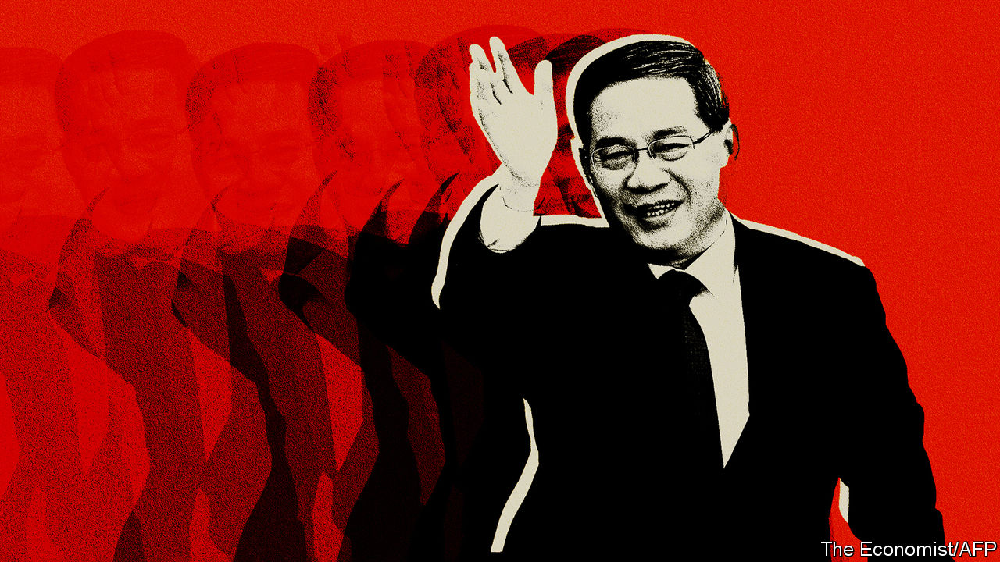

###### More than a yes-man?

# China’s new head of government, Li Qiang, has Xi Jinping’s ear 

##### Will he challenge his new boss? 

 

> Mar 12th 2023 

CHINA’S NEW prime minister, Li Qiang, is a puzzle. He has called private business his native province’s “golden namecard”. He has boasted of the entrepreneurial daring of his home town, and lashed out at officials for interfering with the market. He has scolded scholars for failing to criticise his work boldly enough. But he is also a protégé of Xi Jinping, who has crushed dissent and sent shivers through the business world with his efforts to tighten the  over everything, not least the economy. Could Mr Li’s appointment, rubber-stamped on March 11th by China’s parliament, make a difference to the way China is run?

Mr Xi’s rule by fear, requiring officials to make endless protestations of loyalty, has made it harder than ever to divine the policy preferences of individual leaders and sense how they get along with each other. In the years leading up to his latest appointment, the 63-year-old Mr Li has hewed to the same script as his colleagues. At the annual parliamentary meeting, known as the National People’s Congress, he heaped praise on Mr Xi, attributing China’s “major achievements” amid a “severe and complex international situation” to his “being at the helm and piloting the ship”. Such phraseology recalls the personality cult that surrounded Mao Zedong.

But it is worth pondering what kind of leader Mr Li might be. His predecessor, Li Keqiang, who is 67, was not close to Mr Xi and was sidelined by him after taking over as prime minister in 2013. Previously, however, the job had offered much clout, especially over economic policy. Two questions now arise. Will Mr Xi give the younger Mr Li, whom he is likely to trust far more than Li Keqiang, any more freedom to set his own agenda? If so, how might he use it? 

The two Lis have strikingly different backgrounds. The elder is an intellectual type, whose father was a mid-ranking official. He studied law and economics at the prestigious Peking University. The younger worked in a pumping station and a factory before studying agricultural machinery in his native province, Zhejiang. From early in his career, Li Keqiang appeared on track for a top job in the central leadership. Li Qiang, by contrast, might have remained little known outside Zhejiang had it not been for Mr Xi’s arrival: in 2002 Mr Xi became the province’s party chief. Mr Li was then the party boss of Wenzhou city, a centre of manufacturing in Zhejiang. In 2004 he was promoted, becoming Mr Xi’s chief of staff. (He also continued his part-time studies at Hong Kong Polytechnic University, gaining an MBA in 2005.)

Last October, in a  of the ruling Politburo, Mr Xi surrounded himself with people who had worked with him during his career in the provinces. Mr Li—by then the party leader of Shanghai—became his number two, replacing Li Keqiang. It was a remarkable promotion. Unlike previous holders of that rank, he had no experience at the central level. Some observers had wondered whether his record in Shanghai, where he had overseen a two-month lockdown of the city in 2022 that was widely resented by residents, might have doomed his chances of rising further. But clearly he had impressed Mr Xi, who then was championing a tough approach to covid-19. 

Mr Li, however, is no colourless bureaucrat. He may have instincts that are more in tune than Mr Xi’s with those of private firms. And he may, just possibly, be prepared to argue with his boss, even though he is likely to be unflinchingly loyal. 

In Shanghai many businesspeople liked Mr Li. He helped Tesla, an American electric-vehicle maker, set up a  that was wholly owned by the company—a rare concession to a foreign firm in China’s highly protected automotive industry. He supported the use of imported covid vaccines when the central government was digging in its heels. It still has not approved their use, even though Western-made vaccines are more effective than China’s. Whether policy will change now that Mr Li is prime minister will be interesting to watch. 

According to Reuters, a news agency, Mr Li was put in charge of the country’s covid task-force after last year’s Politburo shake-up. He introduced measures to loosen “zero-covid” restrictions. While cases mounted and Mr Xi wavered, the news agency says, Mr Li “resisted pressure from the president to slow the pace of reopening”. Reuters was not able to establish how Mr Xi reacted. But in February China’s leader declared a “decisive victory” over covid.

Not your typical functionary

In the country’s highly secretive political culture, such inside accounts are hard to confirm. But publicly available records of Mr Li’s career in the provinces occasionally hint at a man who has views of his own. 

One glimpse was offered in 2015 by , a newspaper in Beijing. It said that while working in Zhejiang, Mr Li told a professor at Zhejiang University that the provincial government needed an “independent think-tank like the RAND Corporation” in America to evaluate its performance. Mr Li said it was “very difficult” for official bodies to provide objective analysis and for subordinates to criticise their superiors. The professor accordingly set up a “non-governmental” group of experts in 2009 (though with a party stamp on it: Mr Li was appointed an honorary director). 

After taking over as Zhejiang’s governor in 2013, Mr Li asked the experts to write reports on his work that “tell the truth”. The professor told the group: “We must act like the child in ‘The Emperor’s New Clothes’.” Still, Mr Li reportedly felt the experts’ first attempt was not critical enough, so he paid them a visit to solicit face-to-face feedback that was more hard-hitting. On March 13th, at his first press conference after taking over as prime minister, Mr Li said he welcomed suggestions from netizens. On Weibo, a Twitter-like service, censors scrubbed many of their responses.

Unusually for a senior ethnic-Han official, he flaunted his local identity, particularly his ties with Wenzhou. The city is renowned in China for its maverick streak, its citizens having shown a partiality for capitalism even in Mao’s day. Its unique dialect, unintelligible to outsiders, fosters a sense in Wenzhou of being different (Mr Li has a hint of the accent). “I was born and bred a Wenzhounese,” he said at the inauguration in 2013 of the World Wenzhounese Conference, a group he set up to encourage members of the city’s global diaspora to invest in their home town. “The Wenzhounese spirit of daring to be the first and especially of strong entrepreneurship has always inspired and nourished me.”

Reducing bureaucratic interference in the market is one of his favourite themes. “Zhejiang is a place where reform and opening up began early and a sense of market rules is relatively strong,” he told an interviewer in 2015. “These entrepreneurs should go to the market instead of being cultivated in a greenhouse.” To be noted, however, is Mr Li’s pioneering role in what became a nationwide government-backed effort to create “characteristic towns”, or industrial clusters focused on one type of business, with residential areas around them. Zhejiang’s “Dream Town”, for tech startups, and “Chocolate Town”, for chocolate producers (and tourists), were among his early creations. As the idea spread across China, many such towns became speculative hotspots for housing developers, and the kinds of businesses they were supposed to cultivate sometimes failed to take off. Some became ghost towns.

In his speeches and interviews, Mr Li often spoke glowingly of Zhejiang’s most famous private businessman, , the outspoken founder of Alibaba, an e-commerce giant. Read today, such remarks stand out: Mr Ma all but disappeared from public view in 2020. He had dared to criticise financial regulators in a speech. They responded by lashing out at Ant Group, Alibaba’s financial affiliate, blocking its listing. That was the start of a regulatory onslaught against China’s big tech firms. It wound down last year as the economy faltered and Mr Xi—keen for private-sector support to revive it—began to sound more emollient towards billionaires. 

Mr Li’s appointment may help a bit to calm their nerves. But businesspeople will remain anxious. On March 10th the legislature approved a restructuring plan for the central government that is likely to result in further power being whittled away from the prime minister and being handed to Mr Xi. It also gave Mr Xi an unprecedented third term as president. Not one of the 2,952 delegates in attendance voted against him. Lest any netizen feel tempted to poke fun at such unanimity, Weibo blocked searches for “#2952”. If Mr Li has any different views of how China should be run, he will be super-cautious. He knows the emperor too well. ■


