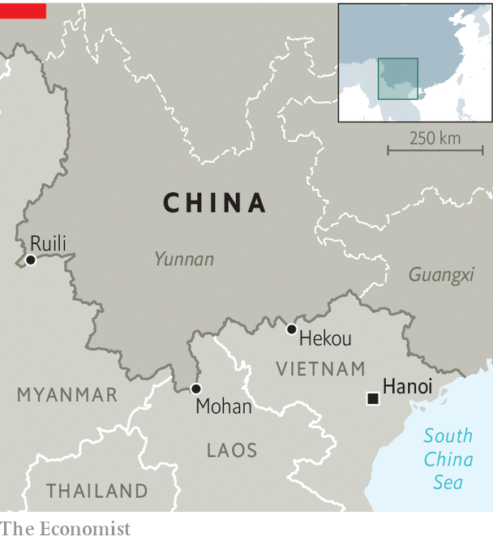

###### New frontier

# How life has changed along China’s border with Southeast Asia 

##### What was once a sieve is now secure 

 

> Mar 16th 2023 

In a dusty watermelon field in Ruili, on China’s frontier, a farmer leans on his hoe and looks south. He can hear chickens clucking in Myanmar, on the other side of the border. He would once have been able to see the country where he was born and where he still has family and land. Now, though, a steel wall blocks his view. It is topped with barbed wire, cameras and speakers, which occasionally blare out a warning for trespassers to stay away.

 


Some 5,000km (3,100 miles) long, China’s border with South-East Asia stretches from Vietnam to Myanmar (see map). According to a census in 2020, around 8.8m people live in the areas around it on the Chinese side. Crossing points in Ruili, Mohan and Hekou are bustling. Billions of dollars in goods cross the border each year, most legally, some not. Until recently, people on both sides—who are often from the same ethnic group—could mingle and trade without much state interference.

But over the past three years, life has changed along the border. During the covid-19 pandemic, barriers sprang up across China. Most were temporary, designed to keep people inside their homes, lest they spread the virus. The border wall—which is really a collection of fences, walls and barriers—aimed to keep covid out of the country. Parts of it were in place before the pandemic. Now it is “pretty complete”, says Hu Zhiding of East China Normal University in Shanghai. Today it is seen by officials as a way to stop smuggling and other illegal activity. What was once China’s leakiest border has become one of its tightest.

China’s southern borderlands were once famously fractious. Locals who lived amid the hills, forests and rivers that separate China from Myanmar, Laos and Vietnam were masters in “the art of not being governed”, as one historian put it. Faced with this challenge, as well as unknown diseases and unforgiving terrain, China’s emperors never took full control of the region. They made do with pledges of loyalty from pliable local leaders. Where, exactly, imperial authority ended was unclear. Still, emperors made use of the area. Disgraced officials were exiled to the south, where they often died of malaria.

A few boundary markers were placed in the late 19th century, after negotiations between the weakening Qing dynasty and European colonial officials in what was then Burma and Indochina. Locals probably ignored them. Following the collapse of the Qing dynasty a few decades later, as China fell into chaos, the border became even more of a fiction. In the 1940s American airmen flew across it to battle pilots from Japan, which had invaded China. A few years after that some Kuomintang generals, defeated by the Communist Party in China’s civil war, fled across the frontier, eventually starting new careers as opium-trading warlords in northern Burma.

When foreign travel was easy

It was not until 2009 that China and Vietnam agreed on their long-disputed land border, allowing mapmakers to draw a line between China and South-East Asia. The reality on the ground, though, remained messy. At China’s official entry points, passports were stamped and customs duties collected. Guards would patrol sensitive areas. But in between them, especially along the border with Myanmar, a multitude of unofficial crossings were used by locals. They might hop across several times a day, to farm their land, work in a factory or simply meet friends.

China grew increasingly concerned. Illegal goods, such as heroin, rosewood and human hair (for wigs), were moving across the border, too. Chinese citizens flowed south, some to gamble in Myanmar’s casinos, others to join gangs using telephones or the internet to con people in China out of money. For a while, leaders in Beijing leaned on locals to report suspicious activity along the border. In Ruili, warnings are still painted on walls: “The cowherds are sentries, too. Those ploughing the fields are also on duty.”

During the pandemic these efforts took on a new urgency. The priority of local governments was to cut off any source of infections. All foreigners and foreign goods were suspect. Locals were asked to man remote border stations in the forests. Big rewards were offered for catching interlopers. In an interview with state media, one volunteer described the “poisonous snakes” and “knife-wielding drug-smugglers” he encountered as he guarded the frontier. “Wherever the country needs me, I am willing to go!” he said proudly. 

At the same time, hundreds of millions of dollars were earmarked to build, expand and fortify barriers along the border. Today the Southern Great Wall, as some call it, cuts through fields and forests. In places it has been dug deep enough to thwart potential tunnellers. Some sections have cameras and motion sensors which, if triggered, will send a live video feed to the mobile phones of nearby guards.

Local leaders claim the wall and other efforts have greatly reduced nefarious activity. At a press conference last June, a police official in Yunnan province said he used the pandemic as an “opportunity” to step up security at the border. As a result, the amount of drugs seized has fallen by 62.4% since late 2021, he boasted. Illegal border crossings for the purpose of fraud, gambling and smuggling have “fallen off a cliff”, he added. His claim that over 99% of suspected criminals were caught at the border may have dented his credibility a little. But residents of Ruili, which is in Yunnan, agree that crossing the border illegally has become much harder.

According to state media, the people of Yunnan are happy with this development. “We feel that we are secure and that the motherland is powerful!” said a person quoted in the , a government-run newspaper. Some inhabitants of Ruili speak approvingly of how the new controls have diminished illegal drug use. Others compare China’s construction of its wall with the failed attempt by Donald Trump to complete a wall along America’s southern border with Mexico. Nationalist bloggers mock the former president. If Mr Trump had outsourced construction to China, his wall “would have been completed long ago”, wrote one netizen.

Propaganda aside, many residents of Yunnan are dejected. Ruili, in particular, suffered during the pandemic. It was subjected to some of the most severe and extensive lockdowns in China. Over the past three years the population shrank by more than half, to 200,000, as people fled to other parts of the country, says a local official. Adding to the decline, some citizens of Myanmar were forcibly repatriated. Others tried and failed to tear down the border wall, say locals.

Now the long way is the only way

The people who have remained in Ruili report that their lives have become much harder. Take the watermelon farmer, who would hop across a river to manage his land in Myanmar before the pandemic. Now he must travel 30km east to cross the border at an official post, then 30km back to reach his land. He has not seen his family in Myanmar since 2020. 

Others have lost their livelihoods running innocuous goods, such as cosmetics or snacks, from one side of the border to the other. Unemployment has increased on both sides, say locals. Goods from Myanmar now must go through authorised channels, where officials apply customs duties. Prices have therefore risen, say traders. One in Ruili complains that the cost of jadeite—the rock which is cut and polished into jade jewellery—has doubled. 

Locals are nostalgic for the days when international travel amounted to walking across a field or through some woods. But many seem resigned to the hardened border. “The wall is here to stay,” says a businessman in Ruili. “At the beginning I felt strongly about it. Now I’m just numb.” ■


