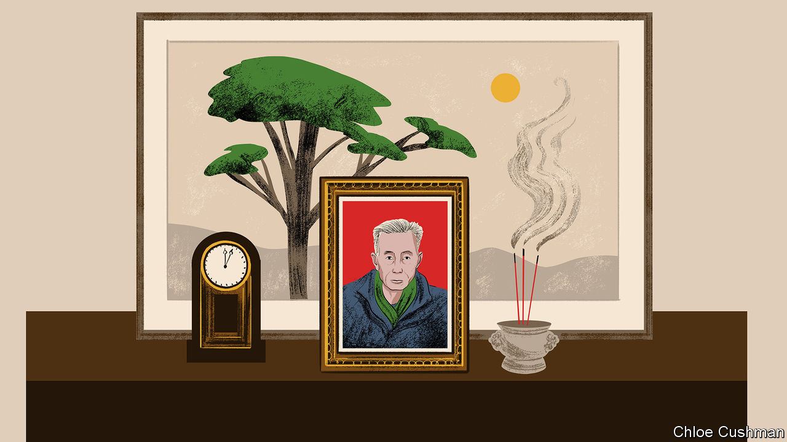

###### Chaguan

# Why Chairman Mao’s victims are denied justice 

##### As they grow old, witnesses to the Cultural Revolution speak out 

 

> Mar 16th 2023 

FOR any regime bent on forgetting past horrors, the last surviving victims are a troublesome group. As they grow old, those who suffered or witnessed acts of political violence become harder to cow into silence. China’s Communist Party faces such a moment. Even the youngest participants in the Cultural Revolution will be turning 70 soon. While there is time, some survivors are speaking out about that deadly decade of purges and bloodletting, unleashed in 1966 by Chairman Mao Zedong as a way to outflank critics within the party establishment. Unfortunately for such survivors, the collective interests of the ruling party and thus the nation, as defined by the supreme leader, President Xi Jinping, leave little room for individual pangs of conscience. 

School textbooks offer only terse accounts of the 1960s and 1970s, declaring that Mao’s mistakes are outweighed by his achievements. Mr Xi denounces “hostile forces” at home and abroad for what he calls “historical nihilism”. By that he means dwelling on dark episodes from the past to shake the public’s faith in the party’s leadership. For some older Chinese, calls to forget are appealing. For others who suffered in the Mao era, party-ordained amnesia is cruel: a life sentence of pain without parole. 

To better understand this moment, Chaguan spent time with a family first condemned as “counter-revolutionary” more than 70 years ago. In 1949 the end of China’s civil war found the Wang family of Shishi, a village set in the wooded hills of Jiangxi province, on the wrong side. Its patriarch was a lieutenant-colonel in the Nationalist army defeated by Communist forces. He was sentenced to hard labour. His only child—the idealistic, bookish Wang Kangfu—became a schoolmaster at the age of 17, teaching Chinese literature in a rural primary school. The younger Wang was 24 years old when the Cultural Revolution began. Soon afterwards police and revolutionary enforcers from a “socialist education work group” took him from his classroom. The investigation report used at his subsequent trial begins with his class background. It charges him with opposing Mao’s policies, reading classical literature under his father’s counter-revolutionary influence and teaching children to be spies. After listing his political crimes, it accuses him of raping and assaulting female students as young as 12 and complains of his “cunning” refusal to admit his guilt.

Wang was convicted of two counts of rape and ten counts of harassment. He was sentenced to ten years in a labour camp. Released in 1975, he continued to insist on his innocence. He was introduced to another class enemy, Zhou Sanying, the daughter of a landlord who had fled to Hong Kong, then a British colony. Locals felt they would be a good match. The two married in 1977, a year after Mao’s death in effect ended the Cultural Revolution. Though it was perilous to doubt the decisions of revolutionary courts, Shishi’s village school hired Wang as a substitute teacher, a low-paid job that he would hold for many years. He would go on to have four children, but devoted most of his energies and meagre income to seeking a retrial or exoneration.

Wang came close to clearing his name a few years after Mao’s death. It was a time of relative openness, when it suited economic reformers at the top of the party to allow some discussion of crimes committed by leftist zealots. Taking a risk, he wrote to ex-pupils whose testimony convicted him. In all, he found ten of the 12 students cited as witnesses. In letters and affidavits, all said he was innocent, including both pupils named as rape victims. Some replied that they did not know that they had accused him of rape, or described being coached to denounce him. In 1980 a well-connected relative secured a review of his case by a local court. As his youngest daughter, Wang Zhenzhen, recalls, the review described a “classic case concocted during the socialist education movement”. But his hopes were dashed. First a county-level judge privately questioned his insistence that he wanted no financial compensation. Then a higher court rejected his appeal, accusing him of colluding with witnesses. The teacher persisted for four lonely decades, rising before dawn to write hundreds of letters to courts, prosecutors and national leaders.

By any legal standard, a case deserving of retrial

Wang’s loneliness eased in recent years. Lawyers offered free advice, calling the prosecution evidence shockingly weak. Chinese journalists interviewed him, testing the boundaries of censorship. Seeing those reports, his ex-pupils rallied round to collect fresh statements. The classmates “all felt he was wronged”, says one of them, a sprightly 71-year-old retired forestry worker. Taking Chaguan to meet one of two women named as rape victims in 1966, he admitted that female classmates are tired of speaking about the case, fearing gossip from neighbours. The woman confirmed her statements that Wang is innocent, then retreated indoors, saying that the subject makes her husband and grown-up son unhappy.

A grave blow came in January 2022, when China’s chief prosecutors declined to reopen the case, citing a lack of new evidence. Wang’s wife does not begrudge him his 44-year-long campaign, though their cement-floored home is chilly and damp, forcing her to wear a thick coat and purple woollen hat indoors. She admits that the case robbed the family of a normal life, so that their home “was not like a home”. At times poverty drove the family to eat rotten vegetables and meat from pigs culled because of swine fever. But she calls her husband a good and kind man. She compares him to a vacuum flask, cold on the outside but warm within. “I have to support him, it’s such an unjust case,” she says.

For China’s rulers, such persistence is inconvenient, but time is on their side. Wang died last October, aged 80. His photograph sits on a dresser, flanked by funeral couplets, incense sticks and a black-and-white portrait of his father, the Nationalist colonel. The authorities can wait. Soon the Cultural Revolution will be known only through history books, and the party writes those. ■


