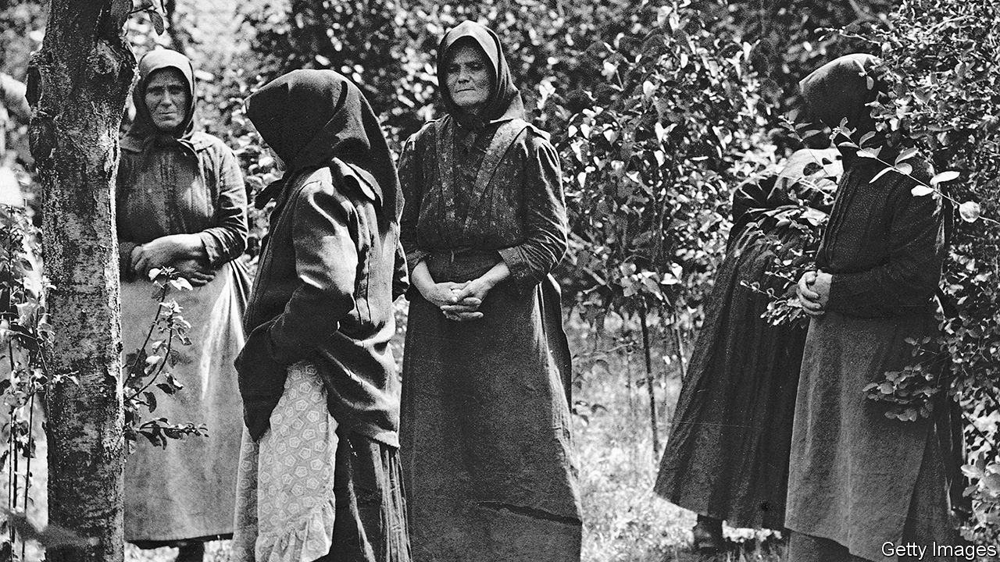

###### Her cruel device

# The story of the poisoners known as the “Angel Makers of Nagyrev” 

##### In a Hungarian village in the early 20th century, women offed their adversaries with arsenic 

 

> Mar 16th 2023 

By Patti McCracken. 

WHEN THE people of Nagyrev had a problem, they went to Auntie Suzy. Though she had no formal training, she was the Hungarian village’s appointed midwife and the closest thing it had to a resident doctor. Men used her homemade tinctures for relief from the aches and pains they sustained toiling in the fields. Women, too, turned to her for help, and not just with the delivery of their babies. Alongside rubs and salves, Auntie Suzy produced another concoction: arsenic, made from boiling flypaper in vinegar.

Some women used the solution out of desperation—to avoid having another mouth to feed or to get rid of a violent spouse or relative. Others, however, dispensed it to deal with less urgent personal inconveniences. One woman had tired of her clingy husband, so fed him contaminated duck soup. Another, weary of her adult son, mixed some of the elixir into his goulash; later, when she suspected her third husband of having an affair, she reprised her technique. The arsenic was an open secret. If a woman complained of her partner’s behaviour, a friend would suggest a visit to the midwife.

Patti McCracken’s new book, “The Angel Makers”, is a detailed account of the killing spree in Nagyrev and other nearby villages in the early 20th century. It took prosecutors several years to grasp its scale. Eventually 29 women and two men were put on trial in 1929 for the murders of 42 men; 16 women were convicted. Scores of bodies were exhumed and examined for traces of arsenic. Some think as many as 300 people could have been killed. “The boldness and utter callousness with which they carried on their criminal activities seems to have been equalled only by the stupidity of the men who were their victims,” the reported.

The author weaves in character sketches that suggest the perpetrators’ various motives. Her portrait of Auntie Suzy, a buxom woman fond of her pipe and brandy, is particularly evocative. When questioned by the police about a pattern of infant deaths, she described her role in benevolent terms: she helped poor people with family planning. In fact, she was motivated by money and status. 

She plundered goods from clients’ homes and charged exorbitant fees for her potions. (From Maria, the woman who killed her son and husband, she hoped to extract a house.) Occasionally Auntie Suzy or one of her helpers would bump someone off unprompted. A baby was killed without the mother’s say-so. A war veteran was dispatched so that Auntie Suzy’s son might marry his wealthy widow. 

Ms McCracken also lays out the context in which these misdeeds took place. She describes regional customs and the effects on the village of the first world war and the fall of the . Nagyrev was surrounded almost entirely by the Tisza river, which often flooded and cut off its inhabitants from the outside world. It was a place making a slow transition from old ways of living to newfangled bureaucracy, and from the methods of Romani healers to modern medicine.

This macabre story offers two enduring lessons. One is the importance of  over whether and when they have children. Another is the value of well-funded public services. Letters, written anonymously, had repeatedly raised the alarm about suspicious deaths in the area. A visiting doctor even requested an investigation, but there was no money to pay for one. The local government was busy renovating the courthouse and, somewhat ironically, the prison.

Readers may also draw a third, more troubling conclusion. Auntie Suzy pledged—wrongly, as it turned out—that “not even a hundred doctors” would be able to detect her poison in its victims. The women thought they could get away with murder and their approach became alarmingly casual. Lots of people could take another life, this episode suggests, given the opportunity, even the slightest of motives and an assurance of impunity. ■

