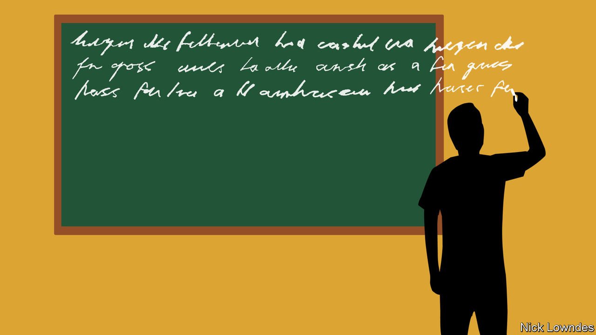

###### Johnson

# “Omit needless words!” But not all of them 

##### When and why redundancy can be useful in writing and speech 

 

> Mar 16th 2023 

“PLEASE RETURN your tray tables to their full upright and locked position.” “Remember to take all of your personal belongings with you when you leave the train.” Something about writing announcements for public transport seems to bring out the wordiness in people. These instructions can be shortened to “Please put your trays up” and “Please take your things.” 

Redundancy is widely seen as a . “Omit needless words” is perhaps the least redundant statement of this view, made famous by “The Elements of Style”, a bestselling usage manual published in 1959. In it, , an essayist and novelist, attributed the dictum to his university English teacher, William Strunk. In the classroom, Strunk “omitted so many needless words” that he was often “left with nothing more to say, yet with time to fill”. So Strunk resorted to saying everything three times: “Omit needless words! Omit needless words! Omit needless words!”

On reflection, though, did he really need to say that three times himself? If he had already said everything that was required, he could have let the class out early rather than repeating his call for concision. That he did so suggests there may be more value in redundancy than meets the eye. Language scholars, indeed, think it fulfils several functions.

One, hinted at by Strunk’s repetition, is learnability. Repetition, after all, is reinforcement. Languages that include the same piece of grammatical information in more than one way are probably more easily acquired by children, or indeed adults. For example, the  ending on the verb gives no new information in “Yesterday, he walked”, because “yesterday” already situates the event in the past. Many languages—Mandarin, for example—do not require such endings. In those, such as English, which do, the doubling up of signals may have developed to make them easier to learn.

Another benefit of redundancy can be seen on those trains and planes. These are noisy and distracting places where a brusque “Please take your things” may not be heard by all passengers. Redundancy makes a signal robust. For instance, spacecraft beaming digital messages to Earth include “error-correction bits”, redundancies in the signal that allow engineers back home to reconstruct the inevitably degraded transmissions. Here redundancy is a feature not a flaw.

A recent study of Dutch and English confirmed this is true of human languages, too. It looked at how both languages handle sentences like “She gave the book to him”: ie, those with both a direct object, “the book”, and an indirect one, “him”. In both Dutch and English, word order is relatively fixed for the giver, thing given and recipient. But there are also ways of emphasising this information. The pronoun “She” is in the nominative case, marking it as the subject or giver. “Him” is in the objective case, making clear that it is an object (it is not “he”). Strictly, either the form of the pronouns or the word order could distinguish giver from recipient, but most such sentences in English and Dutch offer both. 

Languages may even adapt to maintain an optimal level of redundancy. A thousand years ago, every English noun—“king”, say, or “Alfred”—changed forms, as “he” does to “him” to show which role every word played in a sentence (subject, direct object and so on). Over the centuries those endings disappeared, potentially making sentences ambiguous. The grammar of English responded by making word order, which had once been fluid, more rigid. And English still employs other features—such as the use of the preposition “to”, or the objective-case forms “him” and “her”—just in case.

Another possible use of redundancy is simply to make listening or reading less taxing. If every possible word that can be removed is removed, so that every remaining one is absolutely crucial, listening and reading become stressful. You cannot let your mind wander for even a moment. Such prose is almost too dense with information; even a short passage of this kind would be demanding to read. Sometimes a little room to breathe is no bad thing. 

Just a little, that is. The advice to keep it trim is still good counsel. Blaise Pascal, a French author of the 17th century, once apologised for a long letter by saying: “I have not had time to make it shorter.” Keeping things tight can be hard work for the writer, but it saves time for the reader, at least up to a point. Make your prose  to keep your reader reading—but not more.■


