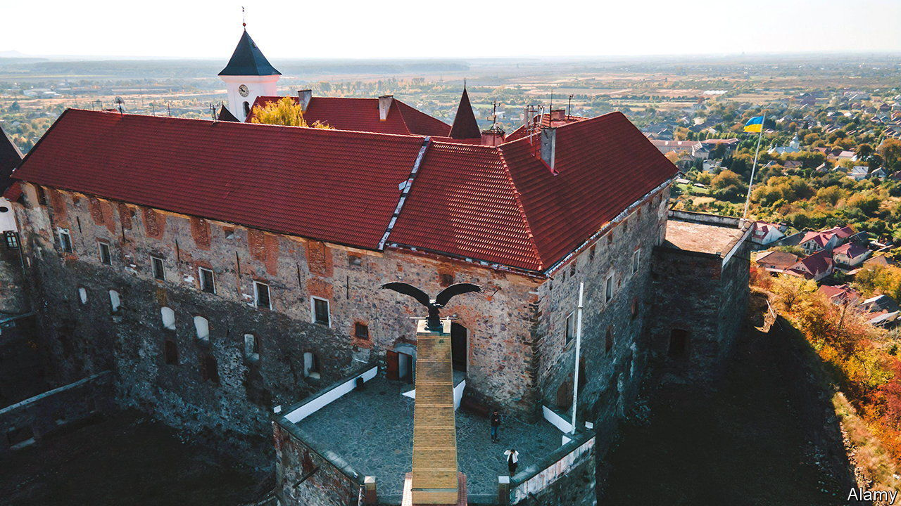
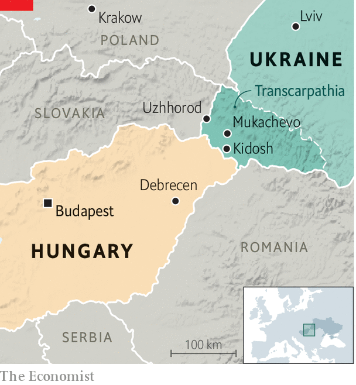

###### Uneasy minority

# Ethnic Hungarians have been having a tricky time in Ukraine 

##### Hungary’s support for Russia has been a problem 

 

> Mar 16th 2023 

“This is not our war,” says Dorottya, a kindergarten janitor, using the words of Viktor Orban, Hungary’s prime minister. “This is a Hungarian village.” But Kidosh is in Ukraine, ten kilometres from the border, in a belt along the frontier inhabited mostly by ethnic Hungarians. Gabor, her 14-year-old son, says he does not feel Ukrainian, does not speak Ukrainian and since “life is not good here”, he wants to go to a boarding school in Hungary, whence he will probably never return. 

Official Hungarian-Ukrainian relations have been frosty for years and the war has made them worse. As a result, Ukraine’s Hungarian minority has suffered. Its numbers have been shrinking and the war is accelerating the exodus. Its members are also divided. Karoly Sass, a winemaker in Kidosh, says that of course “this is our war, we live in this country!” 

 


Almost the entire Hungarian minority in Ukraine lives in the western province of Zakarpattia, commonly known in English as Transcarpathia. In the first post-communist decades, relations between Ukraine and Hungary were excellent, and by 2020 Hungary had provided more than €250m ($264m) in aid to support local Hungarians, and Transcarpathia as a whole. But now relations have deteriorated so much that on January 19th Tamas Menczer, a senior official in Hungary’s foreign ministry, accused Ukrainian officials of committing “atrocities” against the minority. He was, it turns out, referring to the removal by police of Hungarian flags from some municipal buildings near the town of Mukachevo. 

Such language will have delighted the Kremlin. Since 2014, says Dmytro Tuzhanskyi, director of the Institute for Central European Strategy, a think-tank in Uzhhorod, the provincial capital, Russia has tried hard, but failed, to stoke ethnic tensions in Transcarpathia through social media and other means. Gabor claims that the 1920 Treaty of Trianon, by which Hungary lost two-thirds of its territory, including Transcarpathia, was actually a “contract” which expired after 100 years, so now it should be returned to Hungary. He probably got this nonsense from social media. 

Surveys conducted by Mr Tuzhanskyi reveal that there is “almost zero” chance of ethnic conflict in Transcarpathia. But there are real tensions. Since 2017 educational reforms mean that Hungarian-minority state schools must spend increasing amounts of time teaching in Ukrainian. This can be tough for the students. 

A new minority-rights law passed last December is also causing problems. Sandor Shpenik, the dean of the Ukrainian-Hungarian Educational Institute at Uzhhorod university, has concluded that the Ukrainian authorities “want us to assimilate or leave”. Laszlo Zubanics, the head of the Hungarian Democratic Union of Ukraine says sadly that “the problem is that the new generation is not motivated to learn Ukrainian because they cannot see a future in this country.” 

And leave they do. According to the last Ukrainian census, back in 2001, there were 151,500 Hungarians in Transcarpathia, which was then 12% of its population. By 2017 a survey found that the number had dropped to 131,000. Now, says Mr Zubanics, the figure for those remaining has fallen to 75,000-85,000. For years it has been easy for Transcarpathian Hungarians to emigrate anywhere in the EU, as Hungary has given them passports. 

Last October a bronze sculpture of a symbolic Hungarian eagle that had loomed over Mukachevo atop its castle since 2008 was replaced with a Ukrainian trident. The eagle “was erected as a symbol of friendship”, says Andriy Baloha, the (ethnically Ukrainian) mayor: but now the situation has changed. Though he denies it, analysts say the removal of the eagle was part of a row between the “Baloha clan” and local ethnic-Hungarian politicians. 

Mr Baloha says that if Kyiv had fallen to Russia last February, Transcarpathia “would have been transferred to Hungary as a gift for supporting Russia”. Mr Zubanics scoffs at such talk. A Greater Hungary cannot be recreated, he says. Meanwhile, although plenty of ethnic Hungarians, like so many other people, may have fled Ukraine following the Russian invasion, Mr Shpenik is keen to point out that some 300 of his fellow Transcarpathian Hungarians are at the front, fighting alongside their fellow Ukrainians. ■

