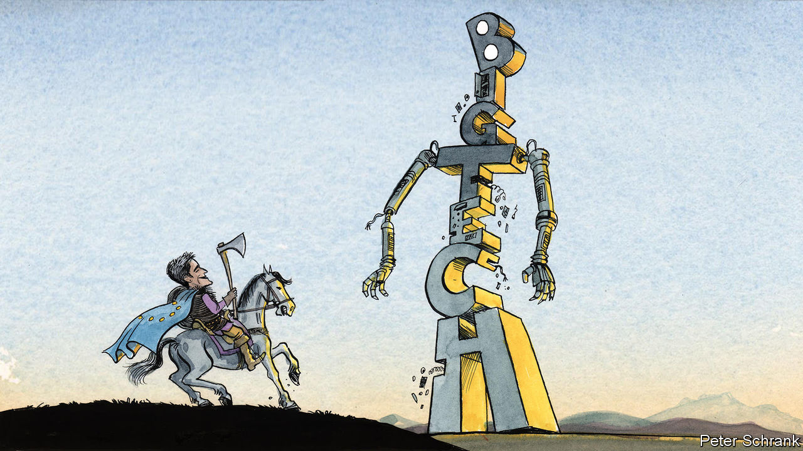

###### Charlemagne

# Europe has led the global charge against big tech. But does it need a new approach? 

##### A chat with Margrethe Vestager 

 

> Mar 16th 2023 

In the Past couple of decades, Europe and America have taken different paths in how they regulate large firms. American watchdogs largely sat back as big business got bigger, most notably the tech mastodons like Google, Apple and Facebook. Europe, in contrast, felt mega-corporations needed to be kept in check. Its regulators became the world’s most fearsome, none more so than Margrethe Vestager, the EU’s antitrust chief since 2014. Even as Europe failed to come up with tech giants of its own, it was not in California or Washington that Silicon Valley faced most scrutiny, but in rainy Brussels, home to the European Commission. 

Liberals anxious to keep markets open and vibrant—including this newspaper—cheered Ms Vestager and the tough approach she embodied. Energetic enforcement of competition rules meant low prices for European consumers shopping for flights, phone calls and more. Americans meanwhile got bilked by firms that had been allowed to consolidate until little competition remained. Perhaps surprisingly, Europe took on even the mighty tech giants, imposing multi-billion-euro fines on the likes of Google and, at times, forcing changes to tech business models. A sweeping new set of rules, known as the Digital Markets Act (DMA), comes into force this year, giving the EU more powers over large tech firms. When the Biden administration from 2021 looked to reverse decades of lax antitrust enforcement in America, its watchdogs borrowed many of their ideas from Ms Vestager. 

Europe might be flattered by such imitation. Nonetheless it should now ask itself if its strong-arm approach is still the right one. For even as its regulatory reasoning has remained the same, the corporate environment it is applying it to has changed. At least when it comes to big tech—antitrust’s thorniest problem—things have not panned out as Europe thought they would. That should prompt fresh thinking on how to regulate online champions.

Ms Vestager’s regulatory method is premised on the idea that consumer tech markets tend to winner-takes-all outcomes: firms that gain an early advantage go on to secure an unassailable perch. Once you have told Facebook who all your friends are, moving to a rival network is all but impossible, even if the site offers a terrible experience. Google fine-tuned its services using troves of data, including years of its users’ search and browsing histories. That entrenches its market power. Only by forcing tech incumbents to open up—for example by forcing Google to hand over data to potential rivals to help them train their offerings—could the playing field be somewhat levelled. 

That was the theory. But recent developments suggest that tech is far more up-for-grabs than Ms Vestager supposed. Facebook is now struggling to keep current users engaged, let alone to attract young ones. Teens have decamped to TikTok, a zippy short-video app from China. For the first time in two decades of dominance, Google is facing a challenge to the search engine that underpins its profits. Advances in artificial intelligence (AI) are powering a new generation of rivals. Microsoft’s Bing, long a distant also-ran, is the latest sensation. Supposed future monopolists like Uber and Netflix have flagged. Across Silicon Valley, tech firms are now laying off workers. The share prices of the biggest firms have sagged, because investors who used to imagine boundless monopoly profits tomorrow now assume competition will grind down margins. 

Is big tech’s weakening grip on consumers a sign that Europe’s approach is working? On the contrary. It was not regulatory action that spurred rivals: both Bing and TikTok have relied on ingenuity more than a helping hand from the state. The lure of capturing vast profit pools spurred innovation, to the benefit of consumers. This is what America’s hands-off school of antitrust said would happen—and Europe’s assumed could not. 

Charlemagne put this case to Ms Vestager in her Brussels office recently. Admirably for a regulator, she is open to those wondering if the assumptions behind the approach that has made her a star among trustbusters may be obsolete. The Dane has noticed tech’s recent travails. But she still sees life in her old stringent approach. “It may be over time that digital monopolies are toppled,” she says, “but time is not something you have if you want the full potential of innovation to be unlocked.” There is plenty of market power to be abused in the years it takes for a better search engine or social-media platform to come along. The power of AI to disrupt monopolies may prove illusory, she says. Mass sackings and sagging share prices are a sign of deflated hype following a pandemic-driven boom, not thriving competition. 

Facebook plant

Ms Vestager’s record in keeping competition vibrant in old-world industries is creditable. A lot of what she has done to hem in big tech—for example all but banning acquisitions of potential future rivals by large incumbents—still looks sensible. But now she is being goaded to do ever more to rein in the titans. In America a new generation of gung-ho trustbusters is now in charge, with no time for the hands-off model once preferred there. They are stretching competition rules to the limit in a bid to bring large companies to heel, often for ideological reasons. Thanks to the DMA, Europe will gain vast new powers to police large “gatekeeper” firms like Amazon and Apple, so preventing anti-competitive behaviour before it happens. Silicon Valley’s foes are hoping Europe will once again become the tech clobberer-in-chief.

This challenge need not be taken up by Ms Vestager. Perhaps fresh evidence will emerge that the antitrust screws do indeed need to be tightened. But a regulator of her calibre should be alive to the possibility that the opposite may be needed. Europe made decisions based on facts at hand; if those facts change, there is no shame in adjusting one’s approach. Watchdogs should aim to be as nimble as the businesses they regulate. That can mean being brave enough to bin ideas and adapt to a new reality. ■


