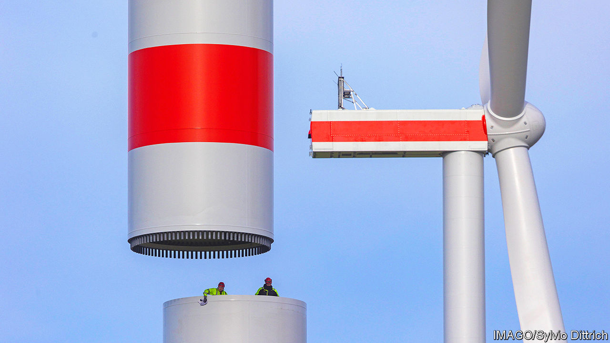
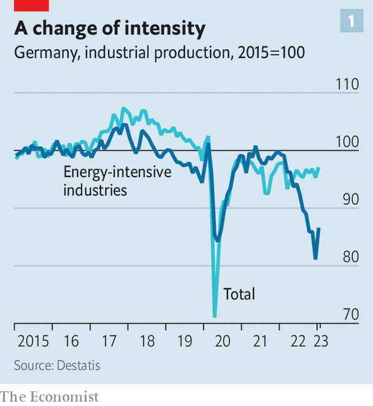
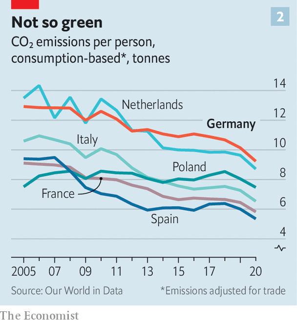
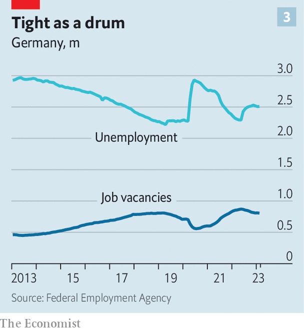

###### Crunch time

# Germany is at last tackling its long-standing economic weaknesses 

##### Can Olaf Scholz turn things around? 

 

> Mar 15th 2023 

“We are at a time of great upheaval,” said  on March 6th, standing in front of Schloss Meseberg, a baroque castle in Brandenburg where his cabinet was holding a two-day pow-wow. This is not only because of , explained the German chancellor, but because of the transformation required by the environmental crisis. He promised to turn Germany at high speed into a gleaming, climate-neutral economy. But can he pull it all off?

This “new German speed” has become Mr Scholz’s mantra. “We already had massive weaknesses before the crisis,” says Clemens Fuest, head of Ifo, a Munich-based economic-policy think-tank. The invasion of Ukraine exposed Germany’s dependence on , its inability to defend itself militarily and the pitfalls of close economic ties with autocracies—those with China potentially as risky as the ones with Russia. Last year China was again Germany’s top trading partner, for the seventh consecutive year, with combined exports and imports of more than €298bn ($320bn), up by around 21% from 2021. Germany depends on China for the import of rare earths that are indispensable in batteries and semiconductors as well as other critical minerals. BASF, a chemicals giant, is investing €10bn in a new factory in southern China. Volkswagen, Europe’s biggest carmaker, relies on China for 40%, by volume, of its sales.

The economy’s vulnerabilities go well beyond those that have been brought into sharp focus by the Russian invasion a year ago. Germany has also been too slow in decarbonising and digitising its economy and in confronting its demographic problems and the acute shortage of skilled workers that affects especially the midsized companies of the 

Does all this mean that Germany’s entire business model is broken? Most economists do not think so, though deep structural change is needed. “The economy was more resilient than expected,” says Klaus Günter Deutsch of the Federation of German Industries, a lobby group. Last year there was talk of large-scale deindustrialisation because of the spiralling cost of energy that affected in particular the chemicals industry, one of Germany’s biggest, but also makers of paper, ceramics and other energy-intensive goods. The DAX, the index of German blue-chips, dropped by 27% in the first nine months of last year, almost twice the fall in Britain’s ftse 100 or America’s s&amp;p 500. Some pundits predicted a deep recession for Germany in 2023. 

As spring approaches, the outlook is rosier. Helped by a mild winter, Germany never came close to needing gas rationing, as many people had feared. According to government forecasts, Germany is now likely to dodge a recession this year. 

 


The panic about deindustrialisation has also abated. Energy-intensive production has declined by 13% compared with January 2022 (see chart 1), but overall industrial output has held up. That points to a rejigging of supply chains rather than a wholesale process of deindustrialisation. BASF is restructuring its complex production profile to shed low-margin products, for instance. Steel-makers have already done so. “Demand for commodity steel in the German market has decreased significantly in recent decades. We focus on highly specialised steel products that very few can produce,” says Markus Grolms of ThyssenKrupp, a big steel-maker. 

Rüdiger Bachmann, an economist at Notre Dame University in Indiana, predicts that the geography of German production will shift permanently. A fairly small percentage of industrial companies that use energy-intensive and relatively simple processes, such as the makers of ammonia, zinc or aluminium, will relocate abroad. But others that use more complex production processes are likely to take their place. 

 


Yet even with fewer energy-intensive businesses Germany will need plenty of green energy if it wants to become a climate-neutral economy, as planned by 2045. Its efforts to decarbonise are lagging. Its annual carbon footprint, of nine tonnes per person in 2020, is roughly 50% higher than that of France, Italy or Spain (see chart 2). For a place that likes to think of itself as a climate leader and that has spent billions on its  a strategy to replace fossil fuels with renewables, it is a long way to net-zero emissions. 

In January Mr Scholz also spoke, in Davos, of the “new German speed” in reaching climate goals. A recent law mandates the prioritisation of expanding wind and solar power, as well as electricity and hydrogen networks, he said.. Under this new regime, approvals for electricity grids are being granted, on average, two years faster than before. This year the Scholz government has more than doubled the volume of calls for tender for onshore wind farms. The chancellor’s ambitious goal is to erect four or five new wind turbines every day until the 2030s. By 2030 fully 80% of German electricity production will come from renewables, promises Mr Scholz. It is a tall order.

The digitisation of businesses is another area where Germany has been too slow and too bureaucratic. It ranks only around average among EU members on businesses’ integration of digital technologies. Its public administration is woefully analogue. It dealt with the pandemic mostly by using the fax machine. Many states and municipalities missed a deadline last year, set by a federal law in 2017, to make almost 600 public services available online. 

There is progress in some areas, especially in the private sector. According to the government’s Gigabit strategy, at least 50% of German households and businesses are to be connected to the optical-fibre network by 2025 and all households should be connected by 2030.  companies are making progress, in particular those in the engineering and machinery industries. But the cultural shift needed to embrace the digital economy takes time. Firms’ readiness to embrace technology often depends on the age of the CEO, says Matthias Knecht, the 41-year-old co-founder of Billie, a startup in Berlin that specialises in business-to-business payments.

 


The final neglected challenge is the replacement of retiring workers. Germany’s working-age population is around 64% of the overall population, similar to America’s. But the largest cohorts are in their late 50s and early 60s. Firms are already struggling to fill vacancies (see chart 3). The Institute for Employment Research, a think-tank, predicts that without more immigration or policy changes, the labour market will lose 7m workers by 2035, from 46m now. But there is some potential in giving older workers and those working part-time more incentives to add hours. 

Retraining the workforce is a central element of businesses‘ strategies to tackle this shortage of skilled workers. “We are planning a training programme of at least 12 full working days per worker, mostly because of new manufacturing techniques,” says René Wolf, of Ford Europe in Cologne. Higher pay would help to draw workers to the best and most productive firms, but Germany prides itself on wage restraint.

Germany needs an economic-policy(an epochal turning-point) as much as it requires the one Mr Scholz has promised in its military and foreign policy. That is a huge task, given the backlog left by previous governments. Mr Scholz must get his coalition government to stop squabbling. And he needs to achieve something possibly even harder: to get his fellow Germans excited about the future. ■

