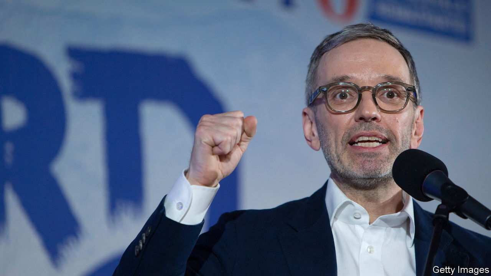

###### Austrian populists

# The alarming comeback of Austria’s far-right Freedom Party 

##### And the rise of Herbert Kickl 

 

> Mar 16th 2023 

A spectre is haunting Austria—the prospect of a government led by Herbert Kickl, boss of the far-right Freedom Party (FPÖ). According to a poll on March 11th for, a weekly, the FPÖ is now comfortably the strongest party in the Alpine republic, with 31% of the vote, followed by the Socialists (SPÖ) at 25% and the centre-right Austrian People’s Party (ÖVP) with 22%. If Austrians could vote directly for their chancellor, the poll showed it would be a tie between Mr Kickl and the ÖVP’s Karl Nehammer, the incumbent. 

The result of recent state elections in Lower Austria, formerly a fief of the ÖVP, confirms the renaissance of the FPÖ. The ÖVP lost its absolute majority, scoring 40% of the vote, its worst result in decades, while the FPÖ’s share jumped from 15% to 24%. On March 5th voters in Carinthia, an FPÖ stronghold and Mr Kickl’s home state, saw the party take its vote share from 23% in 2018 to 25%; the incumbent state governor’s SPÖ lost nine percentage points. 

The reason for the FPÖ’s comeback is the poor performance of the leaders of both of the big mainstream parties, the ÖVP and the SPÖ, and the confluence of the pandemic, the war in Ukraine and the cost-of-living crisis. Austrian tourism was especially hard hit by the chaotic covid policies of successive ÖVP-led governments. 

Mr Kickl is almost unknown outside Austria, even though, as a hardline ideologue, he was the power behind the throne of both Jörg Haider and Heinz-Christian Strache, two of the FPÖ’s long-term leaders. He concocted many of the party’s nastiest slogans, such as “More courage for our Viennese blood” and “Home, not Islam”.

He rose to the top after a scandal rocked Austria in May 2019 that seemed to spell the final destruction of the FPÖ. A secretly filmed video showed Mr Strache, then the FPÖ’s boss, at a villa in the Spanish island of Ibiza where he appeared to promise government contracts in exchange for party donations to a woman who claimed to be the niece of an oligarch close to Vladimir Putin, Russia’s president. Mr Strache was out, both as boss of the FPÖ and as Austria’s vice-chancellor, within 24 hours.

Sebastian Kurz, who was then the chancellor, dissolved the coalition government of his ÖVP and the FPÖ, and called an early general election. Support for the FPÖ thereupon plunged by a third, from 25% to just 16%. Mr Kurz picked the Greens as his new coalition partners rather than the FPÖ.

At municipal elections in Vienna the following year, the FPÖ’s vote slumped even more, from 30% to a dismal 7%. By then led by Norbert Hofer, the party was riven by bitter battles between a more conciliatory faction close to Mr Hofer and acolytes of the openly xenophobic Mr Kickl. In June 2021 Mr Hofer threw in the towel. Mr Kickl became the party’s undisputed boss.

“The international fixation on Jörg Haider meant that once he was gone, the alarm about his party faded,” says Andreas Peham, an expert on the far right at the Documentation Centre of Austrian Resistance. (Haider died in a car crash in 2008 at the age of 58.) But the party’s views have since become still more radical. Mr Kickl, for instance, has sounded ambivalent about his party’s attitude to the identitarian movement, Europe’s answer to America’s alt-right, with its anti-Muslim, anti-media and anti-migrant messages.

As a result of this radical lurch, the other bigger parties say they will refuse to consider any type of alliance with the FPÖ. So even if it were to be the strongest party at next year’s general election, it would get back into government only if the other party leaders changed their mind. They used to ostracise Haider and his FPÖ. But in 2000 Wolfgang Schüssel, the chancellor and ÖVP leader, broke that taboo. In fact, the FPÖ has been part of a coalition government four times in the past 40 years. ■

