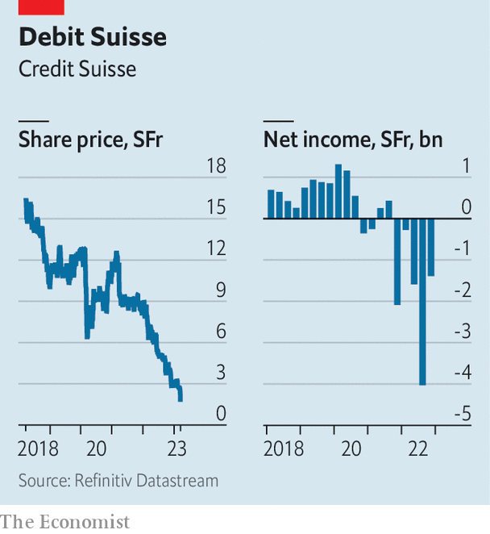

###### Panic on Paradeplatz

# Credit Suisse faces share-price turbulence, as fear sweeps the market 

##### What will release the bank from its waking nightmare? 

 

> Mar 15th 2023 

Shaky share-issuances can sink banks. The  by Silicon Valley Bank (SVB) to raise capital proved as much. On March 15th  found that shaky shareholders can do lots of damage, too. Saudi National Bank, the firm’s biggest shareholder, appears to be suffering a bad case of buyer’s remorse. Quizzed about any further investment in Credit Suisse, the response from the Saudi bank’s chairman was brutal: “Absolutely not, for many reasons outside the simplest reason, which is regulatory and statutory.” 

Investors ran for cover. Credit Suisse’s share price plunged by a quarter to its lowest-ever level; other European banks took a knock as well. Reports swirled that financial institutions were examining their exposure to the bank. By the end of the day Swiss regulators had released a statement saying that Credit Suisse met the capital and liquidity requirements applicable to big banks, but that they would offer the bank support if needed. In the early hours of March 16th, Credit Suisse said it would borrow up to SFr50bn ($54bn) from the central bank and buy back debt. This prompted some recovery in its share price.

 


Investors are unlikely to lose their shirts. Yet they have plenty of reason to grumble. Multibillion-dollar losses from Credit Suisse’s dealings with Archegos Capital, a family office that collapsed in 2021, and Greensill Capital, a supply-chain-finance firm that also imploded that year, are near the top of the list. Last year clients withdrew cash from every corner of the bank. It was all too much for one long-term shareholder: Harris Associates, an investment firm, sold the last of its shares. 

Newer owners have experienced their share of woes. On March 9th Credit Suisse announced a delay in the publication of its annual report owing to a last-minute call from the Securities and Exchange Commission, America’s main financial regulator. The accounting issues in question are nothing major, but the firm’s confession of “material weaknesses” in its financial-reporting system is hardly likely to have reassured investors. 

When shareholders finally got their hands on the report on March 14th, it made for grim reading. At the end of 2022 Credit Suisse posted its fifth consecutive quarterly loss. Raising SFr4bn late last year repaired the bank’s common equity to risk-weighted assets ratio, a crucial indicator of a bank’s capital strength. The figure now stands at a respectable 14.1%, up from 12.6% at the end of September. But few expect it to hold steady as the bank embarks on an ambitious restructuring programme and simultaneously attempts to reverse uncomfortable outflows of client cash. 

Plugging this cash gush is the immediate problem. Assets managed by the wealth-management division fell from SFr740bn at the end of 2021 to just over SFr540bn in 2022, as bankers failed to convince ultra-rich clients to park their money with Credit Suisse. Little reprieve was found in the domestic Swiss bank, normally the cash cow of the business. Total outflows amounted to 8% of assets under management in the fourth quarter, obliging the bank to use its liquidity buffers. 

Although Ulrich Körner, Credit Suisse’s chief executive, hopes to trim the cost base and restructure its investment bank, more pain could lie ahead. The remodelled investment bank, called cs First Boston, will revolve around Michael Klein, a dealmaking supremo. He had served on Credit Suisse’s board of directors until October 2022. In February the bank bought his boutique advisory shop for $175m. 

There are reasons to take the intention to build a big boutique investment bank seriously. Credit Suisse has long excelled in advising on corporate buy-outs, which will eventually recover after a frosty 2022. Giving senior managers equity in the business is a reasonable way to attract dealmakers. But those preparing for the leap will this week probably have decided to pause in order to assess the damage. 

In the event of a catastrophic run, which now seems unlikely, few doubt the Swiss state would come to the rescue of half of the country’s beloved banking duopoly. One option is a tie-up with Credit Suisse’s better-behaved compatriot, ubs. Such a rescue mission would have a weak commercial logic, however, and involve considerable turbulence. As with Credit Suisse’s current plans, its success would be far from guaranteed. ■


