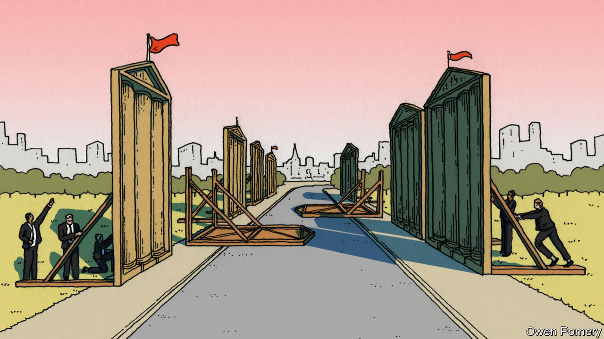
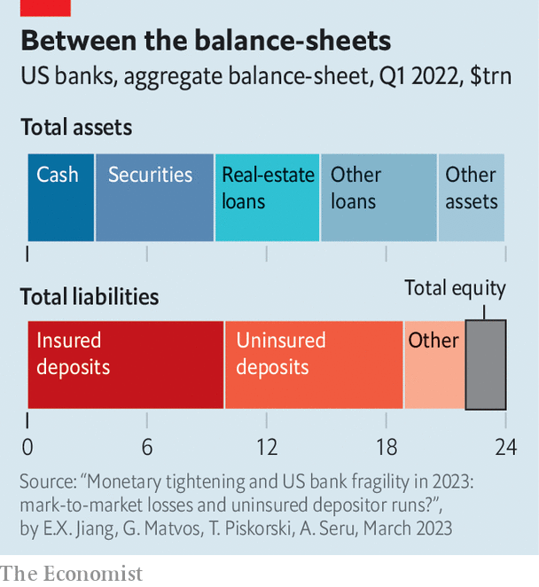
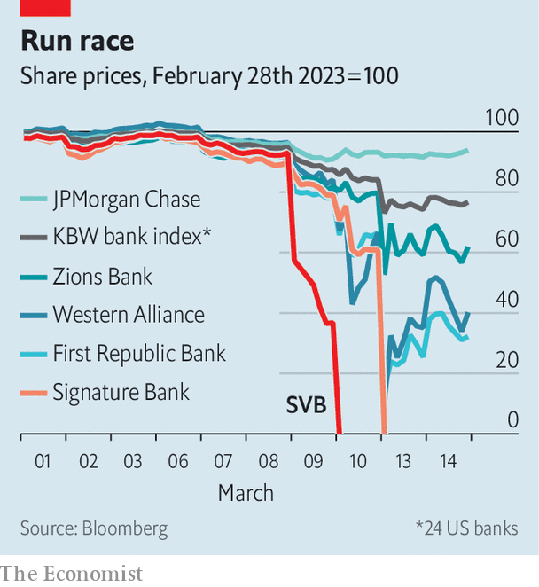

###### The prop-up job

# How deep is the rot in America’s banking industry? 

##### Silicon Valley Bank may be the start of something grimmer 

 

> Mar 16th 2023 

Banking is a confidence trick. Financial history is littered with runs, for the straightforward reason that no bank can survive if enough depositors want to be repaid at the same time. The trick, therefore, is to ensure that customers never have cause to whisk away their cash. It is one that bosses at Silicon Valley Bank (svb), formerly America’s 16th-largest lender, failed to perform at a crucial moment.

The fall of svb, a 40-year-old bank set up to cater to the Bay Area tech scene, took less than 40 hours. On March 8th the lender said it would issue more than $2bn of equity capital, in part to cover bond losses. This prompted scrutiny of its balance-sheet, which revealed around half its assets were long-dated bonds, and many were underwater. In response, deposits worth $42bn were withdrawn, a quarter of the bank’s total. At noon on March 10th regulators declared that svb had failed.

It might have been a one-off. svb’s business—banking for techies—was unusual. Most clients were firms, holding in excess of the $250,000 protected by the Federal Deposit Insurance Corporation (fdic), a regulator. If the bank failed they faced losses. And svb used deposits to buy long-dated bonds at the peak of the market. “One might have supposed that Silicon Valley Bank would be a good candidate for failure without contagion,” says Larry Summers, a former treasury secretary. Nevertheless, withdrawal requests at other regional banks in the following days showed “there was in fact substantial contagion”. 

Hence the authorities’ intervention. Before markets reopened on March 13th, the Federal Reserve and the Treasury Department revealed that Signature Bank, a lender based in New York, had also failed. They announced two measures to guard against more collapses. First, all depositors in svb and Signature would be made whole, and straightaway. Second, the Federal Reserve would create a new emergency-lending facility, the Bank Term Funding Programme. This would allow banks to deposit high-quality assets, like Treasuries or mortgage bonds backed by government agencies, in return for a cash advance worth the face value of the asset, rather than its market value. Banks that had loaded up on bonds which had fallen in price would thus be protected from svb’s fate.


These events raise profound questions about America’s banking system. Post-financial-crisis regulations were supposed to have stuffed banks with capital, pumped up their cash buffers and limited the risks they were able to take. The Fed was meant to have the tools it needed to ensure that solvent institutions remained in business. Critically, it is a lender of last resort, able to swap cash for good collateral at a penalty rate in its “discount window”. Acting as a lender of last resort is one of any central bank’s most important functions. As Walter Bagehot, a former editor of, wrote 150 years ago in “Lombard Street”, a central bank’s job is “to lend in a panic on every kind of current security, or every sort on which money is ordinarily and usually lent.” That “may not save the bank; but if it do not, nothing will save it.”

The Fed and Treasury’s interventions were the sort which would be expected in a crisis. They have fundamentally reshaped America’s financial architecture. Yet at first glance the problem appeared to be poor risk management at a single bank. “Either this was an indefensible overreaction, or there is much more rot in the American banking system than those of us on the outside of confidential supervisory information can even know,” says Peter Conti-Brown, a financial historian at the University of Pennsylvania. So which is it?

 


To assess the possibilities, it is important to understand how changes in interest rates affect financial institutions. A bank’s balance-sheet is the mirror image of its customers’. It owes depositors money. Loans people owe it are its assets. At the beginning of 2022, when rates were near zero, American banks held $24trn in assets. About $3.4trn of this was cash on hand to repay depositors. Some $6trn was in securities, mostly Treasuries or mortgage-backed bonds. A further $11.2trn was in loans. America’s banks funded these assets with a vast deposit base, worth $19trn, of which roughly half was insured by the fdic and half was not. To protect against losses on their assets, banks held $2trn of “tier-one equity”, of the highest quality. 

Then interest rates leapt to 4.5%. svb’s fall has drawn attention to the fact that the value of banks’ portfolios has fallen as a result of the rise in rates, and that this hit has not been marked on balance-sheets. The fdic reports that, in total, America’s financial institutions have $620bn in unrealised mark-to-market losses. It is possible, as many have done, to compare these losses with the equity banks hold and to feel a sense of panic. In aggregate a 10% hit to bond portfolios would, if realised, wipe out more than a quarter of banks’ equity. The financial system might have been well-capitalised a year ago, so the argument goes, but a chunk of this capitalisation has been taken out by higher rates. 

 


The exercise becomes more alarming still when other assets are adjusted for higher rates, as Erica Jiang of the University of Southern California and co-authors have done. There is, for instance, no real economic difference between a ten-year bond with a 2% coupon and a ten-year loan with a fixed 2% interest rate. If the value of the bond has fallen by 15% so has the value of the loan. Some assets will be floating-rate loans, where the rate rises with market rates. Helpfully, the data the researchers compiled divides loans into those with fixed and floating rates. This allows the authors to analyse only fixed-rate loans. The result? Bank assets would be worth $2trn less than reported—enough to wipe out all equity in the American banking system. Although some of this risk could be hedged, doing so is expensive and banks are unlikely to have done much of it.

But as Ms Jiang and co-authors point out, there is a problem with stopping the analysis here: the value of the counterbalancing deposit base has not also been re-evaluated. And it is much, much more valuable than it was a year ago. Financial institutions typically pay nothing at all on deposits. These are also pretty sticky, as depositors park money in checking accounts for years on end. Meanwhile, thanks to rising rates, the price of a ten-year zero-coupon bond has fallen by almost 20% since early 2022. This implies the value of being able to borrow at 0% for ten years, which is what a sticky, low-cost deposit base in effect provides, is worth 20% more now than it was last year—more than enough to offset losses on bank assets. 

The true risk to a bank therefore depends on both deposits and depositor behaviour. When rates go up customers may move their cash into money-market or high-yield savings accounts. This increases the cost of bank funding, although typically not by all that much. Sometimes—if a bank runs into severe difficulties—deposits can vanish overnight, as svb discovered in ruinous fashion. Banks with big, sticky, low-cost deposits do not need to worry much about the mark-to-market value of their assets. In contrast, banks with flighty deposits very much do. As Huw van Steenis of Oliver Wyman, a consultancy, notes: “Paper losses only become real losses when crystallised.” 

How many banks have loaded up on securities, or made lots of fixed-rate loans, and are uncomfortably exposed to flighty deposits? Insured deposits are the stickiest because they are protected if things go wrong. So Ms Jiang and co-authors looked at uninsured cash. They found that if half of such deposits were to be withdrawn, the remaining assets and equity of 190 American banks would not be enough to cover the rest of their deposits. These banks currently hold $300bn in insured deposits. 

The newfound ability to swap assets at face value, under the Bank Term Funding Programme, at least makes it easier for banks to pay out depositors. But even this is only a temporary solution. For the Fed’s new facility is something of a confidence trick itself. The programme will prop up struggling banks only so long as depositors think it will. Borrowing through the facility is done at market rates of around 4.5%. This means that if the interest income a bank earns on its assets is below that—and its low-cost deposits leave—the institution will simply die a slow death from quarterly net-interest income losses, rather than a quick one brought about by a bank run.

 


This is why Larry Fink, boss of BlackRock, a big asset-management firm, has warned of a “slow-rolling crisis”. He expects this to involve “more seizures and shutdowns”. That high interest rates have exposed the kind of asset-liability mismatch that felled svb is, he reckons, a “price we’re paying for decades of easy money”. Mr Conti-Brown of UPenn points out that there are historical parallels, the most obvious being the bank casualties that mounted in the 1980s as Paul Volcker, the Fed’s chairman at the time, raised rates. 

Higher rates have exposed problems in bond portfolios first, as markets show in real-time how these assets fall in value when rates rise. But bonds are not the only assets that carry risk when policy changes. “The difference between interest-rate risk and credit risk can be quite subtle,” notes Mr Conti-Brown, as rising rates will eventually put pressure on borrowers, too. In the 1980s the first banks to fail were those where asset values fell with rising rates—but the crisis also exposed bad assets within America’s “thrifts”, specialist consumer banks, in the end. Thus pessimists worry banks now failing because of higher rates are just the first domino to collapse.

The result of all this is that the banking system is far more fragile than it was perceived to be—by regulators, investors and probably bankers themselves—before the past week. It is clear that smaller banks with uninsured deposits will need to raise more capital soon. Torsten Slok of Apollo, a private-equity firm, points out that a third of assets in America’s banking system are held by banks smaller than svb. All of these will now tighten up lending to try to strengthen their balance-sheets.

That medium-sized banks can be too big to fail is one lesson regulators should learn from svb. The episode has upended other parables of post-crisis finance as well. “After 2008 investors thought deposits were safe, and market funding was risky. They also thought Treasuries were safe and loans were risky,” says Angel Ubide of Citadel, a hedge fund. “All of the post-crisis rule books were written on that basis. Now the reverse looks to be the case.” One parable remains intact, however. Problems in the financial system never emerge from the most closely watched places. ■


