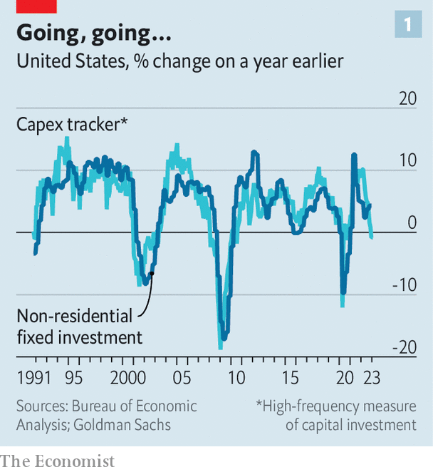
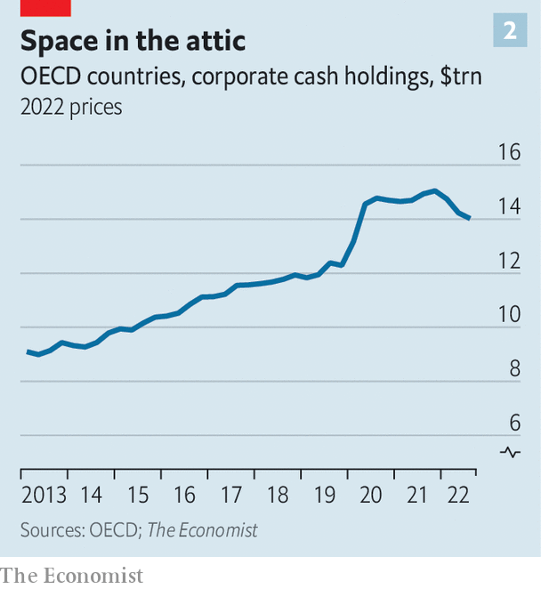

###### Fun while it lasted

# Is the global investment boom turning to bust? 

##### Why capex spending is now heading in the wrong direction 

 

> Mar 16th 2023 

Almost wherever you look, companies seem to be scaling back their ambitions. Meta, the owner of Facebook, recently said that it would invest less in 2023 than previously promised. Disney is slimming its capex plans for this year by a tenth, meaning punier investment in its theme parks. Calavo Growers, a huge producer of avocados and other fruit, intends to reduce its capital expenditures “while we navigate near-term uncertainties”. 

 


The anecdotes are part of an unfortunate broader trend. A global survey of purchasing managers tracks new orders of investment goods, a proxy for capital spending. After surging in 2021, it now points to demand in line with the 2018-19 average. An American capex “tracker” produced by Goldman Sachs, a bank, offers a picture of businesses’ outlays, as well as hinting at future intentions. It is currently registering close to zero growth, year on year (see chart 1). A global tracker produced by JPMorgan Chase, another bank, also points to a sharp deceleration. analysed capital-spending data from 33 oecd countries. In the fourth quarter of last year capex fell by 1% from the previous quarter.

Investment is the most volatile component of gdp. When it soars, the economy as a whole tends to do the same. Extra capex and r&amp;d boosts productivity, raising incomes and living standards. There were hopes the covid-19 pandemic would mark the start of a new “capex supercycle”. In response to the crisis, firms ramped up spending on everything: digitisation, supply chains and more. Rich-world fixed investment took just 18 months to regain its pre-pandemic peak, a fraction of the time it took after the global financial crisis of 2007-09. In 2021 and 2022 firms in the s&amp;p 500 index of large American firms spent $2.5trn, equivalent to 5% of the country’s gdp, on capex and r&amp;d, a real-terms rise of around a fifth compared with 2018-19.

Thus the latest figures are sobering. What people thought was the start of a structural trend may in fact have been end-of-lockdown exuberance. Businesses are revising down future capex investment, too. Our analysis of the plans of around 700 big, listed American and European firms suggests real-terms spending will fall by 1% in 2023. Markets have caught on to this change. In Europe, for instance, the share prices of companies that usually do well when capital spending is high—such as semiconductor and chemicals companies—soared relative to the wider stockmarket in 2021, but have since fallen back. 

 


Why is the boom coming to an end? Three potential explanations are most convincing. The first is that companies have less cash to burn than even a few months ago. Firms across the rich world accumulated extraordinarily high cash balances during the pandemic, in part because of grants and loans from governments. According to our calculations, however, since the end of 2021 the piles have fallen by about $1trn in real terms (see chart 2).

The second relates to global economic conditions. Supply-chain snarl-ups are not as bad as in 2021, meaning there is less need to invest in extra capacity or stock up on inventory. Figures from PitchBook, a data provider, suggest that in the fourth quarter of 2022 the number of venture-capital deals in supply-chain tech fell by about half compared with the year before. Inflation has eaten into consumers’ real incomes—and businesses are less likely to invest in new products and services if they worry that no one will buy them. Meanwhile, survey data suggest that higher interest rates are also prompting cuts. 

The third factor may be the most significant. The capex boom was based in large part on the assumption that pandemic lifestyles would last forever, prompting economic reallocation that would require an ever-larger number of new technologies. In many ways, however, the post-pandemic economy looks remarkably similar to the pre-pandemic one. It turns out there is a limit to people’s Netflix consumption and Peloton use. Spending on services has nearly caught up with spending on goods. 

There are exceptions—not least oil companies—which are likely to boost capex this year, but these firms account for only a small share of overall spending. The companies that led the capex charge are retreating. Semiconductor firms, in particular, have realised that they massively overinvested in capacity, and are now pulling back. In the final quarter of 2022 American real spending on information-processing equipment was down by 2%, year on year. The big tech firms are likely to cut capex by 7% in real terms in 2023, forecasters think. 

In America the Inflation Reduction Act will offer big incentives for green spending; the eu is unveiling its own subsidies. Russia’s war in Ukraine is encouraging Europeans to invest in alternative sources of energy. And in an attempt to rely less on China and Taiwan, many firms are looking to break ground on factories elsewhere. In time, these various changes may cause investment to tick up once again. But there is no getting away from the fact that the capex boom has fizzled out. ■


