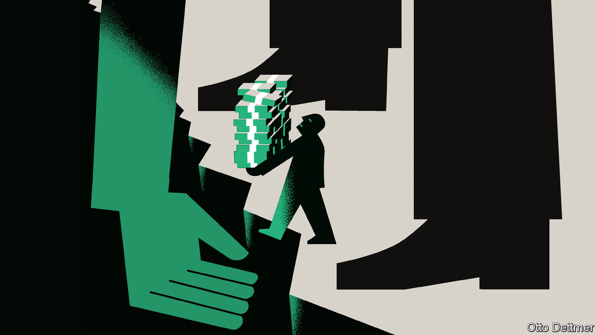

###### Free exchange

# The Fed smothers capitalism in an attempt to save it 

##### Its latest financial intervention is a new twist on an old story 

 

> Mar 16th 2023 

Much about the collapse of Silicon Valley Bank has been profoundly modern. The bank’s name. A client base of tech-focused venture capitalists. A panic whipped up by tweets. Cash withdrawals via smartphones. At its crux, though, the lender’s fall was the latest iteration of a classic bank run. And the solution, a central bank stepping in to backstop the financial system, was time-honoured, too. So well-trodden is the topic in economics that the lyrical phrase describing the central bank’s actions, “lender of last resort”, is often abridged to its ungainly acronym, lolr.

A review of the history shows both the typical and the unique in the case of Silicon Valley Bank. There is ample, albeit imperfect, precedent for the Fed’s actions. Yet they continue a worrying trend of ever-broader interventions and, consequently, distortions to the financial system. This gives rise to questions about whether, in the long run, the Fed’s pursuit of stability harms the economy.

It would be remiss for a column in to overlook the person often credited with first articulating the theory of lolr: Walter Bagehot, an editor of this newspaper in the 19th century. Over the years, his ideas evolved into a rule for how central banks should manage panics: lend quickly and freely, at a punitive rate, against good collateral. As Sir Paul Tucker, formerly of the Bank of England, has put it, the logic is twofold. Knowing the central bank stands behind commercial lenders, depositors have less incentive to flee. If a run does occur, intervention helps limit sell-offs.

Nearly as old as Bagehot’s writing is the obvious objection to lolr: that of moral hazard. Foreknowledge of central-bank intervention may induce bad behaviour. Banks will hold on to fewer liquid, low-yielding assets, piling instead into higher-risk lines of business. How to prevent panics without sowing new dangers is perhaps the central question faced by financial regulators.

The clearest evidence of the need for a financial backstop of some variety comes from the pre-lolr years. There were eight American banking panics in the half-century between 1863 and 1913, each delivering heavy blows to the economy. The government responded by creating the Federal Reserve system in 1913. But broken into regional fiefdoms, it was too timid in response to the Great Depression. Only in the aftermath of that crisis did America establish a true lolr framework. Power was concentrated at the Fed’s centre, while the federal government introduced deposit insurance. To limit moral hazard, other tools such as deposit-rate caps constrained banks. This has remained the general lolr template ever since: authorities both provide support and impose limits. Getting the balance right is what is fiendishly difficult.

In the decades after the Great Depression, the Fed seemed to have put an end to bank runs. But starting in the 1970s, when inflation soared and growth softened, the financial system came under stress. On each occasion officials expanded their playbook. In 1970 they snuffed out trouble that originated outside the banking system. In 1974 they auctioned off a failed bank. In 1984 they guaranteed uninsured deposits. In 1987 they pumped liquidity into the banking system after a stockmarket crash. In 1998 they helped to unwind a hedge fund. Even if each episode was different, the basic principles were consistent. The Fed was willing to let a few dominoes fall. Ultimately, though, it would stop the chain reaction.


These various episodes were dress rehearsals for the Fed’s maximalist responses to the global financial crisis of 2007-09 and the covid crash of 2020. Both times it created a dizzying array of new credit facilities for struggling banks. It guided financing to troubled corners of the economy. It accepted an ever-wider array of securities, including corporate bonds, as collateral. It allowed big firms to fail—most significantly, Lehman Brothers. And as markets started to work again, it retracted much of its support.

Such extensive interventions prompted a rethink of moral hazard. In the 1970s the concern was over-regulation. Rather than making the financial system safer, policies such as the deposit-rate caps had pushed activity to shadow lenders. Little by little, regulators lightened restrictions. But after the financial crisis, the pendulum swung back towards regulation. Big banks now must hold more capital, limit their trading and undergo regular stress-testing. Heftier support from the Fed has come with stricter limits.

In this context, the government’s response to Silicon Valley Bank looks more like another notch in the wall rather than a radical new design. It is hardly the first time that uninsured depositors have walked away scot-free from a financial calamity. Nor is it the first time that the Fed has let a couple of banks fail before introducing a credit programme that is likely to save similar firms.

Hazard lights

Yet every notch in the wall is also indicative of an increasingly expansive Fed. In one important respect, its assistance has been far more lavish than in previous rescues. When providing emergency credit, it is normally conservative in its collateral rules, using market prices to value the securities that banks hand over in exchange for cash. Moreover, it aims to lend only to solvent firms. This time, however, the Fed has accepted government bonds at face value, even though their market value has fallen sharply. That is remarkable. If it had to seize collateral, it could suffer a loss in present-value terms. And the programme could breathe life into banks that, in mark-to-market terms, were insolvent.

The Fed has no desire to make its latest changes permanent. It has capped its special loans at just one year—long enough, officials hope, to stave off a crisis. If they get their way, calm will eventually return, investors will shrug their shoulders and banks will get back to business without needing the Fed’s support. But if they do not and more banks fail, the Fed will be left holding underwater assets on its books, absorbing financial damages that would have otherwise belonged to the market. The lender of last resort risks morphing into the loss-maker of first resort. ■


