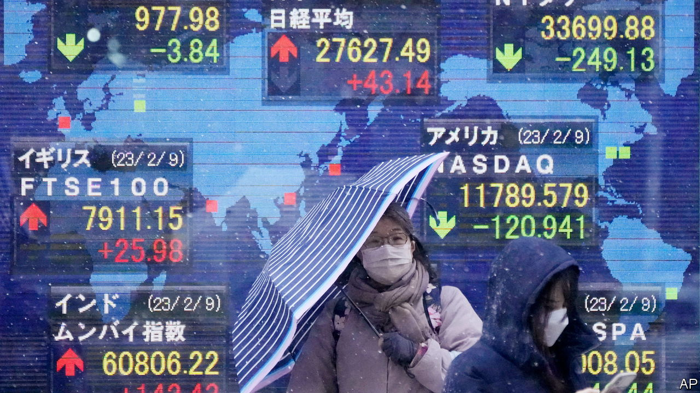
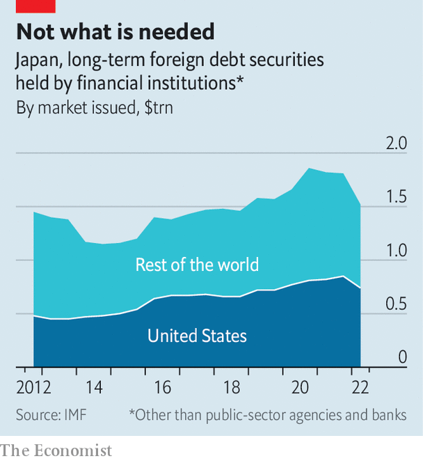

###### Duration dangers

# The search for Silicon Valley Bank-style portfolios 

##### Japanese investment outfits are similarly reliant on long-term bonds 

 

> Mar 16th 2023 

The demise of Silicon Valley Bank had many causes. But at its heart was the institution’s bond portfolio, which plummeted in value as interest rates rose. Little surprise, then, that analysts and investors are scrambling to locate similar hoards elsewhere. One disconcerting finding lies in Japan. Investment institutions there have accumulated vast stocks of domestic and foreign long-maturity bonds.

These bond holdings have already slumped in value, thanks to a combination of sales and the revaluation that occurs when rates rise—the potential for which is known as “duration risk”. Long-term foreign-bond holdings by “other financial corporations”, a category which includes insurance firms, investment outfits and pension funds, ran to $1.5trn in June, the most recent figure available, some $293bn below their level at the end of 2021. 

 


Norinchukin Bank, a Japanese investment firm, is one holder of such bonds. The company has been a mammoth buyer of collateralised-loan obligations, bundles of loans secured in a single product. The value of its bond portfolio has been clipped by rising rates, from ¥36trn ($293bn) in March last year to ¥28trn in December. Japan Post Bank, a savings bank, of which the Japanese government owns almost a third, is another exposed institution. Foreign securities have risen from essentially zero in 2007 to 35% of the firm’s total holdings. 

These institutions’ customers are likely to prove less flighty than svb’s. In Silicon Valley the run was led by panicked venture capitalists. Japan Post Bank has an army of individual depositors across the country, boasting around 120m accounts. Norinchukin Bank’s clients, which are mostly agricultural co-operatives, also seem less likely to flee than excitable tech types. 

But there is a risk from currency movements. As Brad Setser of the Council on Foreign Relations, a think-tank, has noted, the rise in American interest rates has made hedging against currency risk far more expensive. This is true for both investors and the companies and governments from which they once bought bonds. Japanese investors sold $165bn more in foreign long-term bonds than they bought last year, the largest disposal on record. Rising rates have left bond issuers across huge swathes of the world paying more to borrow. The disappearance of previously reliable buyers only adds to the pain.

And enormous holdings of foreign financial assets are just one element of the risk. Japanese interest rates have been at rock-bottom levels by global standards since the early 1990s, after the country’s infamous land and stock bubble burst. Three decades of relative economic stagnation and occasional deflation have meant very low bond yields, which have driven financial institutions to long-term yen-denominated bonds for modestly higher returns. This increases the amount of damage even slightly tighter monetary policy might do. 


But it is increasingly unclear whether Japan will actually be able to maintain its low-rate approach. Consumer-price inflation rose to 4.3% in January; wages at large firms look set to rise at their fastest pace in decades. A one-percentage-point rate rise would knock more than ¥9trn off the value of banks’ yen-denominated bonds. Unrealised losses at big banks would be equivalent to around 10% of their capital. Those at  banks, types of credit union, would be higher still at around 30%.

Last year the Bank of Japan (boj) published analysis suggesting these losses would be offset by the changing value of liabilities. The interest rates banks offer to depositors tend to rise far more slowly than those they charge on new loans, relieving pressure. For regional banks, the analysis suggested, the two forces would almost entirely offset one another. But the central bank’s calculations depend on assumptions about the loyalty of depositors. The slump in the value of banks’ portfolios from higher rates is certain; the stickiness of depositors has not been tested recently.

The boj insists there is still no prospect of rate rises. But recent inflationary pressure and rises in the rest of the world mean this line is getting harder to hold. The mere possibility of an increase is already having an impact on foreign-bond holdings, as investors dispose of assets. And as Japanese institutions shift from buyers to sellers, global corporate and government bond-issuers are losing once-reliable customers, just when they require them most. ■


