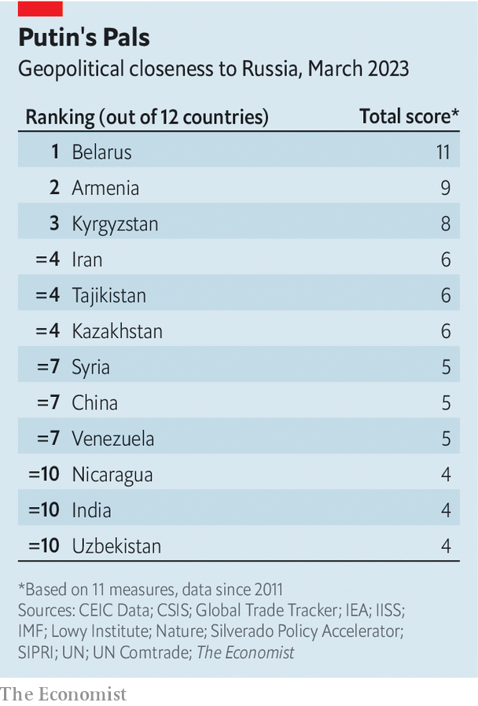
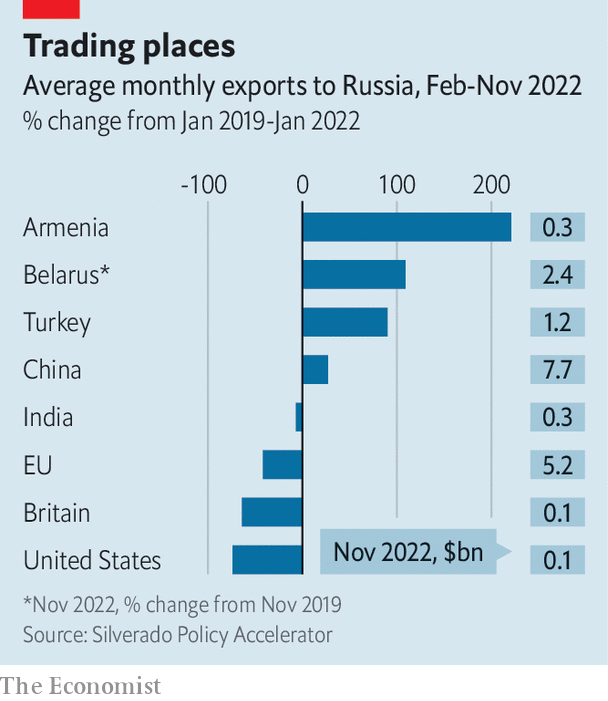
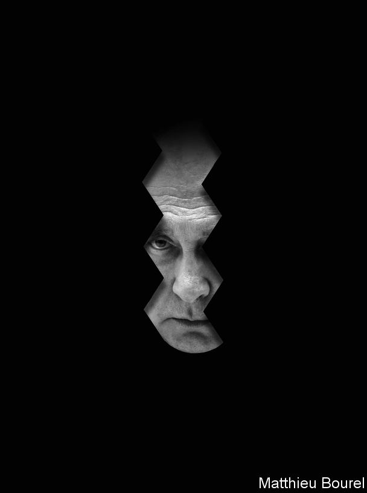

###### Potemkin diplomacy

# Russia’s friends are a motley—and shrinking—crew 

##### They are a coalition of the failing; the Soviet Remembrance Society; and a gang of opportunists 

 

> Mar 14th 2023 


“The West’s plans to isolate Russia by surrounding us with a sanitary cordon have been a fiasco,” Sergei Lavrov, Russia’s foreign minister, gloated recently. “We are strengthening good neighbourly relations…with the international majority.” At first glance Mr Lavrov seems to have a point. On February 23rd, the day before the first anniversary of , 39 countries refused to back a UN resolution condemning it. Despite America and its allies imposing sanctions,  and trade have held up surprisingly well. Mr Lavrov himself, meanwhile, has merrily racked up plenty of air miles visiting foreign capitals. 

On paper, Russia’s geopolitical clout looks impressive. It has troops and mercenaries posted to at least 16 other countries. Some prop up friendly autocrats, as in Mali and Syria. Others sustain “frozen conflicts” that keep countries such as Georgia in line and out of NATO. Over the past decade Russia has accounted for more than half of arms imports in 22 different countries, including big ones such as China and India. At the un it has benefited from the support, or at least useful abstentions, of dozens of countries. 

Natural resources and technology amplify its power. In the decade before the invasion Russia was the dominant natural-gas supplier to more than a dozen countries, giving it an  that it has not hesitated to wield against Europe: in 2005, 2009 and again last year. Ten countries generate a major share of their electricity from Russian-built nuclear reactors, or else co-operate closely with Russia on nuclear technologies. 

 


Russia’s diplomatic resilience has many in the West wringing their hands. Peter Frankopan, a history professor at Oxford University, recently wrote that resentment at the West and sky-high energy prices were transforming the international system in ways that favour Russia. Newspapers, think-tanks and pundits lament that the West has failed to isolate Russia or win over large numbers of developing countries. Yet data collated by  on a broad array of military, economic and diplomatic measures—call it the “Putin’s pals index”—show a fuzzier picture (see table). 

The index looks at 11 different measures of support or potential for coercion in three broad areas. The first set is military. Are they treaty allies with Russia? Do they have Russian troops or mercenaries on their territory? Have they supplied arms to Russia since the war began? Do they depend on Russian arms? Have they done manoeuvres with Russia since the start of the war? The second is diplomatic. Have countries voted against Russia or abstained on key UN resolutions, or voted with it at least twice on these resolutions? 

The third set looks at energy and economics. Do they rely on Russian gas, and do they depend on Russian nuclear-power stations or technology? Is trade with Russia a large share of their total trade? Have  to Russia risen since the war?

The categories are unweighted, so countries are scored on a simple total. This rough-and-ready index is not intended to capture the finer nuances of diplomatic stances that many countries adopt. But it provides a framework for assessing a country’s relationship with Russia and whether it could be vulnerable to coercion. (Readers wanting to browse the full index can find it .)

The half a dozen countries that score most highly are those bound to Russia mainly by politics, history and geography, such as Armenia, Belarus, Iran and Kyrgyzstan. Beneath these is a long list of countries with looser links to Russia, including giants such as China and India and tiddlers such as Eritrea and Nicaragua. 

One way to think about the universe of countries with links to Russia is to group them into three categories: a “coalition of the failing”; the “Soviet remembrance society”; and an “axis of opportunists”.

The B Team

Start with the coalition of the failing. Vladimir Putin is fond of quoting Tsar Alexander III: “Russia has just two allies: the army and the navy.” That is closer to the truth than Mr Putin might like. On paper Russia has five formal allies in the Collective Security Treaty Organisation (CSTO): Armenia, Belarus, Kazakhstan, Kyrgyzstan and Tajikistan. All are bound by treaty to come to each other’s aid if attacked. Yet not one CSTO member has backed Russia’s war in Ukraine with troops, though Belarus has let itself be used as a military base. 

Instead, some CSTO members are trying to distance themselves from the war. Armenia is angry that the 3,500 Russian troops on its territory did not come to its aid during a war with Azerbaijan in 2020. It has refused to host this year’s CSTO war games, and now seems to be hedging its bets when it comes to political patrons, by inviting an EU mission to monitor its border with Azerbaijan. 

Kazakhstan has long been a close ally of Russia. Last year Mr Putin sent troops to the country to put down anti-government protests. Yet that did not stop Kassym-Jomart Tokayev, Kazakhstan’s president, from criticising the Ukraine war in front of Mr Putin during a visit to St Petersburg in June. In February Kazakhstan hosted Antony Blinken, America’s secretary of state. Mark Galeotti of the Royal United Services Institute (RUSI), a think-tank, draws parallels with Britain’s post-imperial decline. Central Asia’s drift away from Moscow, he wrote, is “Putin’s Suez moment”.

Besides Belarus, only Iran and North Korea have sent arms to Russia. America’s government reckons North Korea has delivered a “significant” number of artillery shells, but not enough to alleviate Russia’s shortage or change the course of the war. Iran has sent explosive-laden drones that have helped Russia keep bombing Ukraine, even as its own stocks of missiles have run low. It has also posted “military advisers” to help Russia operate the drones. 

Yet Iran, which was determinedly non-aligned during the cold war, is divided over how much to cosy up to Moscow. Hardliners in the Islamic Revolutionary Guard Corps hope their support will be repaid with modern fighter jets and anti-aircraft missiles. But relative moderates in Iran’s foreign ministry worry about further antagonising the West or condoning the invasion of neighbouring countries—particularly since the Soviet Union conquered much of Iran during the second world war. Set against this group of three allies willing to arm Russia is a Western alliance of 31 countries that have publicly confirmed they are sending weapons to Ukraine. 

Diplomatically, Russia seems almost as isolated. Only four countries (Belarus, Nicaragua, North Korea and Syria) have voted consistently against the seven UN General Assembly resolutions that have condemned Russia’s behaviour in Ukraine since 2014, when its troops seized the Crimean peninsula. Another half dozen, including Bolivia, Eritrea and Mali, have voted with Russia at least twice. 

Countries in the coalition of the failing have much in common. None is a proper democracy. Some, such as Syria, depend directly on Russian troops or mercenaries for the survival of their governments. Others, , are themselves global pariahs that rely on Russia for diplomatic support in the UN Security Council. The coalition is also shrinking. In 2014, when the UN voted to condemn the annexation of Crimea, Russia had the support of ten countries. Several have since withdrawn their backing. These include Bolivia, previously under the thumb of Evo Morales, a leftist strongman, and Sudan, which was ruled by Omar al-Bashir, a genocidal dictator who hated the West. 

Roughly 30 other countries are nominally neutral and tend to abstain on UN votes on Ukraine. Many refuse to take sides, says Dmitri Alperovitch, the head of Silverado Policy Accelerator, an American think-tank. Instead, he says, their attitude is: “a pox on both your houses; this is two white countries fighting each other.” 

Goodbye Lenin

A subset of these make up the Soviet remembrance society. While not offering any serious diplomatic or military help, they tend to lean towards Russia, doing such things as holding military drills with its armed forces or echoing its arguments that NATO expansion or Ukraine itself is to blame for the war. 

Untangling their motives is not always easy, but some common threads emerge. Some countries, such as Algeria, Angola and South Africa, profess sympathy for Russia partly because of historical links to the Soviet Union (they seem to forget that Ukraine was also part of the USSR); or, even more ironically, because they remember the USSR as an ally of oppressed people fighting imperialists. 

Yet Soviet nostalgia is not the only factor at play, particularly in Africa, where most of the countries abstaining on the key UN votes are found. In many cases ruling parties or politicians owe Russia favours for its help in financing or trying to sway elections. South Africa’s ruling African National Congress, for instance, has taken large donations from a mining firm linked to Russia. That may have influenced its decision to host Mr Lavrov and to hold military exercises with the Russian navy. 

Russian diplomacy in Africa focuses on security assistance and weapons sales. The Atlantic Council, a think-tank in Washington, noted in a recent report that whereas Russia had signed seven military co-operation agreements in Africa between 2010 and 2017, it inked 20 between 2017 and 2021. More than half of the recent crop were with countries with which Russia had no previous military ties. 

Russia is not just a big supplier of weapons. It has also become the arms dealer of last resort, gaining influence in countries that are cut off from Western supplies because of coups and human-rights abuses, such as Mali and the Central African Republic. Western arms embargoes “opened the door [for the Russians],” says J. Peter Pham, America’s special envoy for the Sahel under the Trump administration. “We can’t really blame the Malians for taking what they can get.”

 


Yet in some cases Russia’s attempts to win influence have failed spectacularly. Madagascar, for instance, turned against Russia after it was caught trying to swing a presidential election towards pro-Russia candidates in 2019. After five fighters from Wagner, a Russian mercenary firm, were captured and beheaded by jihadists in Mozambique, the country turned to Rwanda and the West for security assistance.

“Everywhere they go, they seem to be struggling in terms of political interference,” says Samuel Ramani, also of RUSI and the author of “Russia in Africa”, a book published last month. The mistakes Russia makes in poor countries are often similar to its intelligence blunders in Ukraine, such as overestimating the popularity of local proxies or leaders. “Most of it is general incompetence, and also a misreading of local situations,” says Mr Ramani.

Nuclear energy offers Mr Putin another potential lever. Rosatom, Russia’s state-owned nuclear-energy firm, is the world’s biggest exporter of reactors. A paper published in  last month by Kacper Szulecki and Indra Overland at the Norwegian Institute of International Affairs notes that at least nine countries, including Bangladesh and Egypt, could be vulnerable to political pressure because they depend on Russian-built or operated nuclear plants. Several other countries have high levels of nuclear co-operation with Russia. Yet this, too, may be weakening. Russia’s interruption of gas exports to Europe may undermine its general reputation as a reliable supplier of energy. 

The third group of countries—the axis of opportunists—see Western sanctions as a chance to boost their own trade with Russia on juicy terms. Russian imports of goods collapsed by more than 40% in the first few months after its invasion, according to an analysis by Silverado Policy Accelerator. Yet by September they had largely recovered, as China and Turkey in particular stepped in to replace exports from Europe and America (see chart). The West has so far proved unable to completely shut down Russian imports of high-tech widgets such as computer chips, which are used in missiles and other weapons. Russia has continued to import between a third and a half as many chips as it did before the war started, largely thanks to a big increase from China. 

China initially seemed to have been caught off-guard by Russia’s attack on Ukraine. It had agreed to a strategic partnership with “no limits” just weeks before the tanks rolled in. Since then China’s supreme leader, Xi Jinping, has sought to turn the situation to his advantage, sensing an opportunity to distract America from its efforts to confront China, especially over Taiwan. 

 


Yet at the same time, Mr Xi has calibrated his response to try to insulate China from any American or allied retaliation. Chinese officials thus profess neutrality on Ukraine, refusing to condemn Russia’s invasion but blaming the war on NATO’s expansion since the end of the cold war. One big question is whether China will begin supplying weapons to Russia for use in Ukraine. That could relieve Russian shortages of ammunition, and perhaps change the course of the war. More may be revealed when Mr Xi visits Russia, which could be as soon as next week.

Turkey’s relationship with Russia is more complex. Turkey is a NATO member. It has sold armed drones to Ukraine and is thought to have sent precision-guided artillery and rockets too. It competes with Russia for influence from the Middle East to Central Asia. It has fought proxy wars against it in Syria and Libya. Yet it also relies on Russia for gas and help building nuclear-power plants. It earns billions of dollars a year from Russian tourists. This locks both countries into mutual dependence. Turkey finds it advantageous to play Russia and the West against each other. Russia, in turn, seems willing to overlook Turkish support for Ukraine so long as trade continues to flow. 

India could be benefiting far more from trade with Russia than it is. It has studiously refused to condemn Russia’s invasion and has increased its imports of discounted Russian oil (though now says it will stick to a price cap imposed by the West). It remains a big buyer of Russian weapons. Yet at the same time it does not seem to have become a critical conduit for getting goods under sanctions into Russia. Indeed, the value of India’s exports to Russia has fallen since the invasion. 

Picking battles

The West has been trying to tug some of Putin’s remaining pals away. It has deterred countries such as Belarus from playing a more active part in the war, and Iran from supplying ballistic missiles. But Ukraine’s allies have floundered over how—or even whether—to counter Russian influence in poor countries. 

The first step may be to avoid over-inflating the importance of the soft support offered to Russia by its fellow travellers—particularly when it leads to little more than abstentions on UN votes or other symbolic gestures of solidarity. “I worry about setting ourselves up for an unprofitable game of whack-a-mole if we try to counter each and every manifestation of Russian influence,” says Andrew Weiss, a Russia specialist at the Carnegie Endowment for International Peace, an American think-tank. “In some cases, we risk overpaying to deal with problems that don’t have all that much strategic importance.”

At the same time the West could be taking relatively cheap steps to counter the spread of Wagner in Africa. One option would be to help arm and support regional security forces and friendly governments so that they are not forced to turn to Russia to provide security. Similarly, when dealing with Russia’s axis of opportunists, the West needs to carefully calibrate its own red lines, spell them out and not protest at increased trade outside of military and high-tech goods. It should keep its economic powder dry to deter China or others from sending arms and ammunition. A year after Mr Putin’s invasion, Russia is not as isolated as some in the West had hoped. But Mr Lavrov’s claim that it is surrounded by close friends is wide of the mark. ■

