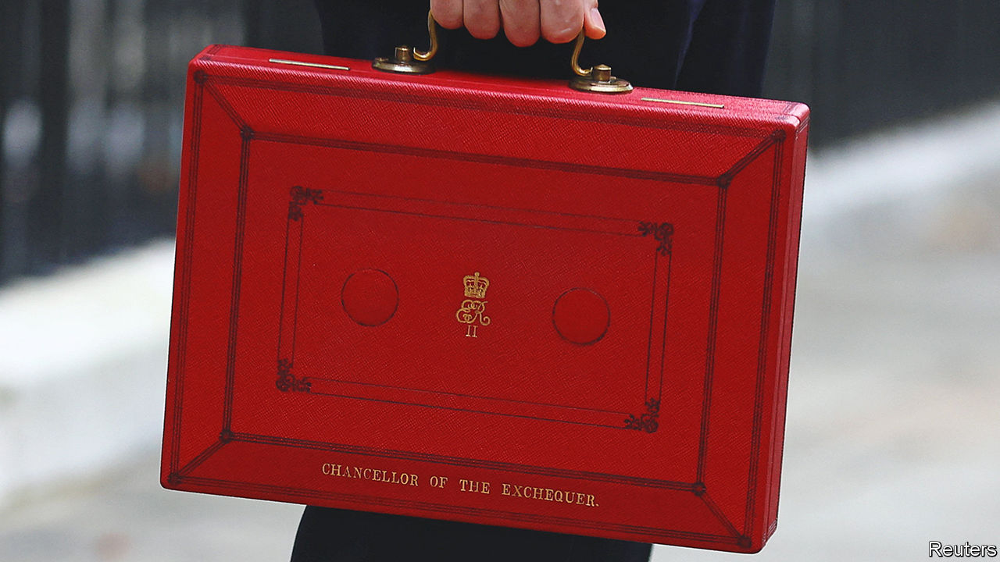

###### Britain’s economy

# Jeremy Hunt’s budget is better at diagnosis than treatment 

##### Stability but no cigar 

 

> Mar 15th 2023 

The bar for a successful budget has been dramatically lowered in Britain over the past year. By not blowing up the gilts market on March 15th, , the chancellor of the exchequer, easily bested his predecessor, Kwasi Kwarteng. He managed to talk about tackling Britain’s  without relying on magical thinking about unfunded tax cuts. But Mr Hunt’s budget, a little like the man himself, was nonetheless a curious mixture of the reassuring and the unnerving. The country is in much more competent hands with him and Rishi Sunak, the prime minister, at the helm, but its underlying troubles persist. 

Start with the reassuring elements. Mr Hunt is taking a far more methodical approach to tackling Britain’s problems than happened under Liz Truss and Boris Johnson. Mr Johnson made “levelling up”, the ironing out of regional inequalities, into a powerful campaign pitch; Mr Hunt’s decision to give two big conurbations in England more control over the money they are given by Whitehall adds substance to that slogan. Ms Truss wanted to cut the ribbon on investment zones everywhere; Mr Hunt plans a more targeted approach focused on high-potential clusters. (His usual language about turning Britain into another Silicon Valley was absent, perhaps because of a bust American bank.) 

The chancellor has responded to concerns that crippling tax bills are forcing doctors into early retirement, even if scrapping the lifetime limit on tax-advantaged pension savings for everyone is a bizarrely blunt way to do it. Getting rid of the “work capability assessment”, so that people with a disability will have more incentive to work without risking a loss of benefits, is a good idea in principle. Speeding up approvals for medicines, based on the decisions of foreign regulators, is also sensible. 

But there is also much to dislike in the budget. Mr Hunt froze fuel duty again, a bad decision that will raise carbon emissions. His desire to encourage business investment and his need to stick to public-borrowing rules led to a dreadful fudge: the introduction of full expensing for plant and equipment spending but only for a three-year period. Britain desperately needs a stable tax regime that spurs investment; the current fiscal framework forces it to make sensible policies temporary. The Office for Budget Responsibility (OBR), a watchdog, duly pronounced that debt would be falling at the end of its five-year forecast period but that capital intensity would not have changed. 

Mr Hunt’s flagship measure was a big step-up in support for parents of young children: starting in September 2025, the government is promising 30 hours of free  a week from the age of nine months. This expansion in subsidies is a hostage to fortune: it will only work if the funding is generous enough to make the sums add up for childminders and nurseries. It would have been better to provide the cash directly to parents, who know best exactly what child-care arrangements suit them.

A judgment on the budget depends on the baseline for comparison. Set against the upheavals of the autumn, it is a triumph. The public finances are stable again. The OBR has upgraded its short-term growth forecasts. By restoring competence and normalising relations with the EU, Mr Hunt and Mr Sunak are steadily closing the policy gap with Labour; that will have the salutary effect of forcing the opposition party to be bolder in its own thinking ahead of the next election, which is due by January 2025.

Baby steps

But compare things with 2019, when Mr Johnson won a thumping election victory, and the picture is bleaker. The tax take is forecast to reach a post-war high, even as public services stutter. By 2024 real living standards are set to have fallen by the greatest amount over a two-year period since records began; the OBR says they will still be below their pre-pandemic levels in 2027-28. The country’s dismal record on productivity is poised to continue. Mr Hunt and Mr Sunak claim to be problem-solvers. But they have not yet tackled Britain’s biggest headaches. ■


