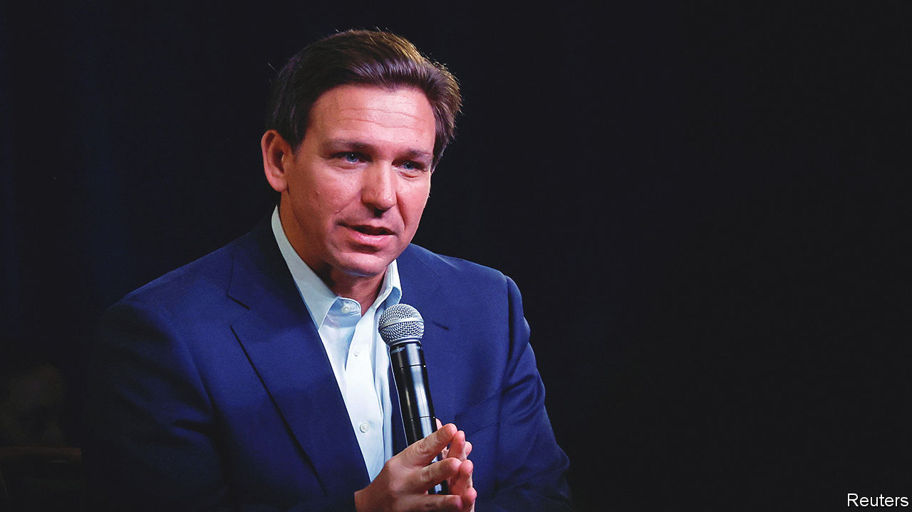

###### Ron DeReckless

# Ron DeSantis emboldens Vladimir Putin 

##### Florida’s governor has blundered by saying Ukraine is not a vital American interest 

 

> Mar 16th 2023 

PEOPLE SPOUT all sorts of nonsense to get themselves elected. Most of the time it does not matter, because memories fade and circumstances change. This week, however, , the governor of Florida and the most plausible challenger to  for the Republican presidential nomination, declared that Ukraine is not one of America’s “vital national interests”. He was not only wrong, but his words have done lasting , America’s allies and America itself. 

Mr DeSantis was not speaking off the cuff, but in a prepared answer to a questionnaire put out by Tucker Carlson, a host on Fox News. Describing the war as a “territorial dispute”, he argued that America should not become further entangled in Ukraine when it faces so many other tasks, including countering China and securing its own borders. Because Mr Trump has also said that he thinks America has been too generous, it is possible that a Republican victory in 2024 would abandon Ukraine to the invading armies of Vladimir Putin.

Back in 2014 Mr DeSantis favoured arming Ukraine. If his flip-flop is sincere, it is mistaken. The war is not, as he suggests, a local squabble. Mr Putin has made clear that he believes he is fighting NATO over whether Ukraine has the right to determine its own future as a sovereign nation. By defining the war as “territorial”, Mr DeSantis is turning his back on the principles America helped build into the UN after the second world war.

Mr DeSantis was also inviting Mr Putin to expand his aggression beyond Ukraine. Mr Putin believes that fickle, inward-looking America will soon tire of protecting Europe and that Russia can profit by helping fill the vacuum it leaves behind. Were Russia to pick off Georgia or Moldova next, and then start testing NATO itself, the peril America faces would be much greater than today. By encouraging Mr Putin in his belief, Mr DeSantis plays into a logic that will put American lives at risk. 

And Mr DeSantis is undermining his own priority of standing up to China. If America abandons Ukraine, then Asian countries that depend on America for their security will start to question its reliability. Should they lose faith, some will react by falling in behind China. Others, such as Japan and South Korea, could even procure nuclear weapons. Neither is in American interests.

Perhaps, though, Mr DeSantis’s critics are being naive. The governor could be being disingenuous (it has been known). Trailing in the polls, he is desperate not to antagonise Mr Trump’s supporters, many of whom are against the war. Mr DeSantis could be leaving himself enough room to shift position and stand by Ukraine if he wins the White House in 2024. 

If this is Mr DeSantis’s thinking, his campaign tactics come with a price attached. The war is not going well for Mr Putin. His armies are failing to make advances. He is losing men and equipment at an alarming rate. His  is ragged or opportunistic, but not loyal. However, because Russia is a nuclear-armed power, the only way to establish a real peace is for Mr Putin, or more likely his successor, to realise that trying to conquer Ukraine is futile.

That is why Mr Putin will take heart from Mr DeSantis’s words. Elections in America are 50/50 affairs. If Russia can hang on in Ukraine until November 2024, Mr Putin can reasonably hope that American backing for Ukraine will fade away. Potential dissenters in the Kremlin and the army will be encouraged to hang on, too. And if the conflict should be frozen, Mr Putin will be tempted to think that he can rebuild his armies and attack Ukraine again in the belief that a DeSantis or a Trump White House would stand back. 

As governor of Florida, Mr DeSantis has specialised in putting forward policies—such as attacking Disney for its wokeness—that thrill his base and rile liberals, but often have little effect in the real world. On the international stage, reckless words have consequences. ■


