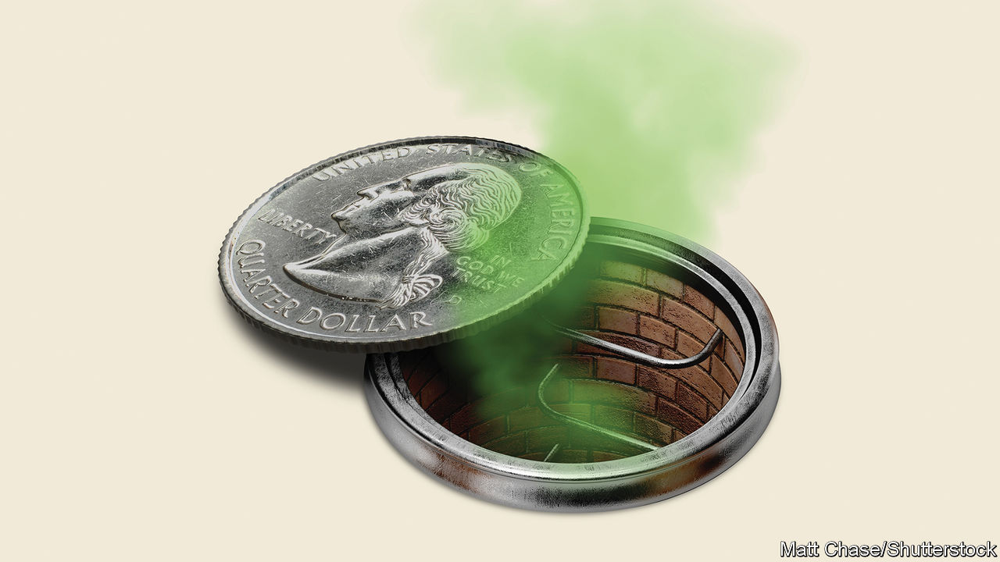

###### The financial system

# What’s wrong with the banks 

##### Rising interest rates have left banks exposed. Time to fix the system—again 

 

> Mar 16th 2023 

Only ten days ago you might have thought that the banks had been fixed after the nightmare of the financial crisis in 2007-09. Now it is clear that they still have the power to cause a heart-stopping scare. A ferocious run at  on March 9th saw $42bn in deposits flee in a day. svb was just one of three American lenders to collapse in the space of a week. Regulators worked frantically over the weekend to devise a rescue. Even so, customers are asking once again if their money is safe. 

Investors have taken fright. Fully $229bn has been wiped off the market value of America’s banks so far this month, a fall of 17%. Treasury yields have tumbled and markets now reckon the  will begin cutting interest rates in the summer. Share prices of banks in Europe and Japan have plunged, too. , which faces other woes, saw its stock fall by 24% on March 15th and on March 16th it sought liquidity support from the Swiss central bank. Fourteen years since the financial crisis, questions are once again swirling about how fragile banks are, and whether regulators have been caught out.

The high-speed collapse of SVB has cast light on an underappreciated risk within . When interest rates were low and asset prices high the Californian bank loaded up on long-term bonds. Then the Fed raised rates at its sharpest pace in four decades, bond prices plunged and the bank was left with huge losses. America’s capital rules do not require most banks to account for the falling price of bonds they plan to hold until they mature. Only very large banks must mark to market all of their bonds that are available to trade. But, as svb discovered, if a bank wobbles and must sell bonds, unrecognised losses become real.

Across America’s banking system, these  are vast: $620bn at the end of 2022, equivalent to about a third of the combined capital cushions of America’s banks. Fortunately, other banks are much further away from the brink than svb was. But rising interest rates have left the system vulnerable.

The financial crisis of 2007-09 was the result of reckless lending and a housing bust. Post-crisis regulations therefore sought to limit credit risk and ensure that banks hold assets that will reliably have buyers. They encouraged banks to buy government bonds: nobody, after all, is more creditworthy than Uncle Sam and nothing is easier to sell in a crisis than Treasuries.

Many years of low inflation and interest rates meant that few considered how the banks would suffer if the world changed and longer-term bonds fell in value. This vulnerability only worsened during the pandemic, as deposits flooded into banks and the Fed’s stimulus pumped cash into the system. Many banks used the deposits to buy long-term bonds and government-guaranteed mortgage-backed securities. 

You might think that unrealised losses don’t matter. One problem is that the bank has bought the bond with someone else’s money, usually a deposit. Holding a bond to maturity requires matching it with deposits and as rates rise, competition for deposits increases. At the largest banks, like JPMorgan Chase or Bank of America, customers are sticky so rising rates tend to boost their earnings, thanks to floating-rate loans. By contrast, the roughly 4,700 small and mid-sized banks with total assets of $10.5trn have to pay depositors more to stop them taking out their money. That squeezes their margins—which helps explain why some banks’ stock prices have plunged. 


The other problem affects banks of all sizes. In a crisis once-loyal depositors could flee, forcing the bank to cover deposit outflows by selling assets. If so, the bank’s losses would crystallise. Its capital cushion might look comforting today, but most of its stuffing would suddenly become an accounting fiction. 

That alarming prospect explains why the Fed acted so dramatically last weekend. Since March 12th it has stood ready to make loans secured against banks’ bonds. Whereas it used to impose a haircut on the value of the collateral, it will now offer loans up to the bonds’ face value. With some long-term bonds, this can be more than 50% above market value. Given such largesse, it is all but impossible for the unrealised losses on a bank’s bonds to cause a collapse. And that means that the bank’s depositors have no reason to . 

The Fed is right to lend against good collateral to stop runs. But such easy terms carry a cost. By creating the expectation that the Fed will assume interest-rate risks in a crisis, they encourage banks to behave recklessly. The emergency programme is supposed to last only for a year but, even after it has expired, banks competing for deposits will search for high returns by taking excessive risks. Some depositors, knowing that the Fed has stepped in once, will not have much reason to discriminate between good risks and bad.


Regulators must therefore use the year ahead to make the system safer. One step is to remove many of the odd exemptions that apply to mid-sized banks, some of which were the result of post-crisis rules being rolled back amid much lobbying in 2018 and 2019. The rescue of depositors in SVB demonstrates that policymakers think such banks pose systemic risks. If so, they should face the same accounting and liquidity rules as the megabanks—as they do in Europe—and be required to submit to the Fed plans for their orderly resolution if they fail. In effect, this would force them to increase their safety buffers. 

Buffering, please wait

Regulators everywhere must also build a regime that recognises the risks from rising interest rates. A bank with unrealised losses will be at greater risk of failure during a crisis than one without such losses. Yet this disparity is not reflected in capital requirements. One idea is to stress-test what might happen to a bank’s safety cushion were its bond portfolios marked to market, and if rates rose further. Policymakers could then consider whether on this measure the system has enough capital.

Bankers will hate the idea of yet more capital buffers and rulemaking. But the gains from safety are vast. Depositors and taxpayers from Silicon Valley to Switzerland are facing a mighty scare. They should not have to live with the fear and fragility they thought had been consigned to history years ago. ■


