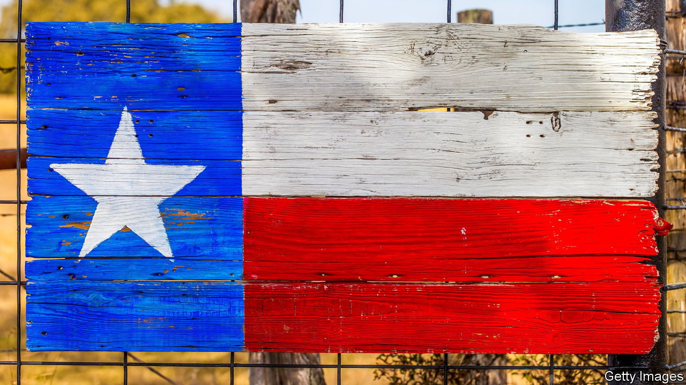
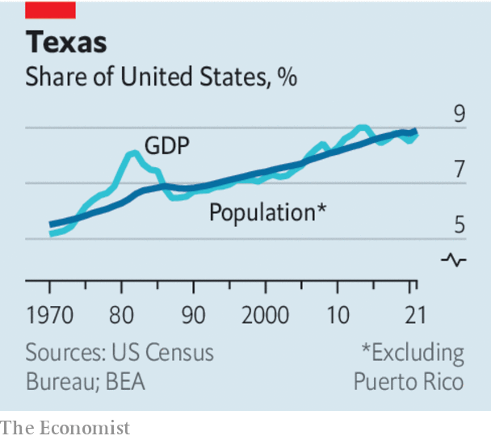

###### Lean, mean and surprisingly green

# Why America is going to look more like Texas 

##### Lessons from the surge of the Lone Star State 

 

> Mar 16th 2023 

Texas keeps getting bigger. In the year to June 2022 the Lone Star State added 471,000 people, nearly as many as live in Atlanta, Georgia. More than one in three of the net new jobs created in America since February 2020 was created there. A thriving  has helped, but, as  explains, the boom is remarkably broad-based. Sometime in the 2040s, Texas is likely to pass  in population. Like it or not, America is becoming a bit more Texan every day.

With 38 members of Congress and 40 electoral-college votes in 2024 (around 15% of those required to win the presidency), Texas will have a mighty say in national politics. If people and firms continue moving there, as looks likely, Texas will take on an even greater prominence in the American economy. It will also influence how the country navigates its energy transition, because Texas leads not just in oil and gas but also in renewables such as wind and solar. And America’s demography will increasingly resemble that of Texas today (where, already, 60% of the population is non-white). 

 


If Texas points to the future, what lessons does it offer? One is that its leaders understood earlier than most that companies and people are mobile. Rick Perry, a former governor, went on “hunting trips” in search of business prey in other states; Greg Abbott, today’s governor, has followed suit. Covid-19 highlighted the attractions of a state which was quicker to leave lockdown than many others, such as California, and boasts a cheaper cost of living and fewer restrictions. Texas has offered some incentives to firms, but much of the growth has been down to the lure of a place with no income tax, lots of land for expansion, less red tape and a pro-business attitude. Granted, liberals and moderates abhor the state’s shrill, deep-red politics. Mr Abbott courts headlines by, for example, sending busloads of unauthorised immigrants to New York. Such stunts do not seem to have deterred many individuals or companies from moving to Texas, however; it remains to be seen whether recent draconian abortion laws will.

Another lesson from Texas is that nurturing one golden goose is not enough. The oil shock of the 1980s was painful, but the state has since diversified its economy. Finance and property have blossomed. The big cities all have different strengths: tech in Austin, energy in Houston, finance and more in Dallas. Instead of relying solely on oil and gas until the wells run dry, Texas has positioned itself on the cutting edge of new energy technologies (although listening to the rhetoric of the state’s politicians, you would not always know it). Places that have only one strong industry should start thinking about how they can use it as a platform to launch the next new thing. 

The last lesson, however, is a cautionary one. For much of its history, Texas has had an exceptionally lean government. It has been loth to invest in the people and projects required for the future, including education and roads. Of late, as its formidable growth shows, it has got away with this. But the lean approach almost certainly has its limits, which it would be complacent to ignore. The people moving to Texas have been better educated than native Texans and filled many of the higher-skilled jobs. The state should invest more in its workforce. 

The Perot precedent

That is what it did in 1984, when a bill promoted by Ross Perot, a businessman and politician, played a big part in the state’s successful economic diversification, by revamping education funding and better preparing Texan students for jobs in industries other than energy and agriculture. Texas today has its biggest two-year surplus ever, worth $33bn (larger than the annual budget of 24 states), so there could be no better time to do something similar for the next stage of the state’s development. The debates around culture-war issues are distractions from this task. 

Texas is not a blueprint for all of America. It has oil and gas, enabling it to forgo a state income tax. Vast amounts of land help it accommodate companies’ expansion. And Texas has plenty of problems. It might be home to more 500 companies than any other state, but it also has the largest number of people who lack health insurance. Its politics have shifted to the extreme right, with rules that curb freedom (such as the abortion ban) and are at odds with the state’s traditions of small-government pragmatism (such as its blacklisting of financial firms that boycott hydrocarbons). 

Texas’s politicians should climb out of the trenches of the culture wars and focus on what the state really needs to secure its prosperity. Astute, targeted investments in its people and infrastructure will help the Lone Star State shine even more brightly. The future of Texas, as with other states, depends on leaders taking the long view. ■

