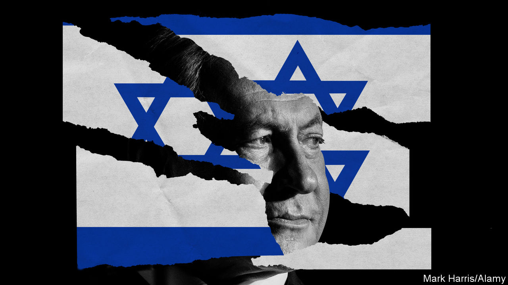

###### Binyamin Netanyahu and a constitutional crisis

# Will Bibi break Israel? 

##### When Israel’s best and brightest are up in arms it is time to worry 

 

> Mar 16th 2023 

This should have been Israel’s moment. As it approaches its 75th birthday in April the risk of a conventional war with neighbouring Arab states, for decades an existential danger, is at its lowest since 1948. The last Palestinian intifada, or uprising against occupation, ended 18 years ago. Israel’s tech-powered economy is more successful and globally relevant than ever. Last year gdp per person hit $55,000, making it richer than the eu. 

Yet instead of celebrations, Israel faces a crisis. Judicial reforms proposed by the  would undermine the rule of law and . The prime minister, Binyamin Netanyahu, who has led Israel for 15 of the past 27 years, prides himself on making ruthless, often ugly, trade-offs that ultimately leave Israel stronger. Now he risks squandering his legacy and leaving Israel less able to cope with the social and geopolitical challenges of the coming decades.

. On March 11th hundreds of thousands of people took to the streets in what may be Israel’s largest-ever protests. Generals, entrepreneurs and scholars warn that democracy is under threat; some 60% of Israelis oppose the legal reforms. Fiery rhetoric from right-wingers, including government ministers, helps fuel violence in the West Bank: so far this year 80 Palestinians have been killed, the highest rate for perhaps two decades.

The struggle may escalate further. The Knesset, or parliament, could pass the legislation in the next couple of weeks. There could be a showdown between it and the Supreme Court, forcing citizens and soldiers to make a painful choice about where their loyalties lie. Ehud Barak, a former prime minister and army chief, has called for mass civil disobedience.

The reforms are a bad solution to a real problem. Israel has no written constitution. For decades, however, the Supreme Court has asserted that some “basic” laws amount to a quasi-constitution it can enforce, overruling the Knesset. Such activism was not clearly understood to be the aim when these basic laws were passed. The right sees a power grab by a lefty judicial establishment. But Mr Netanyahu, who faces corruption charges and detests the legal elite, is imposing a woeful remedy. His reforms would let the Knesset appoint judges and override the Supreme Court, thus handing virtually unchecked power to a slim majority in the single-chamber legislature. 

The fight is part of a struggle over Israel’s identity, which has become polarised. A far-right fringe has grown, fuelled by Mr Netanyahu’s demagogic anti-elite politics, inequality and a bigger number of Jewish settlers in the West Bank. The number of ultra-Orthodox Jews in Israel has grown fast: they are 13% of the population and many study the Torah instead of working or serving in the army. Together, far-right and Orthodox parties won a quarter of Knesset seats in elections last year. With the centre-left parties and Mr Netanyahyu’s right-wing Likud unwilling to govern together, he has formed a coalition with them. Moderate Israelis fume that they create the wealth, pay the taxes and fight the wars, in a country that is betraying its liberal roots.

Plenty of other states have survived bouts of populist and divisive rule. Yet Israel is unusually vulnerable. One reason is the economy. With $196bn of foreign reserves, Israel is not about to face a financial collapse. But the core of its economy is technology, which generates over half of its exports. This is powered by spending on research and development which, at 5% of gdp annually, is higher than in any other rich country. The experts and entrepreneurs who make this possible do not relish their country being in thrall to religious fanatics, and could emigrate.

Israel is also vulnerable because it cannot afford to alienate America, which guarantees its security and supplies 80% of its imported arms. Bipartisan support for Israel among Americans is eroding: a majority of Democrats and people aged 18-29 view it unfavourably. Over 90 members of Congress have written to President Joe Biden, objecting to the legal reforms. Meanwhile Iran has enriched uranium to 84% purity and Britain, France and Germany are warning of “the increasingly severe escalation of its nuclear programme”. Mr Netanyahu has built links with Sunni Arab states, including via the Abraham accords, in order to form an anti-Iran coalition. But last week Saudi Arabia struck a de-escalation deal with Iran, brokered by China. In a dangerous, unstable region, America remains Israel’s indispensable ally.

The final vulnerability concerns Israel’s Arab citizens and Palestinians in the West Bank. If minority rights in Israel are weakened, Israeli Arabs, who face discrimination, will grow more disillusioned. And in the West Bank the Supreme Court has to some degree curbed settlements. Weakening the court, even as Israeli ministers openly espouse anti-Arab racism, is incendiary. Mr Netanyahu hopes the Palestinian question can be put on ice for ever. But the Palestinian Authority’s biddable 87-year-old boss may not last much longer, and new militant groups are forming.

What is to be done? The legal reforms should be paused. A fitting goal for Israel’s 75th anniversary would be a constitutional convention to strike a balance between the courts and parliament and secure broad consent. Divided countries need stronger institutions and safeguards, not weaker ones. Israel also needs a political realignment so that its parties reflect social change. Some 50-60% of Israeli voters are moderate and together they could command a majority in the Knesset. Broad party realignments have happened before. 

Promised land

Mr Netanyahu, an mit-educated, secular pragmatist, is Israel’s most consequential politician of the past 25 years, with a big hand in its economic revival and rapprochement with some Arab states. He surely knows that a more restrained government could run Israel better than this one, which relies on extremists. If he could catalyse a new centrist configuration in Israeli politics he would secure his legacy. Alas, his brand is too toxic and he is too bent on self-preservation. His time has passed. To stop Bibi from breaking Israel, moderates must resist his power grab—and press for a government that puts the Middle East’s only successful liberal democracy on a less dangerous path.■


