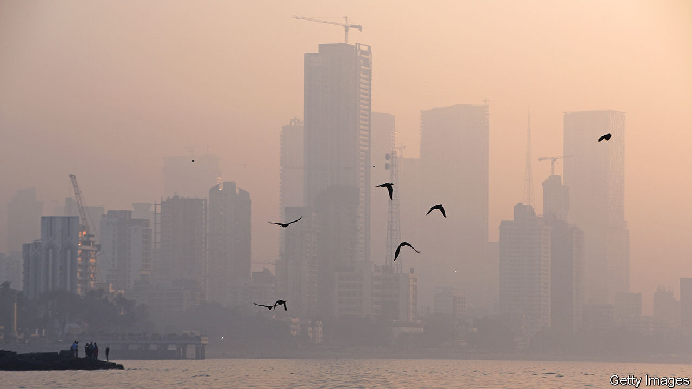

###### On obesity, colonialism, YouTube and Alphabet, air pollution, the Chagos Islands, Zoomers

# Letters to the editor 

##### A selection of correspondence 

 

> Mar 16th 2023 


No substitute for exercise

The new obesity drugs covered in your briefing will not curb the obesity pandemic but only fan its fire (“”, March 4th). Neither the trials that assessed the health consequences of the drugs, nor your article, focused on the impact that they will have on individual and government incentives for obesity control. With a miracle drug at hand, why limit your appetite or work up a sweat through exercise? Governments already hesitant to regulate the obesogenic environment will find that the drugs give them a reason not to tackle the proliferation of ultra-processed fast food and sedentary lifestyles.

The real way to curb obesity is not to focus on treatment but on prevention. Tobacco control has shown the way in regulating unhealthy lifestyles: price increases, limits on sales points, advertising bans and a drastic reduction in the places where smoking is allowed. Businesses that feed obesity are already a multi-billion-dollar industry. With the new drugs, the obesity-treatment industry will become the same. Governments around the world will need the political determination to counter these interests. But societies will gain from controlling obesity. Just as they benefited from tobacco control.

Jochen Mierau

Professor of public health economics

University of Groningen


 


In the 1950s a message of “Smoke, treat, repeat” would have been an inadequate response to ending the health problems from smoking. Your mantra of “” (March 4th) is similarly misplaced. You did not mention the systemic problems with our food systems, particularly those serving the needs of urban populations. 

Jonathan Rushton

Professor of animal health and food systems economics

University of Liverpool

The average person living with obesity needs to lose more than 15-20% of their weight to attain a healthy BMI. These drugs will only help those on the cusp of obesity. Most obese people who use these drugs will remain obese. Serious political engagement with our obesogenic environment is the only way to fix this problem.

Dr Luke Allen

GP and clinical research fellow

London School of Hygiene and Tropical Medicine

 


Investing in green shipping

As attention turns to replacing oil and gas with a renewable-energy produced hydrogen economy we are going to need to create an entire supply chain that can service the creation and distribution of these fuels (“”, February 18th). In the absence of a navy of empire to pay for the infrastructure required for such as task, as was the case with the development of coal and oil, companies will be called upon to fill the void.

Exporting countries will require excess renewable generating capacity, fuel-production facilities, new port infrastructure, and ships or pipelines to be put in place. Importing countries will also require the ships, port infrastructure or pipeline and a distribution network to supply domestic needs. The scale of the challenge is tremendous and the longer we wait to get stated the harder it will be to keep to anywhere near climate-change goals.

Much though policymakers may want such developments to be created as a philanthropic act of largess none of this will happen without a sound business case. All elements of this value chain, including shipowners, will have to deliver a return on investments. 

Guy Platten

Secretary general

International Chamber of Shipping


 


Studying empires

I pondered over your reviewer’s offhanded dismissal of Nigel Biggar’s observation that other empires were worse than the British version (“”, March 4th). They were, as anyone who has spent time living and working in Africa can attest. In fact, travel isn’t even necessary to reach that conclusion. André Gide’s classic “Travels in the Congo” (1927) and the more recent “King Leopold’s Ghost” by Adam Hochschild provide ample evidence of the horrors of Belgian and French colonialism. As for that other great colonial power, Portugal, it was the last to ban the slave trade, many decades after its continental peers, and partly because of British pressure. 

Chris Hennemeyer

International humanitarian consultant

 

 


Stick with Alphabet

The proposition to spin off YouTube from Alphabet presents a compelling argument for investors (, February 25th). However, the decision does not align with the interests of Alphabet or YouTube. You underestimate the complexities involved in dividing the shared hardware and software infrastructure. To function independently YouTube would require a global network of data centres and undersea cables and a separate software stack, which is currently shared with Google. Duplicating, forking and maintaining all of this would require a significant amount of time and resources, allowing competitors to gain an advantage in the meantime.

Furthermore, YouTube and Alphabet have fundamentally different roles. Alphabet is an advertising business that offers a platform on all its properties, upselling YouTube to advertisers who don’t already use it. If YouTube were to become an independent entity it would lose the additional revenue from upselling and would also have to create a sales organisation from scratch. And although YouTube undoubtedly has the potential to grow, it relies on data collected from each consumer to refine its algorithms for content and ads. With less data than before, it would find it a challenge to compete with rivals, such as TikTok. 

You suggest that YouTube could focus on subscriptions. However, there is nothing to prevent it from doing so under Alphabet. YouTube Premium already exists. 

Krishna Sundarram


 


Cleaner air in South Asia

“” (February 18th) may have been overly pessimistic about the prospects for international co-operation to reduce South Asian air pollution. There are many examples of international collective endeavours dealing with shared environmental problems between geopolitical adversaries (admittedly with mixed success). Long-standing efforts are already in place in such contentious areas as the Mediterranean Sea and the Persian Gulf.

The preconditions for success in reducing pollution include a mobilised transnational scientific community, a strong international institution to co-ordinate national policies and sufficient financial resources to achieve the necessary reductions. Although daunting, these are not impossible to attain, particularly in the South Asian region, where India enjoys many scientific capabilities. The World Bank has also co-ordinated reasonably successful co-operative environmental protection efforts for the Black Sea, although the UN Environment Programme has the greatest experience at organising regional pollution-control efforts.

Peter Haas

Emeritus professor of political science at the University of Massachusetts Amherst


 


Potential chaos in the Chagos

One has to wonder why Mauritius is so keen to obtain the Chagos Islands, which are half an ocean away from its main island (“, February 18th). The Seychelles has a better claim, as does the Maldives. Does Mauritius hope to change the current situation, where America and Britain freely share the archipelago? Or is it that Mauritian fishing interests are keen to see an end of the marine protected area, and strict no-fishing zone?

What seems certain is that, even if there are some Chagossians who wish to return to permanent residence in the islands, the Mauritian government has neither the interest, nor the wherewithal to provide the infrastructure (school, hospital, transport) expected of an enlightened colonial power.

Simon Jackson

Former commissioner’s representative in the British Indian Ocean Territory


The new generation

“Gen Zers” as shorthand for Generation Zers is hard on the eyes and harder on the ears (“”, February 25th). Please consider using “Zoomers”. Or Zedders?

James Holgate


